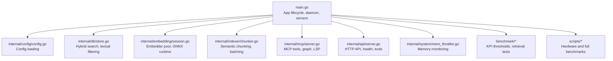
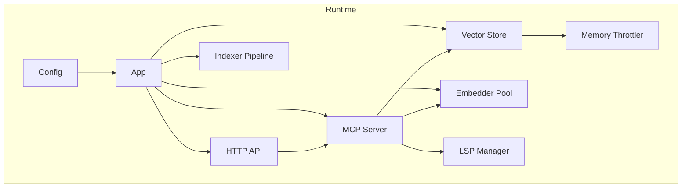
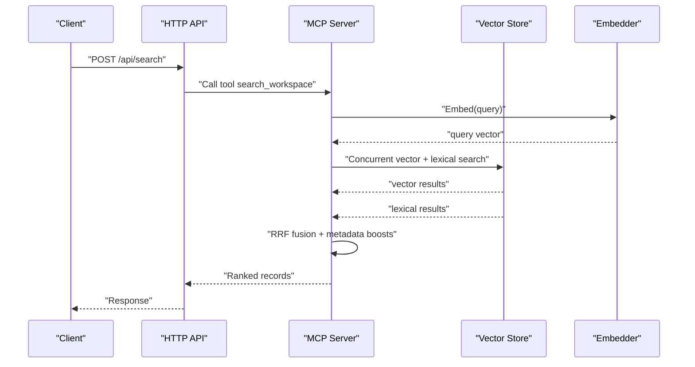
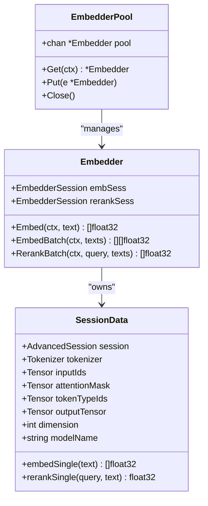
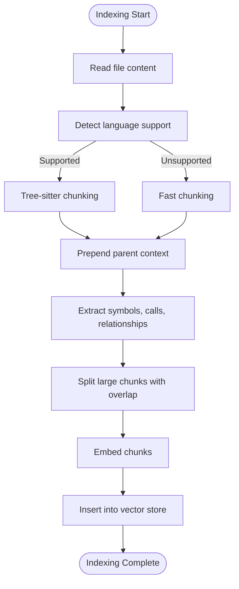
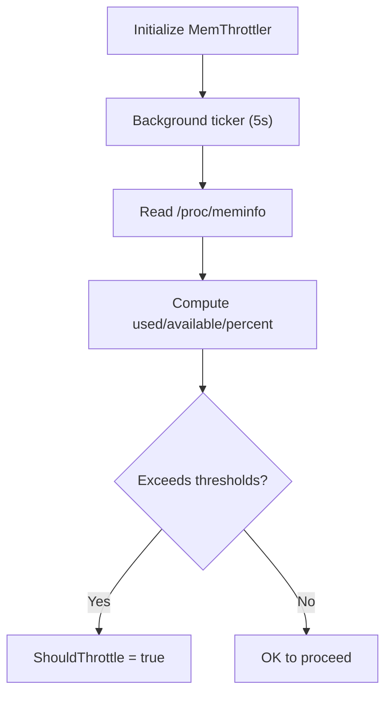
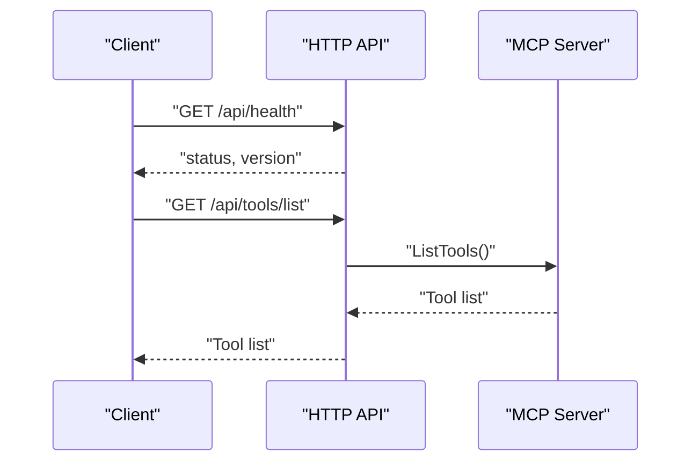
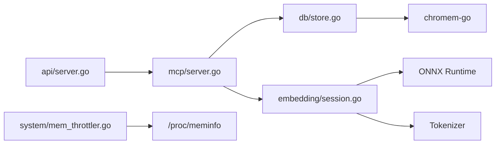

# Performance Monitoring and Tuning

<cite>
**Referenced Files in This Document**
- [main.go](file://main.go)
- [config.go](file://internal/config/config.go)
- [store.go](file://internal/db/store.go)
- [session.go](file://internal/embedding/session.go)
- [mem_throttler.go](file://internal/system/mem_throttler.go)
- [chunker.go](file://internal/indexer/chunker.go)
- [server.go](file://internal/mcp/server.go)
- [api_server.go](file://internal/api/server.go)
- [test-hardware.sh](file://scripts/test-hardware.sh)
- [benchmark-all.sh](file://scripts/benchmark-all.sh)
- [retrieval_bench_test.go](file://benchmark/retrieval_bench_test.go)
- [kpi_thresholds.json](file://benchmark/fixtures/polyglot/kpi_thresholds.json)
- [graph.go](file://internal/db/graph.go)
</cite>

## Table of Contents
1. [Introduction](#introduction)
2. [Project Structure](#project-structure)
3. [Core Components](#core-components)
4. [Architecture Overview](#architecture-overview)
5. [Detailed Component Analysis](#detailed-component-analysis)
6. [Dependency Analysis](#dependency-analysis)
7. [Performance Considerations](#performance-considerations)
8. [Troubleshooting Guide](#troubleshooting-guide)
9. [Conclusion](#conclusion)
10. [Appendices](#appendices)

## Introduction
This document provides comprehensive performance monitoring and tuning guidance for Vector MCP Go. It focuses on measurable KPIs such as search latency, indexing throughput, embedding computation time, and memory utilization. It explains how to integrate monitoring tools, set up performance dashboards and alerting, tune configuration parameters, profile bottlenecks, and implement continuous performance improvement processes tailored to this codebase.

## Project Structure
Vector MCP Go is organized around a modular architecture:
- Application bootstrap and lifecycle management
- Configuration loading and environment overrides
- Vector database operations and hybrid search
- Embedding engine with ONNX runtime
- Indexing pipeline with chunking and batching
- MCP server and HTTP API for observability and control
- Benchmarks and scripts for performance regression detection

**Diagram sources**
- [main.go:1-349](file://main.go#L1-L349)
- [config.go:1-139](file://internal/config/config.go#L1-L139)
- [store.go:1-664](file://internal/db/store.go#L1-L664)
- [session.go:1-367](file://internal/embedding/session.go#L1-L367)
- [chunker.go:1-759](file://internal/indexer/chunker.go#L1-L759)
- [server.go:1-470](file://internal/mcp/server.go#L1-L470)
- [api_server.go:1-139](file://internal/api/server.go#L1-L139)
- [mem_throttler.go:1-151](file://internal/system/mem_throttler.go#L1-L151)
- [retrieval_bench_test.go:1-357](file://benchmark/retrieval_bench_test.go#L1-L357)

**Section sources**
- [main.go:1-349](file://main.go#L1-L349)
- [config.go:1-139](file://internal/config/config.go#L1-L139)

## Core Components
- Configuration and environment-driven tuning
  - Embedder pool size, model selection, reranker toggle, watcher and live indexing toggles, API port, and logging path.
- Vector database and hybrid search
  - Vector similarity search, lexical filtering, reciprocal rank fusion (RRF), and boosting by metadata.
- Embedding engine
  - ONNX runtime sessions, tokenization, normalization, and optional reranking.
- Indexing pipeline
  - Tree-sitter-based semantic chunking with overlap, fast fallback chunking, and configurable chunk size.
- MCP server and API
  - Unified tools for search, indexing, LSP, and mutation; HTTP endpoints for health and tool invocation.
- Memory throttling
  - Background monitoring of system memory and advisories for throttling heavy tasks.

**Section sources**
- [config.go:13-130](file://internal/config/config.go#L13-L130)
- [store.go:80-336](file://internal/db/store.go#L80-L336)
- [session.go:29-367](file://internal/embedding/session.go#L29-L367)
- [chunker.go:43-101](file://internal/indexer/chunker.go#L43-L101)
- [server.go:67-128](file://internal/mcp/server.go#L67-L128)
- [api_server.go:24-139](file://internal/api/server.go#L24-L139)
- [mem_throttler.go:21-151](file://internal/system/mem_throttler.go#L21-L151)

## Architecture Overview
The system orchestrates embedding, indexing, and search with concurrency and resource controls. The MCP server exposes tools and integrates with the vector store and LSP. The API server provides HTTP endpoints for health and tool execution.

**Diagram sources**
- [main.go:37-176](file://main.go#L37-L176)
- [server.go:88-128](file://internal/mcp/server.go#L88-L128)
- [api_server.go:33-109](file://internal/api/server.go#L33-L109)
- [store.go:19-64](file://internal/db/store.go#L19-L64)
- [session.go:34-85](file://internal/embedding/session.go#L34-L85)
- [mem_throttler.go:21-110](file://internal/system/mem_throttler.go#L21-L110)

## Detailed Component Analysis

### Search and Hybrid Retrieval
Key performance characteristics:
- Vector search with configurable top-K and category/project scoping
- Lexical search with parallel filtering and early exits
- Hybrid search using concurrent vector and lexical search, RRF scoring, and metadata-based boosting
- Sorting and ranking with priority and recency boosts

**Diagram sources**
- [api_server.go:75-85](file://internal/api/server.go#L75-L85)
- [server.go:342-349](file://internal/mcp/server.go#L342-L349)
- [store.go:223-336](file://internal/db/store.go#L223-L336)
- [session.go:176-245](file://internal/embedding/session.go#L176-L245)

**Section sources**
- [store.go:80-409](file://internal/db/store.go#L80-L409)
- [session.go:176-245](file://internal/embedding/session.go#L176-L245)

### Embedding Computation and Pooling
- Embedder pool maintains multiple ONNX sessions for concurrency
- Tokenization, tensor preparation, and inference run per request
- Normalization ensures cosine similarity compatibility
- Optional reranking batch scoring

**Diagram sources**
- [session.go:34-85](file://internal/embedding/session.go#L34-L85)
- [session.go:176-245](file://internal/embedding/session.go#L176-L245)
- [session.go:300-367](file://internal/embedding/session.go#L300-L367)

**Section sources**
- [session.go:34-85](file://internal/embedding/session.go#L34-L85)
- [session.go:176-245](file://internal/embedding/session.go#L176-L245)

### Indexing Pipeline and Chunking
- Semantic chunking via Tree-sitter with contextual metadata
- Fallback fast chunking with overlap
- Overlap and max runes tuned for large-context models
- Relationship and call extraction for richer metadata

**Diagram sources**
- [chunker.go:43-101](file://internal/indexer/chunker.go#L43-L101)
- [chunker.go:537-577](file://internal/indexer/chunker.go#L537-L577)
- [chunker.go:724-758](file://internal/indexer/chunker.go#L724-L758)

**Section sources**
- [chunker.go:43-101](file://internal/indexer/chunker.go#L43-L101)
- [chunker.go:537-577](file://internal/indexer/chunker.go#L537-L577)
- [chunker.go:724-758](file://internal/indexer/chunker.go#L724-L758)

### Memory Monitoring and Throttling
- Periodic sampling of system memory (/proc/meminfo)
- Threshold-based advisories for pausing heavy tasks
- Minimum available MB and percentage thresholds

**Diagram sources**
- [mem_throttler.go:46-110](file://internal/system/mem_throttler.go#L46-L110)

**Section sources**
- [mem_throttler.go:21-151](file://internal/system/mem_throttler.go#L21-L151)

### MCP Server and API Observability
- MCP resources expose index status and configuration
- HTTP API provides health endpoint and tool proxying
- Notifications and logging channels for operational visibility

**Diagram sources**
- [api_server.go:131-139](file://internal/api/server.go#L131-L139)
- [server.go:457-464](file://internal/mcp/server.go#L457-L464)

**Section sources**
- [api_server.go:24-139](file://internal/api/server.go#L24-L139)
- [server.go:201-283](file://internal/mcp/server.go#L201-L283)

## Dependency Analysis
- Embedding engine depends on ONNX runtime and tokenizer libraries
- Vector store uses chromem-go for persistent collections
- MCP server integrates with the vector store and embedder
- API server proxies MCP requests and exposes health and tool endpoints
- Memory throttler depends on OS memory stats

**Diagram sources**
- [session.go:13-14](file://internal/embedding/session.go#L13-L14)
- [store.go:16-17](file://internal/db/store.go#L16-L17)
- [server.go:18-26](file://internal/mcp/server.go#L18-L26)
- [api_server.go:14-19](file://internal/api/server.go#L14-L19)
- [mem_throttler.go:113-150](file://internal/system/mem_throttler.go#L113-L150)

**Section sources**
- [session.go:13-14](file://internal/embedding/session.go#L13-L14)
- [store.go:16-17](file://internal/db/store.go#L16-L17)
- [server.go:18-26](file://internal/mcp/server.go#L18-L26)
- [api_server.go:14-19](file://internal/api/server.go#L14-L19)
- [mem_throttler.go:113-150](file://internal/system/mem_throttler.go#L113-L150)

## Performance Considerations

### Key Performance Indicators (KPIs)
- Search latency
  - p50 and p95 latency for hybrid search queries
  - Measured in milliseconds via scripts and benchmarks
- Indexing throughput
  - Index time per KLOC during retrieval benchmark
- Embedding computation time
  - Per-request embedding and reranking durations
- Memory utilization
  - Available memory, used percentage, and throttling advisories

**Section sources**
- [retrieval_bench_test.go:205-224](file://benchmark/retrieval_bench_test.go#L205-L224)
- [test-hardware.sh:104-107](file://scripts/test-hardware.sh#L104-L107)
- [benchmark-all.sh:115-119](file://scripts/benchmark-all.sh#L115-L119)
- [mem_throttler.go:87-103](file://internal/system/mem_throttler.go#L87-L103)

### Monitoring Tools Integration
- Health endpoint for readiness and version checks
- MCP resources for index status and configuration
- Logging to structured JSON for ingestion by log collectors

**Section sources**
- [api_server.go:131-139](file://internal/api/server.go#L131-L139)
- [server.go:201-251](file://internal/mcp/server.go#L201-L251)
- [config.go:71-81](file://internal/config/config.go#L71-L81)

### Performance Dashboards Setup
- Metrics to export:
  - Search latency (p50/p95)
  - Indexing throughput (seconds per KLOC)
  - Embedding time per request
  - Memory usage and throttling events
- Suggested panels:
  - Latency over time (line chart)
  - Throughput vs. model and reranker combinations
  - Memory percent and available MB
  - Error rates and rejections due to throttling

[No sources needed since this section provides general guidance]

### Alerting Mechanisms
- Threshold-based alerts for:
  - p95 latency exceeding configured bounds
  - Indexing throughput degrading below targets
  - Memory percent above threshold or available MB below minimum
- Integration with monitoring stack for notifications

[No sources needed since this section provides general guidance]

### Configuration Tuning Parameters
- Embedding and model
  - MODEL_NAME and RERANKER_MODEL_NAME
  - EMBEDDER_POOL_SIZE for concurrency
- Indexing and search
  - EnableLiveIndexing and DisableWatcher toggles
  - Top-K limits and category filters in search
- Storage and environment
  - DB_PATH and MODELS_DIR locations
  - API_PORT for HTTP service

**Section sources**
- [config.go:88-129](file://internal/config/config.go#L88-L129)
- [config.go:103-108](file://internal/config/config.go#L103-L108)
- [store.go:338-409](file://internal/db/store.go#L338-L409)

### Profiling Techniques and Bottleneck Identification
- Use scripts to measure latency and throughput across model combinations
- Instrument embedding and search paths to isolate hotspots
- Correlate memory usage with latency spikes

**Section sources**
- [test-hardware.sh:86-111](file://scripts/test-hardware.sh#L86-L111)
- [benchmark-all.sh:91-124](file://scripts/benchmark-all.sh#L91-L124)
- [session.go:176-245](file://internal/embedding/session.go#L176-L245)
- [store.go:223-336](file://internal/db/store.go#L223-L336)

### Performance Regression Detection
- Deterministic retrieval benchmark with KPI thresholds
- Fixture-based evaluation of recall@K, MRR, and NDCG
- Automated CI checks to prevent regressions

**Section sources**
- [retrieval_bench_test.go:92-224](file://benchmark/retrieval_bench_test.go#L92-L224)
- [kpi_thresholds.json:1-6](file://benchmark/fixtures/polyglot/kpi_thresholds.json#L1-L6)

### Production Monitoring and Capacity Planning
- Track latency and throughput trends to forecast growth
- Plan embedding pool sizing based on peak concurrency and model characteristics
- Size storage and memory to accommodate growth and maintain low throttling

[No sources needed since this section provides general guidance]

### Automated Performance Optimization Strategies
- Dynamic adjustment of embedding pool size based on observed latency
- Adaptive chunk size and overlap based on content distribution
- Intelligent reranker toggling based on latency vs. accuracy trade-offs

[No sources needed since this section provides general guidance]

## Troubleshooting Guide

Common performance issues and remedies:
- High search latency
  - Increase EMBEDDER_POOL_SIZE
  - Reduce top-K or add category filters
  - Verify memory throttling is not triggering pauses
- Slow indexing
  - Tune chunk size and overlap
  - Disable watcher if not needed (-D flag)
  - Ensure adequate disk I/O and model availability
- Memory pressure and throttling
  - Lower concurrency or increase system RAM
  - Monitor memory percent and available MB thresholds

**Section sources**
- [config.go:103-108](file://internal/config/config.go#L103-L108)
- [store.go:338-409](file://internal/db/store.go#L338-L409)
- [mem_throttler.go:87-103](file://internal/system/mem_throttler.go#L87-L103)

## Conclusion
Vector MCP Go’s performance hinges on balanced embedding concurrency, efficient indexing chunking, and robust memory management. By instrumenting KPIs, setting up dashboards and alerts, and continuously validating with deterministic benchmarks, teams can maintain responsive search experiences and scale reliably in production.

[No sources needed since this section summarizes without analyzing specific files]

## Appendices

### Appendix A: Benchmark Scripts and Fixtures
- Hardware testing script measures index time and latency across models
- Full benchmark script evaluates multiple model combinations and reports hit rates
- Retrieval benchmark validates KPI thresholds against fixture expectations

**Section sources**
- [test-hardware.sh:1-114](file://scripts/test-hardware.sh#L1-L114)
- [benchmark-all.sh:1-127](file://scripts/benchmark-all.sh#L1-L127)
- [retrieval_bench_test.go:92-224](file://benchmark/retrieval_bench_test.go#L92-L224)
- [kpi_thresholds.json:1-6](file://benchmark/fixtures/polyglot/kpi_thresholds.json#L1-L6)

### Appendix B: Knowledge Graph Impact on Performance
- Graph population and usage can influence memory footprint and warm-up times
- Consider graph rebuild cadence and incremental updates for large codebases

**Section sources**
- [graph.go:35-105](file://internal/db/graph.go#L35-L105)
- [server.go:176-193](file://internal/mcp/server.go#L176-L193)