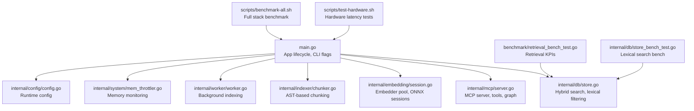
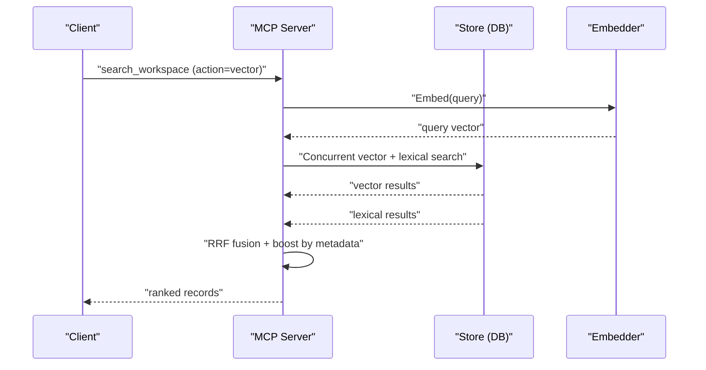
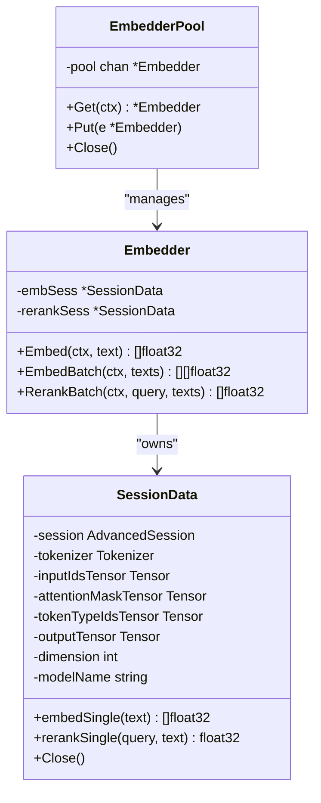
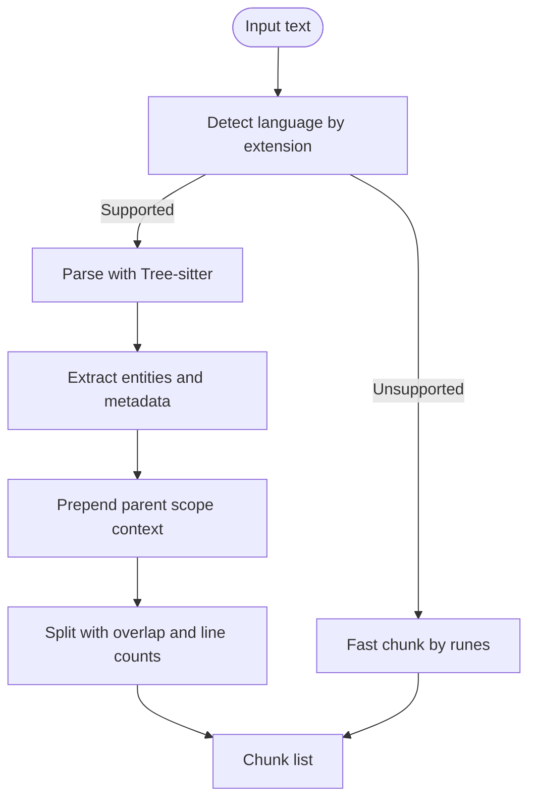
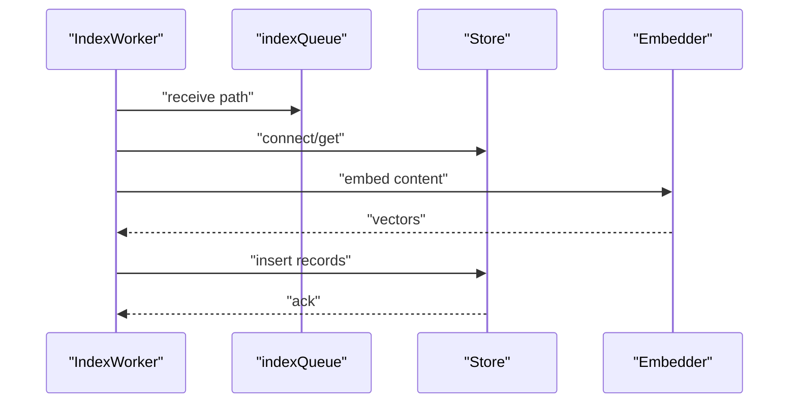
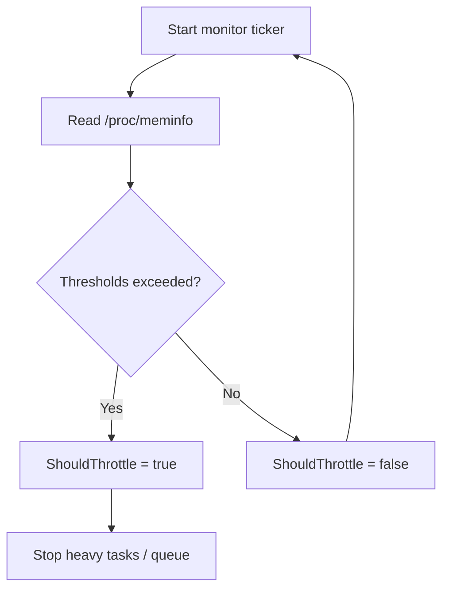
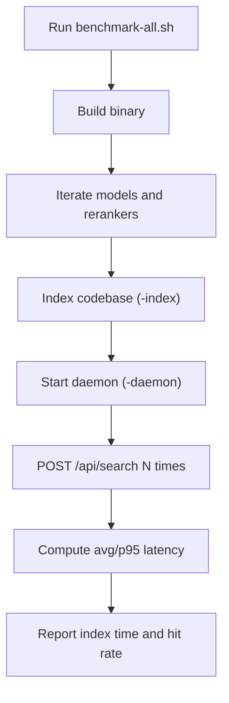
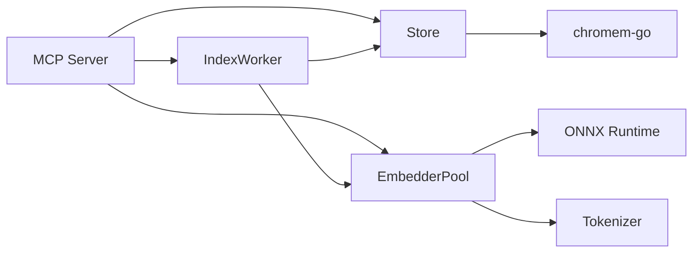

# Performance and Optimization

<cite>
**Referenced Files in This Document**
- [main.go](file://main.go)
- [README.md](file://README.md)
- [benchmark/retrieval_bench_test.go](file://benchmark/retrieval_bench_test.go)
- [benchmark/fixtures/polyglot/kpi_thresholds.json](file://benchmark/fixtures/polyglot/kpi_thresholds.json)
- [internal/db/store.go](file://internal/db/store.go)
- [internal/db/store_bench_test.go](file://internal/db/store_bench_test.go)
- [internal/db/graph.go](file://internal/db/graph.go)
- [internal/embedding/session.go](file://internal/embedding/session.go)
- [internal/system/mem_throttler.go](file://internal/system/mem_throttler.go)
- [internal/worker/worker.go](file://internal/worker/worker.go)
- [internal/indexer/chunker.go](file://internal/indexer/chunker.go)
- [internal/mcp/server.go](file://internal/mcp/server.go)
- [internal/config/config.go](file://internal/config/config.go)
- [scripts/benchmark-all.sh](file://scripts/benchmark-all.sh)
- [scripts/test-hardware.sh](file://scripts/test-hardware.sh)
</cite>

## Table of Contents
1. [Introduction](#introduction)
2. [Project Structure](#project-structure)
3. [Core Components](#core-components)
4. [Architecture Overview](#architecture-overview)
5. [Detailed Component Analysis](#detailed-component-analysis)
6. [Dependency Analysis](#dependency-analysis)
7. [Performance Considerations](#performance-considerations)
8. [Troubleshooting Guide](#troubleshooting-guide)
9. [Conclusion](#conclusion)
10. [Appendices](#appendices)

## Introduction
This document provides comprehensive performance documentation for Vector MCP Go. It covers benchmarking methodologies, performance testing frameworks, memory management, concurrency patterns, retrieval and indexing performance, embedding optimization, profiling and monitoring, bottleneck identification, scaling and capacity planning, tuning parameters, and production best practices. The goal is to help operators and contributors achieve predictable latency, throughput, and resource utilization in real-world deployments.

## Project Structure
Vector MCP Go is organized around a modular architecture:
- Application lifecycle and orchestration in the main entrypoint
- MCP server and tool registration
- Vector database integration and hybrid search
- Embedding pipeline with ONNX runtime and pooling
- Indexing pipeline with language-aware chunking
- Background workers and memory throttling
- Benchmarks and scripts for performance regression testing



**Diagram sources**
- [main.go:280-349](file://main.go#L280-L349)
- [internal/mcp/server.go:86-117](file://internal/mcp/server.go#L86-L117)
- [internal/db/store.go:35-64](file://internal/db/store.go#L35-L64)
- [internal/embedding/session.go:38-65](file://internal/embedding/session.go#L38-L65)
- [internal/indexer/chunker.go:43-101](file://internal/indexer/chunker.go#L43-L101)
- [internal/worker/worker.go:24-44](file://internal/worker/worker.go#L24-L44)
- [internal/system/mem_throttler.go:21-44](file://internal/system/mem_throttler.go#L21-L44)
- [internal/config/config.go:30-130](file://internal/config/config.go#L30-L130)
- [benchmark/retrieval_bench_test.go:92-224](file://benchmark/retrieval_bench_test.go#L92-L224)
- [internal/db/store_bench_test.go:10-51](file://internal/db/store_bench_test.go#L10-L51)
- [scripts/benchmark-all.sh:1-127](file://scripts/benchmark-all.sh#L1-L127)
- [scripts/test-hardware.sh:1-114](file://scripts/test-hardware.sh#L1-L114)

**Section sources**
- [README.md:1-40](file://README.md#L1-L40)
- [main.go:280-349](file://main.go#L280-L349)

## Core Components
- Application lifecycle and CLI flags: Initializes configuration, master/slave mode, stores, embedder pool, MCP/API servers, and background workers.
- MCP server: Registers tools, resources, and prompts; coordinates search, indexing, LSP, and mutation operations.
- Vector database: Provides persistent storage, vector similarity search, lexical filtering, and hybrid ranking with Reciprocal Rank Fusion (RRF).
- Embedding engine: Manages ONNX sessions, tokenization, pooling, normalization, and optional reranking.
- Indexer: Produces semantically meaningful chunks using Tree-sitter and fallback chunking, enriching content with structural metadata.
- Workers: Background indexing with progress tracking and panic recovery.
- Memory throttler: Monitors system memory and advises when to throttle or pause heavy tasks.
- Configuration: Centralized runtime configuration with environment overrides and defaults.

**Section sources**
- [main.go:37-91](file://main.go#L37-L91)
- [internal/mcp/server.go:66-117](file://internal/mcp/server.go#L66-L117)
- [internal/db/store.go:19-64](file://internal/db/store.go#L19-L64)
- [internal/embedding/session.go:29-65](file://internal/embedding/session.go#L29-L65)
- [internal/indexer/chunker.go:43-101](file://internal/indexer/chunker.go#L43-L101)
- [internal/worker/worker.go:24-44](file://internal/worker/worker.go#L24-L44)
- [internal/system/mem_throttler.go:21-44](file://internal/system/mem_throttler.go#L21-L44)
- [internal/config/config.go:30-130](file://internal/config/config.go#L30-L130)

## Architecture Overview
The system orchestrates embedding, indexing, and search with concurrency and resource controls. The MCP server delegates to the vector store for hybrid search and uses the embedder pool for batched operations. Background workers handle incremental indexing, while the memory throttler prevents OOM conditions.

```mermaid
graph TB
subgraph "Client"
U["Agent/LSP Client"]
end
subgraph "Server"
MCP["MCP Server<br/>internal/mcp/server.go"]
CFG["Config<br/>internal/config/config.go"]
THROTTLE["MemThrottler<br/>internal/system/mem_throttler.go"]
WORKER["IndexWorker<br/>internal/worker/worker.go"]
end
subgraph "Indexing"
CHUNK["Chunker<br/>internal/indexer/chunker.go"]
EMBPOOL["EmbedderPool<br/>internal/embedding/session.go"]
STORE["Store (DB)<br/>internal/db/store.go"]
end
subgraph "API"
API["API Server<br/>internal/api/server.go"]
end
U --> MCP
MCP --> STORE
MCP --> EMBPOOL
MCP --> THROTTLE
MCP --> WORKER
MCP --> CFG
API --> MCP
WORKER --> CHUNK
WORKER --> EMBPOOL
WORKER --> STORE
EMBPOOL --> STORE
```

**Diagram sources**
- [internal/mcp/server.go:86-117](file://internal/mcp/server.go#L86-L117)
- [internal/config/config.go:30-130](file://internal/config/config.go#L30-L130)
- [internal/system/mem_throttler.go:21-44](file://internal/system/mem_throttler.go#L21-L44)
- [internal/worker/worker.go:24-44](file://internal/worker/worker.go#L24-L44)
- [internal/indexer/chunker.go:43-101](file://internal/indexer/chunker.go#L43-L101)
- [internal/embedding/session.go:38-65](file://internal/embedding/session.go#L38-L65)
- [internal/db/store.go:35-64](file://internal/db/store.go#L35-L64)

## Detailed Component Analysis

### Retrieval Performance and Hybrid Search
- HybridSearch performs vector and lexical search concurrently, then applies RRF with dynamic weights. It supports boosting by function score, recency, and priority metadata.
- LexicalSearch filters records in parallel across CPU cores for large collections, with caching for parsed metadata arrays.
- KPI thresholds define minimum acceptable recall, MRR, and NDCG for regression detection.



**Diagram sources**
- [internal/db/store.go:223-336](file://internal/db/store.go#L223-L336)
- [internal/mcp/server.go:331-338](file://internal/mcp/server.go#L331-L338)

**Section sources**
- [internal/db/store.go:85-221](file://internal/db/store.go#L85-L221)
- [internal/db/store.go:223-336](file://internal/db/store.go#L223-L336)
- [benchmark/retrieval_bench_test.go:92-224](file://benchmark/retrieval_bench_test.go#L92-L224)
- [benchmark/fixtures/polyglot/kpi_thresholds.json:1-6](file://benchmark/fixtures/polyglot/kpi_thresholds.json#L1-L6)

### Embedding Computation Optimization
- EmbedderPool maintains a bounded set of ONNX sessions and tensors to reduce allocation overhead.
- Tokenization uses reusable tensors sized to MaxSeqLength; padding and masking are prepared in-place.
- Normalization is applied per-vector to maintain cosine similarity semantics.
- Optional reranker session supports cross-encoder scoring for post-retrieval refinement.



**Diagram sources**
- [internal/embedding/session.go:34-85](file://internal/embedding/session.go#L34-L85)
- [internal/embedding/session.go:18-27](file://internal/embedding/session.go#L18-L27)
- [internal/embedding/session.go:29-65](file://internal/embedding/session.go#L29-L65)

**Section sources**
- [internal/embedding/session.go:38-65](file://internal/embedding/session.go#L38-L65)
- [internal/embedding/session.go:176-245](file://internal/embedding/session.go#L176-L245)
- [internal/embedding/session.go:261-271](file://internal/embedding/session.go#L261-L271)
- [internal/embedding/session.go:300-314](file://internal/embedding/session.go#L300-L314)

### Indexing Efficiency and Chunking
- AST-based chunking uses Tree-sitter for language-specific entities, extracting symbols, relationships, calls, docstrings, and structural metadata.
- Gap-filling and overlap-aware splitting produce semantically coherent chunks with minimal UTF-8 boundary issues.
- Fallback fastChunk ensures coverage for unsupported languages.



**Diagram sources**
- [internal/indexer/chunker.go:114-421](file://internal/indexer/chunker.go#L114-L421)
- [internal/indexer/chunker.go:537-577](file://internal/indexer/chunker.go#L537-L577)
- [internal/indexer/chunker.go:724-758](file://internal/indexer/chunker.go#L724-L758)

**Section sources**
- [internal/indexer/chunker.go:43-101](file://internal/indexer/chunker.go#L43-L101)
- [internal/indexer/chunker.go:114-421](file://internal/indexer/chunker.go#L114-L421)
- [internal/indexer/chunker.go:537-577](file://internal/indexer/chunker.go#L537-L577)
- [internal/indexer/chunker.go:724-758](file://internal/indexer/chunker.go#L724-L758)

### Concurrent Processing Patterns
- HybridSearch uses goroutines for vector and lexical search, then merges results with RRF and metadata-based boosts.
- LexicalSearch parallelizes filtering across CPU cores for large result sets.
- EmbedderPool uses channels to serialize access to ONNX sessions, preventing contention.
- IndexWorker runs a long-lived goroutine consuming a bounded channel of paths.



**Diagram sources**
- [internal/db/store.go:223-336](file://internal/db/store.go#L223-L336)
- [internal/db/store.go:85-221](file://internal/db/store.go#L85-L221)
- [internal/embedding/session.go:38-65](file://internal/embedding/session.go#L38-L65)
- [internal/worker/worker.go:46-61](file://internal/worker/worker.go#L46-L61)

**Section sources**
- [internal/db/store.go:223-336](file://internal/db/store.go#L223-L336)
- [internal/db/store.go:85-221](file://internal/db/store.go#L85-L221)
- [internal/embedding/session.go:38-65](file://internal/embedding/session.go#L38-L65)
- [internal/worker/worker.go:46-61](file://internal/worker/worker.go#L46-L61)

### Memory Management and Resource Control
- MemThrottler periodically reads /proc/meminfo, tracks total/available/used and percentage, and exposes ShouldThrottle and CanStartLSP checks.
- EmbedderPool and SessionData reuse tensors and destroy them on close to minimize GC pressure.
- Store caches parsed JSON arrays to avoid repeated unmarshaling during lexical filtering.



**Diagram sources**
- [internal/system/mem_throttler.go:46-103](file://internal/system/mem_throttler.go#L46-L103)
- [internal/system/mem_throttler.go:112-150](file://internal/system/mem_throttler.go#L112-L150)

**Section sources**
- [internal/system/mem_throttler.go:21-103](file://internal/system/mem_throttler.go#L21-L103)
- [internal/embedding/session.go:282-298](file://internal/embedding/session.go#L282-L298)
- [internal/db/store.go:633-663](file://internal/db/store.go#L633-L663)

### Benchmarking Methodologies and Regression Testing
- Retrieval KPIs benchmark computes recall@K, MRR, NDCG, p50/p95 latency, and index time per KLOC against a polyglot fixture with predefined thresholds.
- Lexical search benchmark measures raw throughput of lexical filtering.
- Full-stack benchmarks script exercises model selection, daemon startup, health checks, and latency metrics.
- Hardware test script evaluates latency across models and indexing durations.



**Diagram sources**
- [scripts/benchmark-all.sh:58-124](file://scripts/benchmark-all.sh#L58-L124)
- [scripts/test-hardware.sh:49-111](file://scripts/test-hardware.sh#L49-L111)
- [benchmark/retrieval_bench_test.go:92-224](file://benchmark/retrieval_bench_test.go#L92-L224)
- [internal/db/store_bench_test.go:10-51](file://internal/db/store_bench_test.go#L10-L51)

**Section sources**
- [benchmark/retrieval_bench_test.go:92-224](file://benchmark/retrieval_bench_test.go#L92-L224)
- [benchmark/fixtures/polyglot/kpi_thresholds.json:1-6](file://benchmark/fixtures/polyglot/kpi_thresholds.json#L1-L6)
- [internal/db/store_bench_test.go:10-51](file://internal/db/store_bench_test.go#L10-L51)
- [scripts/benchmark-all.sh:1-127](file://scripts/benchmark-all.sh#L1-L127)
- [scripts/test-hardware.sh:1-114](file://scripts/test-hardware.sh#L1-L114)

## Dependency Analysis
- EmbedderPool depends on ONNX runtime sessions and tokenizer libraries; it bounds concurrency via channel capacity.
- Store depends on chromem-go for vector operations and metadata filtering; it caches parsed arrays to reduce CPU and allocations.
- MCP server composes Searcher, StoreManager, and StatusProvider abstractions to support both local and remote operation modes.
- Worker consumes a bounded channel and interacts with Store and Embedder; progress is tracked via sync.Map.



**Diagram sources**
- [internal/embedding/session.go:38-65](file://internal/embedding/session.go#L38-L65)
- [internal/db/store.go:35-64](file://internal/db/store.go#L35-L64)
- [internal/mcp/server.go:66-117](file://internal/mcp/server.go#L66-L117)
- [internal/worker/worker.go:24-44](file://internal/worker/worker.go#L24-L44)

**Section sources**
- [internal/embedding/session.go:38-65](file://internal/embedding/session.go#L38-L65)
- [internal/db/store.go:35-64](file://internal/db/store.go#L35-L64)
- [internal/mcp/server.go:66-117](file://internal/mcp/server.go#L66-L117)
- [internal/worker/worker.go:24-44](file://internal/worker/worker.go#L24-L44)

## Performance Considerations
- Embedding
  - Tune EmbedderPool size to match CPU cores and available memory; pool size equals concurrency of ONNX sessions.
  - Prefer smaller models for constrained environments; larger models increase embedding latency and memory footprint.
  - Normalize vectors post-embedding to preserve cosine similarity semantics.
- Indexing
  - Use Tree-sitter for language-specific chunking to improve retrieval quality; fallback fastChunk ensures coverage.
  - Control chunk size and overlap to balance context and embedding cost.
- Search
  - HybridSearch benefits from fetching topK*2 from each branch to improve fusion quality; adjust topK and weights based on workload.
  - Leverage metadata boosts (function_score, recency, priority) to refine relevance.
- Concurrency
  - Use runtime.NumCPU to parallelize lexical filtering; avoid oversubscription on small datasets.
  - Limit queue sizes for background workers to prevent memory spikes.
- Memory
  - Monitor system memory via MemThrottler; cap available MB threshold to avoid swapping.
  - Reuse tensors and close sessions to reduce GC pressure.

[No sources needed since this section provides general guidance]

## Troubleshooting Guide
- Embedding failures
  - Verify model and tokenizer files exist in ModelsDir; ensure correct model filenames for selected model names.
  - Check ONNX session creation errors and tensor shape mismatches.
- Search performance regressions
  - Compare recall@K, MRR, NDCG against thresholds; investigate degraded lexical vs. vector contributions.
  - Inspect metadata boosts and recency calculations.
- Memory pressure
  - Use MemThrottler.ShouldThrottle to gate heavy operations; reduce EmbedderPool size or chunk size.
  - Review tensor reuse and ensure proper Close() calls.
- Background indexing stalls
  - Check indexQueue capacity and worker goroutine logs; confirm panic recovery writes status to store.

**Section sources**
- [internal/embedding/session.go:87-101](file://internal/embedding/session.go#L87-L101)
- [internal/embedding/session.go:152-162](file://internal/embedding/session.go#L152-L162)
- [benchmark/retrieval_bench_test.go:70-90](file://benchmark/retrieval_bench_test.go#L70-L90)
- [internal/system/mem_throttler.go:87-103](file://internal/system/mem_throttler.go#L87-L103)
- [internal/worker/worker.go:63-72](file://internal/worker/worker.go#L63-L72)

## Conclusion
Vector MCP Go’s performance hinges on efficient embedding, robust indexing, and hybrid search with metadata-aware ranking. The provided benchmarks, memory throttling, and concurrency patterns enable predictable behavior across diverse workloads. Operators should tune model size, embedding pool size, chunking parameters, and queue depths to meet latency and throughput targets while maintaining stability under memory pressure.

[No sources needed since this section summarizes without analyzing specific files]

## Appendices

### Performance Tuning Parameters and Configuration
- Environment variables and defaults
  - DATA_DIR, DB_PATH, MODELS_DIR, LOG_PATH: Paths for data, database, models, and logs.
  - MODEL_NAME, RERANKER_MODEL_NAME: Embedding and optional reranker model selection.
  - HF_TOKEN: Hugging Face token for model downloads.
  - DISABLE_FILE_WATCHER, ENABLE_LIVE_INDEXING: Operational toggles.
  - EMBEDDER_POOL_SIZE: Number of concurrent ONNX sessions.
  - API_PORT: API server port.
- Runtime behavior
  - Dimension is derived from the chosen embedding model.
  - EmbedderPool size directly impacts parallel embedding throughput.

**Section sources**
- [internal/config/config.go:30-130](file://internal/config/config.go#L30-L130)

### Scaling Strategies and Capacity Planning
- Horizontal scaling
  - Use master/slave mode with a shared database; slaves delegate embedding and store operations to the master.
- Vertical scaling
  - Increase EmbedderPool size and CPU cores proportionally; ensure sufficient memory for tensor buffers.
- Storage and indexing
  - Monitor record counts and index rebuild cadence; schedule re-indexing during off-peak hours.
- Monitoring
  - Expose health endpoints and leverage MCP resources for status reporting.

**Section sources**
- [main.go:93-176](file://main.go#L93-L176)
- [internal/mcp/server.go:191-272](file://internal/mcp/server.go#L191-L272)

### Continuous Performance Monitoring and Regression Testing
- Automated benchmarks
  - Use retrieval KPI thresholds to detect regressions in recall/MRR/NDCG.
  - Run lexical search and full-stack benchmarks regularly.
- Observability
  - Track latency percentiles, index time per KLOC, and hit rates.
  - Integrate structured logging for embedding failures and worker panics.

**Section sources**
- [benchmark/retrieval_bench_test.go:92-224](file://benchmark/retrieval_bench_test.go#L92-L224)
- [scripts/benchmark-all.sh:58-124](file://scripts/benchmark-all.sh#L58-L124)
- [internal/worker/worker.go:63-72](file://internal/worker/worker.go#L63-L72)