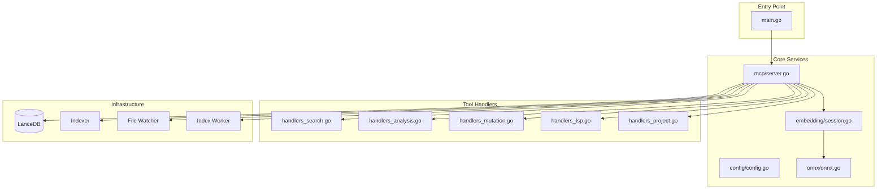
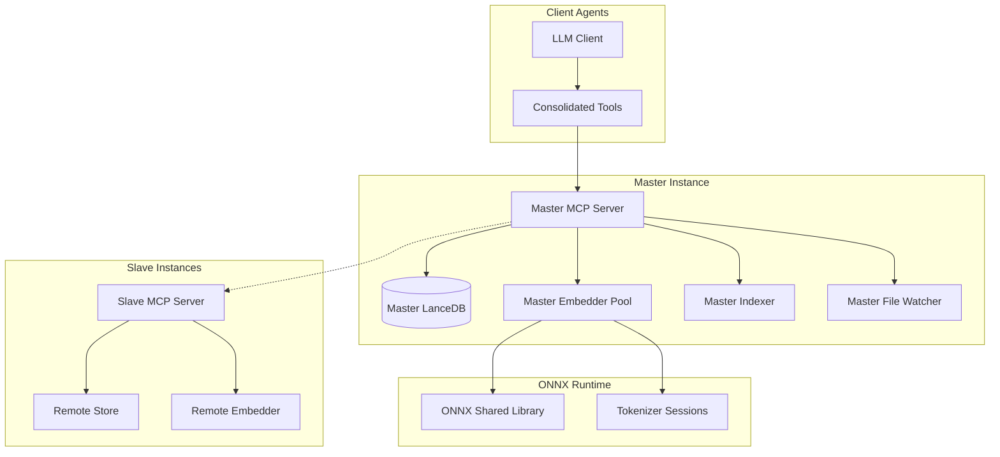
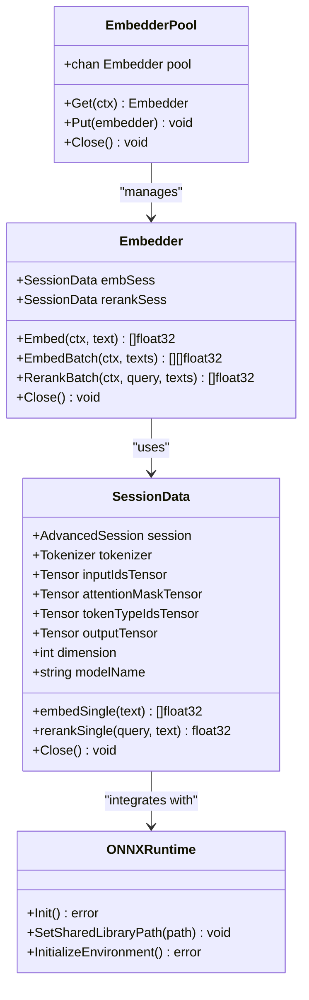
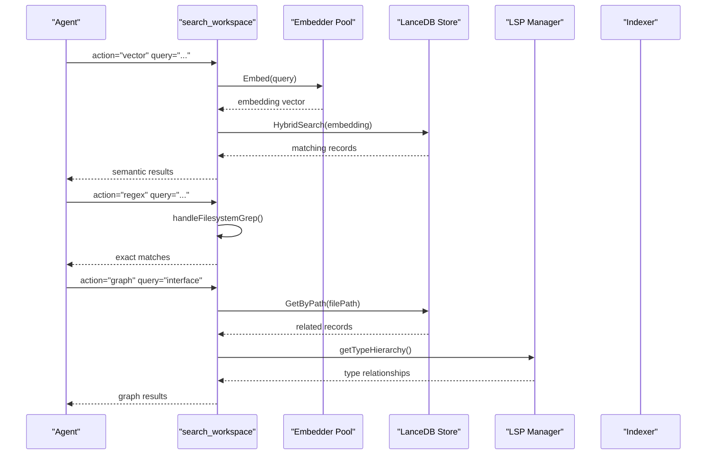
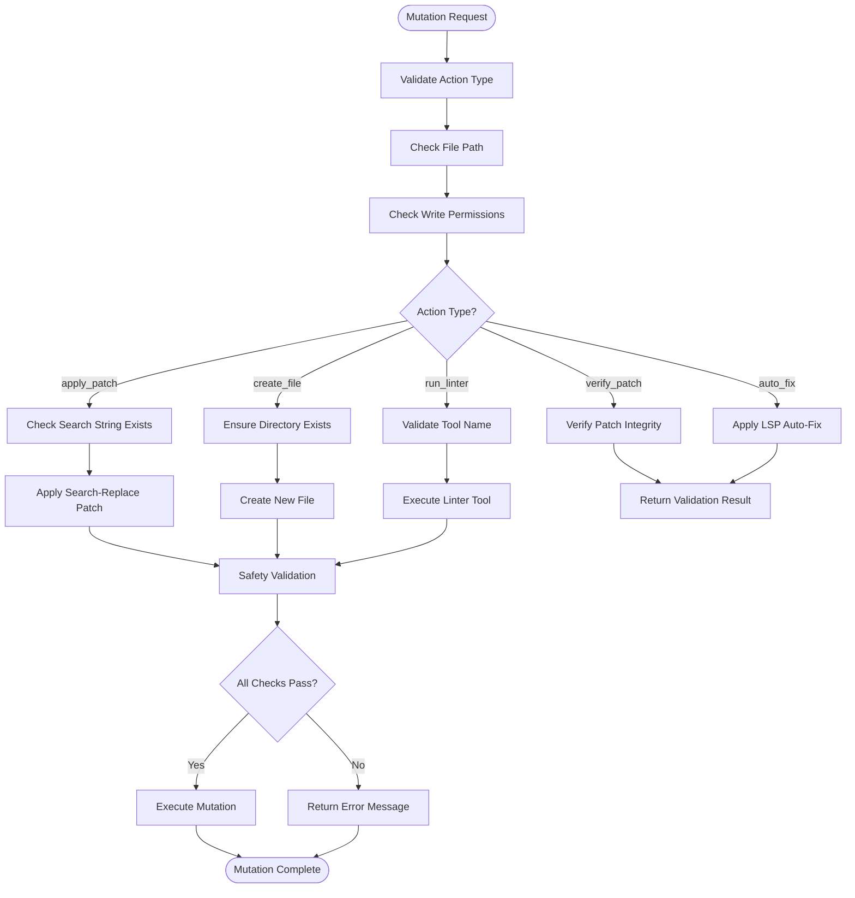
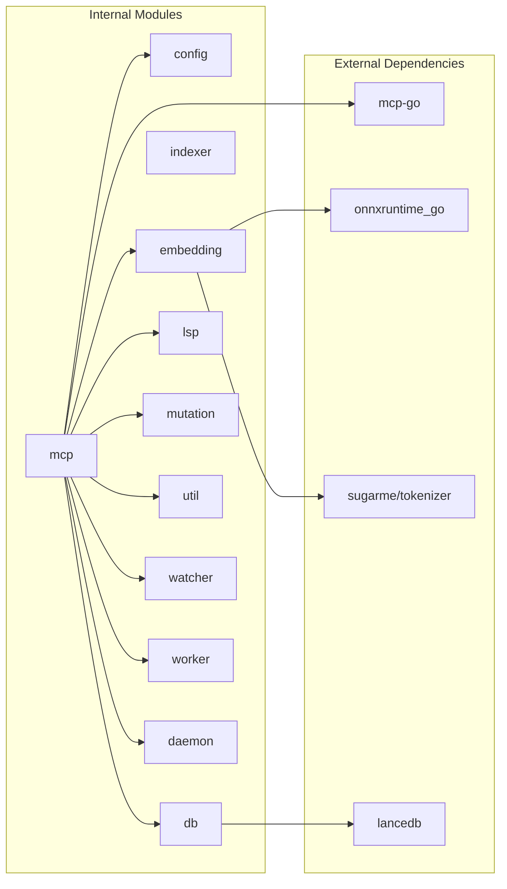

# Project Overview

<cite>
**Referenced Files in This Document**
- [README.md](file://README.md)
- [main.go](file://main.go)
- [internal/mcp/server.go](file://internal/mcp/server.go)
- [internal/mcp/handlers_search.go](file://internal/mcp/handlers_search.go)
- [internal/mcp/handlers_analysis.go](file://internal/mcp/handlers_analysis.go)
- [internal/mcp/handlers_mutation.go](file://internal/mcp/handlers_mutation.go)
- [internal/mcp/handlers_lsp.go](file://internal/mcp/handlers_lsp.go)
- [internal/mcp/handlers_project.go](file://internal/mcp/handlers_project.go)
- [internal/config/config.go](file://internal/config/config.go)
- [internal/embedding/session.go](file://internal/embedding/session.go)
- [internal/onnx/onnx.go](file://internal/onnx/onnx.go)
- [AGENTS.md](file://AGENTS.md)
- [mcp-config.json.example](file://mcp-config.json.example)
</cite>

## Table of Contents
1. [Introduction](#introduction)
2. [Project Structure](#project-structure)
3. [Core Components](#core-components)
4. [Architecture Overview](#architecture-overview)
5. [Detailed Component Analysis](#detailed-component-analysis)
6. [Dependency Analysis](#dependency-analysis)
7. [Performance Considerations](#performance-considerations)
8. [Troubleshooting Guide](#troubleshooting-guide)
9. [Conclusion](#conclusion)

## Introduction
Vector MCP Go is a high-performance, purely deterministic Model Context Protocol (MCP) server written in Go. It provides advanced semantic search, architectural analysis, and codebase mutation capabilities directly to your LLM agent. The server operates 100% deterministically, relying exclusively on the client LLM for generative reasoning while delivering precise, repeatable tooling for code exploration and safe modifications.

Key differentiators:
- Deterministic operation without external API calls
- Local ONNX embeddings using the bge-m3 model for privacy-preserving semantic understanding
- Five consolidated MCP tools following the "Fat Tool" pattern to reduce fragmentation and improve tool selection accuracy
- Privacy-first design with no cloud dependencies
- High-performance indexing and search powered by vector databases

## Project Structure
The project follows a layered architecture with clear separation of concerns:

**Diagram sources**
- [main.go:1-349](file://main.go#L1-L349)
- [internal/mcp/server.go:1-459](file://internal/mcp/server.go#L1-L459)

**Section sources**
- [README.md:1-40](file://README.md#L1-L40)
- [main.go:1-349](file://main.go#L1-L349)

## Core Components
The server implements five consolidated MCP tools that embody the "Fat Tool" pattern:

### 1. search_workspace (Unified Search Engine)
Routes across semantic vector search, exact text/regex matching, code relationship graph traversal, and indexing state monitoring. This single tool consolidates four distinct search modalities into one cohesive interface.

### 2. lsp_query (Deep Language Server Integration)
Provides precise absolute references, type hierarchies, definitions, and impact blast-radius analysis through Language Server Protocol integration. Supports multiple programming languages with automatic session management.

### 3. analyze_code (Fast Codebase Diagnostics)
Delivers AST-based structural skeletons, dead code detection, duplication analysis, and manifest validation for dependency health assessment. Combines lexical and semantic analysis for comprehensive code quality insights.

### 4. workspace_manager (Project Lifecycle Control)
Centralizes workspace lifecycle operations including project root switching, specialized indexing triggers, and detailed system diagnostics. Simplifies project management through unified command interface.

### 5. modify_workspace (Safe File Mutations)
Offers guarded workspace mutations with code patching, file creation, linting, and LSP-driven patch verification. Ensures safe iterative development through integrity checks and automated validation.

**Section sources**
- [README.md:11-19](file://README.md#L11-L19)
- [internal/mcp/server.go:323-407](file://internal/mcp/server.go#L323-L407)

## Architecture Overview
Vector MCP Go employs a master-slave architecture with distributed capabilities:

**Diagram sources**
- [main.go:93-176](file://main.go#L93-L176)
- [internal/mcp/server.go:86-117](file://internal/mcp/server.go#L86-L117)

The architecture ensures deterministic operation by:
- Centralizing embedding computation in master instances
- Providing remote access to slave instances for distributed workloads
- Maintaining consistent state through shared vector databases
- Enforcing strict tool registration and parameter validation

**Section sources**
- [main.go:93-176](file://main.go#L93-L176)
- [internal/mcp/server.go:86-117](file://internal/mcp/server.go#L86-L117)

## Detailed Component Analysis

### Embedding Engine and ONNX Runtime
The system uses local ONNX embeddings via the bge-m3 model for privacy-preserving semantic understanding:

**Diagram sources**
- [internal/embedding/session.go:29-85](file://internal/embedding/session.go#L29-L85)
- [internal/embedding/session.go:87-174](file://internal/embedding/session.go#L87-L174)
- [internal/onnx/onnx.go:12-43](file://internal/onnx/onnx.go#L12-L43)

The embedding system provides:
- Thread-safe embedder pooling for concurrent operations
- Automatic model loading and initialization
- Cross-encoder reranking for improved search precision
- Deterministic tokenization and normalization
- Memory-efficient tensor management

**Section sources**
- [internal/embedding/session.go:29-85](file://internal/embedding/session.go#L29-L85)
- [internal/onnx/onnx.go:12-43](file://internal/onnx/onnx.go#L12-L43)

### Search Workflow Implementation
The unified search tool demonstrates the "Fat Tool" pattern through coordinated workflows:

**Diagram sources**
- [internal/mcp/handlers_search.go:315-365](file://internal/mcp/handlers_search.go#L315-L365)
- [internal/mcp/handlers_search.go:191-313](file://internal/mcp/handlers_search.go#L191-L313)

**Section sources**
- [internal/mcp/handlers_search.go:315-365](file://internal/mcp/handlers_search.go#L315-L365)
- [internal/mcp/handlers_search.go:191-313](file://internal/mcp/handlers_search.go#L191-L313)

### Mutation Safety and Validation
The modify_workspace tool implements comprehensive safety checks:

**Diagram sources**
- [internal/mcp/handlers_mutation.go:93-153](file://internal/mcp/handlers_mutation.go#L93-L153)

**Section sources**
- [internal/mcp/handlers_mutation.go:93-153](file://internal/mcp/handlers_mutation.go#L93-L153)

## Dependency Analysis
The project maintains loose coupling through well-defined interfaces and dependency injection:

**Diagram sources**
- [internal/mcp/server.go:8-26](file://internal/mcp/server.go#L8-L26)
- [main.go:3-29](file://main.go#L3-L29)

**Section sources**
- [internal/mcp/server.go:8-26](file://internal/mcp/server.go#L8-L26)
- [main.go:3-29](file://main.go#L3-L29)

## Performance Considerations
Vector MCP Go is optimized for high-performance codebase operations:

### Memory Management
- Embedder pooling prevents repeated model initialization overhead
- Thread-safe progress tracking minimizes contention
- Memory throttling prevents system resource exhaustion
- Efficient tensor reuse reduces allocation pressure

### Concurrency Patterns
- Worker-based indexing with configurable pool sizes
- Parallel file scanning with worker pools
- Concurrent embedding operations through pool management
- Asynchronous indexing with progress reporting

### Storage Optimization
- LanceDB vector storage with efficient indexing
- Semantic caching for frequently accessed results
- Intelligent pruning of ignored directories and files
- Batch operations for reduced I/O overhead

**Section sources**
- [internal/mcp/server.go:67-70](file://internal/mcp/server.go#L67-L70)
- [internal/config/config.go:103-108](file://internal/config/config.go#L103-L108)

## Troubleshooting Guide

### Common Issues and Solutions

**ONNX Runtime Initialization Failures**
- Verify ONNX shared library path is correctly configured
- Ensure compatible ONNX runtime version is installed
- Check library permissions and accessibility

**Embedding Model Loading Problems**
- Confirm model files exist in the expected directory
- Verify tokenizer configuration matches model requirements
- Check model dimension compatibility

**Memory and Performance Issues**
- Adjust embedder pool size based on available resources
- Monitor memory usage through throttler configuration
- Optimize indexing parameters for large codebases

**Section sources**
- [internal/onnx/onnx.go:12-43](file://internal/onnx/onnx.go#L12-L43)
- [internal/config/config.go:103-108](file://internal/config/config.go#L103-L108)

## Conclusion
Vector MCP Go represents a sophisticated approach to AI-assisted development, combining high-performance vector search with deterministic, privacy-preserving operations. The five consolidated MCP tools, following the "Fat Tool" pattern, provide comprehensive codebase exploration and modification capabilities while maintaining strict determinism and privacy guarantees.

The project's strength lies in its balanced architecture that prioritizes:
- Deterministic, repeatable operations without external dependencies
- High-performance semantic search through local ONNX embeddings
- Comprehensive code analysis and mutation safety
- Privacy-first design with no cloud data transmission
- Scalable architecture supporting both single-instance and distributed deployments

This positioning makes it ideal for AI-assisted development workflows where reliability, privacy, and performance are paramount considerations.