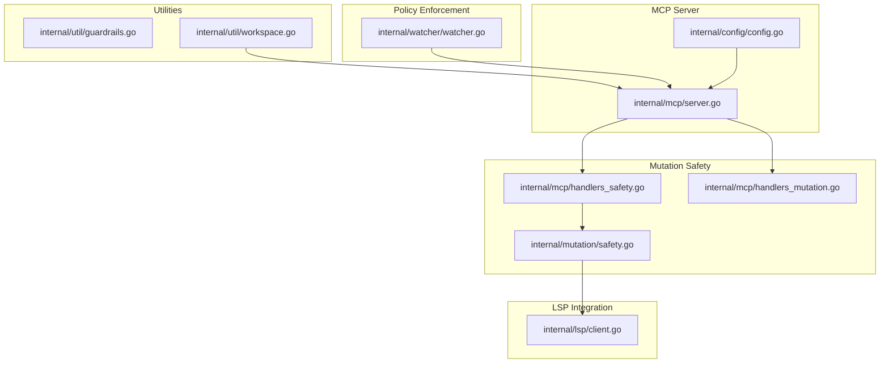
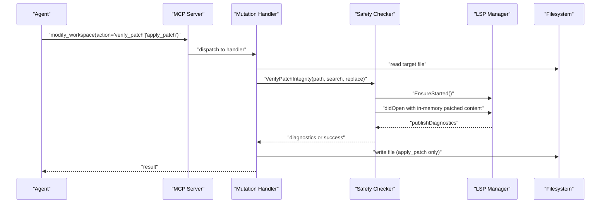
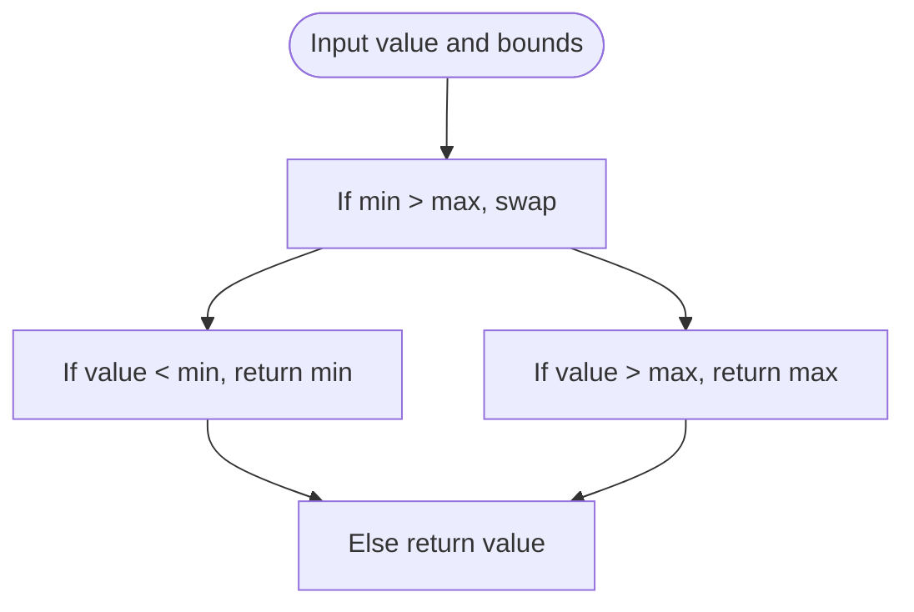
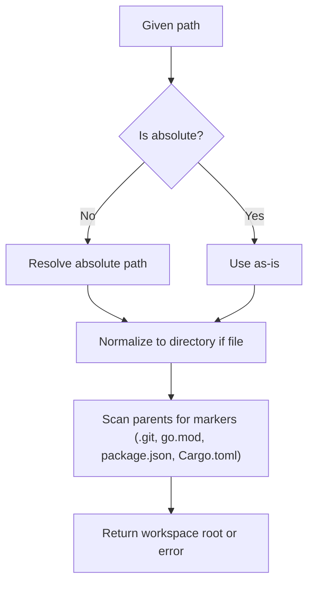
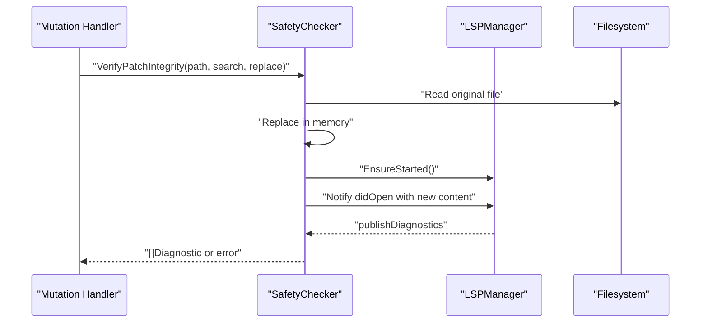
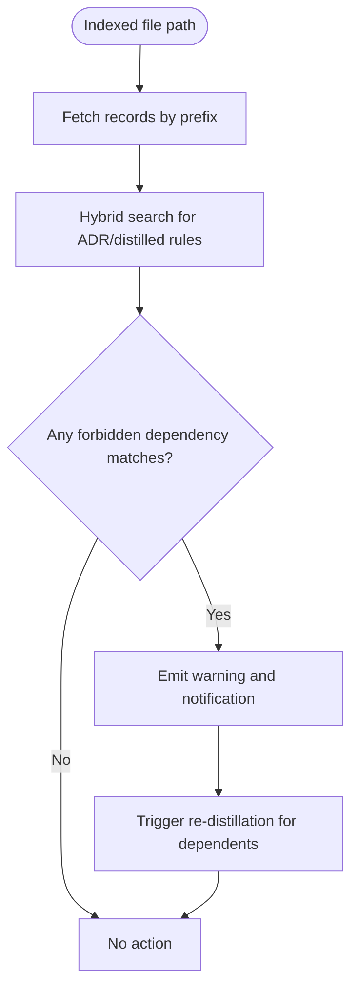
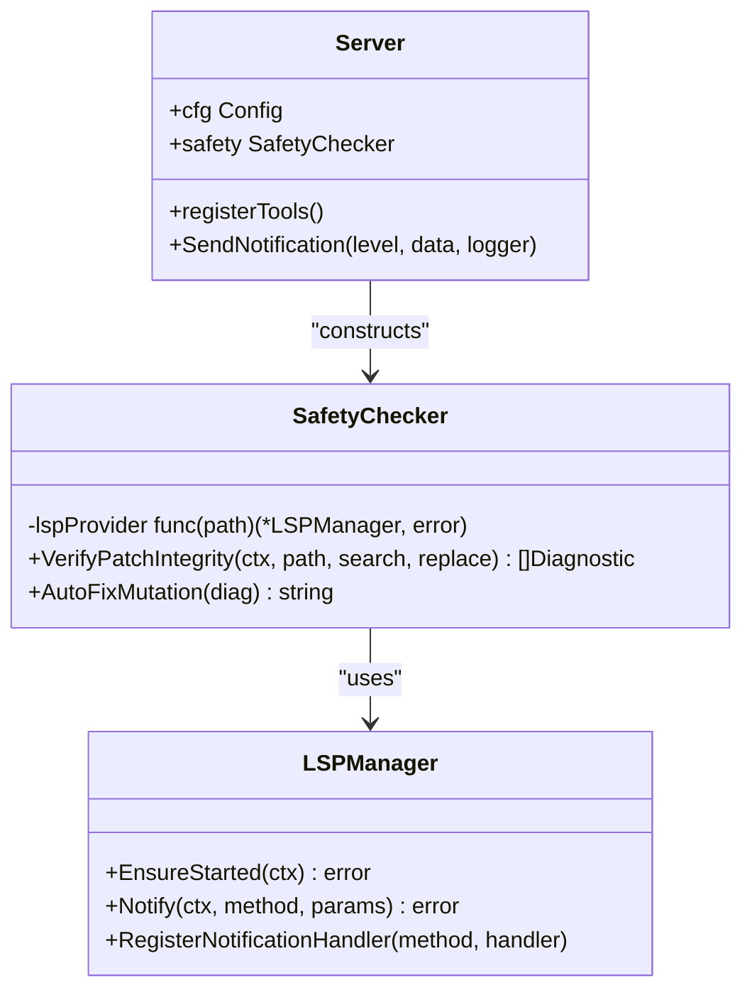
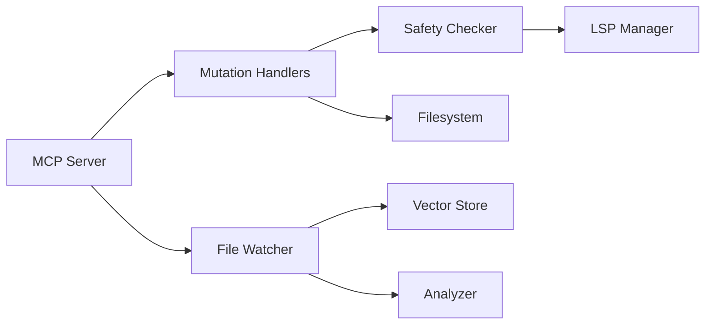

# Architectural Guardrails and Policy Enforcement

<cite>
**Referenced Files in This Document**
- [guardrails.go](file://internal/util/guardrails.go)
- [guardrails_test.go](file://internal/util/guardrails_test.go)
- [workspace.go](file://internal/util/workspace.go)
- [safety.go](file://internal/mutation/safety.go)
- [handlers_safety.go](file://internal/mcp/handlers_safety.go)
- [handlers_mutation.go](file://internal/mcp/handlers_mutation.go)
- [client.go](file://internal/lsp/client.go)
- [watcher.go](file://internal/watcher/watcher.go)
- [server.go](file://internal/mcp/server.go)
- [config.go](file://internal/config/config.go)
- [main.go](file://main.go)
- [mcp-config.json.example](file://mcp-config.json.example)
</cite>

## Table of Contents
1. [Introduction](#introduction)
2. [Project Structure](#project-structure)
3. [Core Components](#core-components)
4. [Architecture Overview](#architecture-overview)
5. [Detailed Component Analysis](#detailed-component-analysis)
6. [Dependency Analysis](#dependency-analysis)
7. [Performance Considerations](#performance-considerations)
8. [Troubleshooting Guide](#troubleshooting-guide)
9. [Conclusion](#conclusion)
10. [Appendices](#appendices)

## Introduction
This document explains the architectural guardrails and policy enforcement systems in Vector MCP Go. It focuses on:
- Preventing unsafe file operations and enforcing path validation
- Mutation safety via pre-flight integrity checks powered by the Language Server Protocol (LSP)
- Policy enforcement algorithms grounded in semantic indexing and proactive analysis
- Security considerations, audit trail generation, and compliance monitoring
- Practical examples of guarded operations, policy violations, and custom guardrail development

## Project Structure
Vector MCP Go organizes guardrails across utility helpers, MCP tool handlers, LSP integration, and file watching. Key areas:
- Utility guardrails: clampers and safe string truncation
- Workspace root resolution and path normalization
- Mutation safety: in-memory patch verification and diagnostics
- File watcher: proactive architectural compliance checks and re-distillation
- MCP server: tool registration and safety-integrated mutation workflows

**Diagram sources**
- [server.go:1-459](file://internal/mcp/server.go#L1-L459)
- [handlers_safety.go:1-59](file://internal/mcp/handlers_safety.go#L1-L59)
- [safety.go:1-126](file://internal/mutation/safety.go#L1-L126)
- [client.go:1-355](file://internal/lsp/client.go#L1-L355)
- [handlers_mutation.go:1-154](file://internal/mcp/handlers_mutation.go#L1-L154)
- [watcher.go:1-281](file://internal/watcher/watcher.go#L1-L281)
- [workspace.go:1-46](file://internal/util/workspace.go#L1-L46)
- [guardrails.go:1-61](file://internal/util/guardrails.go#L1-L61)
- [config.go:1-139](file://internal/config/config.go#L1-L139)

**Section sources**
- [server.go:1-459](file://internal/mcp/server.go#L1-L459)
- [config.go:1-139](file://internal/config/config.go#L1-L139)

## Core Components
- Utility guardrails: clamp numeric values and safely truncate strings to rune boundaries to avoid UTF-8 corruption
- Workspace root resolution: finds project roots using markers (.git, go.mod, etc.) and normalizes paths
- Mutation safety: verifies patches without persisting changes by temporarily applying them in memory and requesting LSP diagnostics
- File watcher guardrails: detects architectural violations by searching stored ADRs/distilled summaries and warns on forbidden dependencies
- MCP server: orchestrates tools, enforces path constraints, and integrates safety checks into mutation workflows

**Section sources**
- [guardrails.go:1-61](file://internal/util/guardrails.go#L1-L61)
- [workspace.go:1-46](file://internal/util/workspace.go#L1-L46)
- [safety.go:1-126](file://internal/mutation/safety.go#L1-L126)
- [handlers_safety.go:1-59](file://internal/mcp/handlers_safety.go#L1-L59)
- [handlers_mutation.go:1-154](file://internal/mcp/handlers_mutation.go#L1-L154)
- [watcher.go:198-244](file://internal/watcher/watcher.go#L198-L244)

## Architecture Overview
The system enforces safety and policy through layered checks:
- Path validation: absolute path construction under the configured project root
- Mutation safety: LSP-backed integrity verification before applying changes
- Policy enforcement: semantic search over stored ADRs and distilled knowledge to detect violations
- Audit and notifications: warnings surfaced to clients and logged for compliance monitoring

**Diagram sources**
- [handlers_mutation.go:93-154](file://internal/mcp/handlers_mutation.go#L93-L154)
- [safety.go:42-114](file://internal/mutation/safety.go#L42-L114)
- [client.go:66-117](file://internal/lsp/client.go#L66-L117)

## Detailed Component Analysis

### Utility Guardrails
- Clamp helpers: clampInt, clampInt64, clampFloat64 ensure numeric values remain within inclusive bounds, swapping min/max when needed
- Safe truncation: truncateRuneSafe prevents UTF-8 corruption by counting runes instead of bytes

**Diagram sources**
- [guardrails.go:3-46](file://internal/util/guardrails.go#L3-L46)

**Section sources**
- [guardrails.go:1-61](file://internal/util/guardrails.go#L1-L61)
- [guardrails_test.go:1-107](file://internal/util/guardrails_test.go#L1-L107)

### Path Validation and Workspace Root Resolution
- Absolute path construction: mutation handlers join relative paths to the configured project root
- Workspace root discovery: FindWorkspaceRoot traverses upward from a file path to locate project markers

**Diagram sources**
- [handlers_mutation.go:75-84](file://internal/mcp/handlers_mutation.go#L75-L84)
- [workspace.go:9-45](file://internal/util/workspace.go#L9-L45)

**Section sources**
- [handlers_mutation.go:13-91](file://internal/mcp/handlers_mutation.go#L13-L91)
- [workspace.go:1-46](file://internal/util/workspace.go#L1-L46)

### Mutation Safety and Integrity Checks
- In-memory patch verification: the SafetyChecker reads the file, applies the replacement in memory, and triggers an LSP didOpen with the modified content
- Diagnostics capture: publishes diagnostics for compiler errors/warnings; a timeout or context cancellation is handled gracefully
- Fix suggestions: AutoFixMutation provides a human-readable suggestion based on diagnostic severity

**Diagram sources**
- [safety.go:42-114](file://internal/mutation/safety.go#L42-L114)
- [client.go:66-117](file://internal/lsp/client.go#L66-L117)

**Section sources**
- [safety.go:1-126](file://internal/mutation/safety.go#L1-L126)
- [handlers_safety.go:13-58](file://internal/mcp/handlers_safety.go#L13-L58)
- [client.go:1-355](file://internal/lsp/client.go#L1-L355)

### Policy Enforcement via File Watcher
- Architectural compliance: after indexing, the watcher searches for stored ADRs and distilled summaries and compares discovered dependencies against rules
- Violation detection: heuristically matches rule content for forbidden packages and emits warnings
- Autonomous re-distillation: triggers re-distillation for dependent packages to keep architectural knowledge fresh

**Diagram sources**
- [watcher.go:198-244](file://internal/watcher/watcher.go#L198-L244)

**Section sources**
- [watcher.go:198-244](file://internal/watcher/watcher.go#L198-L244)

### MCP Server Integration and Tool Registration
- SafetyChecker initialization: the MCP server constructs a SafetyChecker with an LSP provider bound to the server’s session management
- Tool registration: mutation tools are unified under modify_workspace with actions for apply_patch, create_file, run_linter, verify_patch, and auto_fix
- Notifications: warnings and informational messages are broadcast to clients for auditability

**Diagram sources**
- [server.go:66-117](file://internal/mcp/server.go#L66-L117)
- [safety.go:34-40](file://internal/mutation/safety.go#L34-L40)
- [client.go:36-64](file://internal/lsp/client.go#L36-L64)

**Section sources**
- [server.go:107-111](file://internal/mcp/server.go#L107-L111)
- [server.go:324-407](file://internal/mcp/server.go#L324-L407)

## Dependency Analysis
- Coupling: mutation safety depends on LSP lifecycle management; the MCP server composes SafetyChecker and delegates LSP sessions per file
- Cohesion: path validation and workspace root resolution are cohesive utilities used by mutation handlers
- External dependencies: LSP server commands, filesystem operations, and vector store hybrid search

**Diagram sources**
- [handlers_mutation.go:93-154](file://internal/mcp/handlers_mutation.go#L93-L154)
- [safety.go:42-114](file://internal/mutation/safety.go#L42-L114)
- [client.go:66-117](file://internal/lsp/client.go#L66-L117)
- [watcher.go:198-244](file://internal/watcher/watcher.go#L198-L244)

**Section sources**
- [handlers_mutation.go:1-154](file://internal/mcp/handlers_mutation.go#L1-L154)
- [safety.go:1-126](file://internal/mutation/safety.go#L1-L126)
- [client.go:1-355](file://internal/lsp/client.go#L1-L355)
- [watcher.go:1-281](file://internal/watcher/watcher.go#L1-L281)

## Performance Considerations
- LSP startup and memory throttling: LSPManager checks memory pressure before starting language servers and cleans up idle sessions
- Timeout-bound diagnostics: mutation safety waits up to a fixed duration for diagnostics to avoid blocking
- Debounced file watching: the watcher coalesces events to reduce redundant indexing and policy checks

**Section sources**
- [client.go:66-117](file://internal/lsp/client.go#L66-L117)
- [safety.go:105-113](file://internal/mutation/safety.go#L105-L113)
- [watcher.go:121-139](file://internal/watcher/watcher.go#L121-L139)

## Troubleshooting Guide
Common issues and mitigations:
- LSP not configured for extension: ensure LanguageServerMapping includes the file extension; otherwise, mutation safety cannot be performed
- Search string not found: the patch application requires the search term to exist in the file
- Timeout waiting for diagnostics: increase tolerance or reduce workspace size; verify LSP availability
- Forbidden dependency violation: review stored ADRs/distilled summaries and adjust imports accordingly
- Path outside project root: ensure relative paths are resolved under the configured project root

Operational tips:
- Use verify_patch prior to apply_patch to catch regressions early
- Monitor MCP notifications for warnings and informational messages
- Confirm environment variables for model paths and ports are set appropriately

**Section sources**
- [handlers_safety.go:19-41](file://internal/mcp/handlers_safety.go#L19-L41)
- [handlers_mutation.go:19-43](file://internal/mcp/handlers_mutation.go#L19-L43)
- [watcher.go:233-243](file://internal/watcher/watcher.go#L233-L243)
- [client.go:31-34](file://internal/lsp/client.go#L31-L34)

## Conclusion
Vector MCP Go’s guardrails combine practical path validation, mutation safety via LSP diagnostics, and policy enforcement through semantic indexing and proactive watchers. Together, they constrain risky operations, surface violations early, and maintain architectural integrity while preserving auditability and compliance visibility.

## Appendices

### Policy Configuration Options
- Environment variables influence runtime behavior and resource locations:
  - DATA_DIR, MODELS_DIR, DB_PATH, LOG_PATH: control storage and logging
  - PROJECT_ROOT: establishes the base for path resolution
  - MODEL_NAME, RERANKER_MODEL_NAME: configure embedding models
  - DISABLE_FILE_WATCHER, ENABLE_LIVE_INDEXING: toggle indexing features
  - EMBEDDER_POOL_SIZE, API_PORT: tune performance and API exposure
  - HF_TOKEN: optional token for model downloads

These settings are loaded and normalized by the configuration loader and applied across the server and tools.

**Section sources**
- [config.go:30-130](file://internal/config/config.go#L30-L130)

### Guarded Operations and Examples
- Applying a patch:
  - Action: apply_patch
  - Inputs: path, search, replace
  - Behavior: reads file, replaces text, writes back
- Verifying a patch:
  - Action: verify_patch
  - Inputs: path, search, replace
  - Behavior: in-memory simulation and LSP diagnostics
- Creating a file:
  - Action: create_file
  - Inputs: path, content
  - Behavior: ensures directory exists, writes content
- Running a linter:
  - Action: run_linter
  - Inputs: path, tool
  - Behavior: currently supports go fmt (placeholder)

**Section sources**
- [handlers_mutation.go:13-91](file://internal/mcp/handlers_mutation.go#L13-L91)
- [handlers_mutation.go:93-154](file://internal/mcp/handlers_mutation.go#L93-L154)

### Policy Violations and Prevention
- Violation detection:
  - Forbidden dependency rule matching during indexing
  - Heuristic search for “No ... in ...” or “Forbidden: ...”
- Prevention strategies:
  - Enforce verify_patch before apply_patch
  - Use create_file for controlled content creation
  - Monitor MCP notifications for architectural alerts

**Section sources**
- [watcher.go:233-243](file://internal/watcher/watcher.go#L233-L243)
- [handlers_safety.go:23-41](file://internal/mcp/handlers_safety.go#L23-L41)

### Custom Guardrail Development
- Extend mutation safety:
  - Add new diagnostics-aware actions in the SafetyChecker
  - Integrate domain-specific analyzers via MCP tools
- Enhance policy enforcement:
  - Expand rule formats and heuristics in the watcher
  - Introduce stricter semantic matching for ADRs
- Improve auditability:
  - Emit structured logs and notifications for all guardrail decisions
  - Surface violations in MCP resources for client consumption

**Section sources**
- [safety.go:116-125](file://internal/mutation/safety.go#L116-L125)
- [watcher.go:198-244](file://internal/watcher/watcher.go#L198-L244)
- [server.go:409-429](file://internal/mcp/server.go#L409-L429)

### Security Considerations
- Least privilege: ensure file operations occur under the project root and validated by workspace root resolution
- Sandboxed checks: mutation safety avoids persistent writes by operating in memory and using LSP diagnostics
- Resource guards: LSPManager enforces memory pressure checks and TTL-based shutdown to prevent resource exhaustion
- Logging and notifications: structured logs and MCP notifications provide an audit trail for compliance monitoring

**Section sources**
- [client.go:76-117](file://internal/lsp/client.go#L76-L117)
- [handlers_mutation.go:75-84](file://internal/mcp/handlers_mutation.go#L75-L84)
- [server.go:409-429](file://internal/mcp/server.go#L409-L429)

### Compliance Monitoring Capabilities
- Notifications: warnings and informational messages are broadcast to clients for continuous monitoring
- Stored artifacts: ADRs and distilled summaries serve as canonical policy references
- Hybrid search: leverages semantic similarity to retrieve relevant rules for comparison

**Section sources**
- [watcher.go:237-239](file://internal/watcher/watcher.go#L237-L239)
- [watcher.go:210-214](file://internal/watcher/watcher.go#L210-L214)

### MCP Configuration Reference
- Example configuration shows how to launch the server as an MCP server with environment overrides

**Section sources**
- [mcp-config.json.example:1-12](file://mcp-config.json.example#L1-L12)