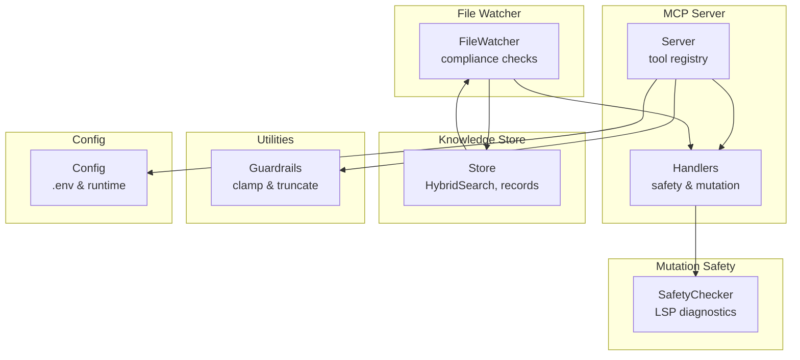
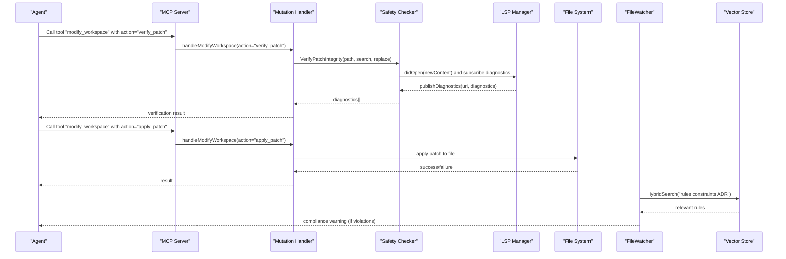
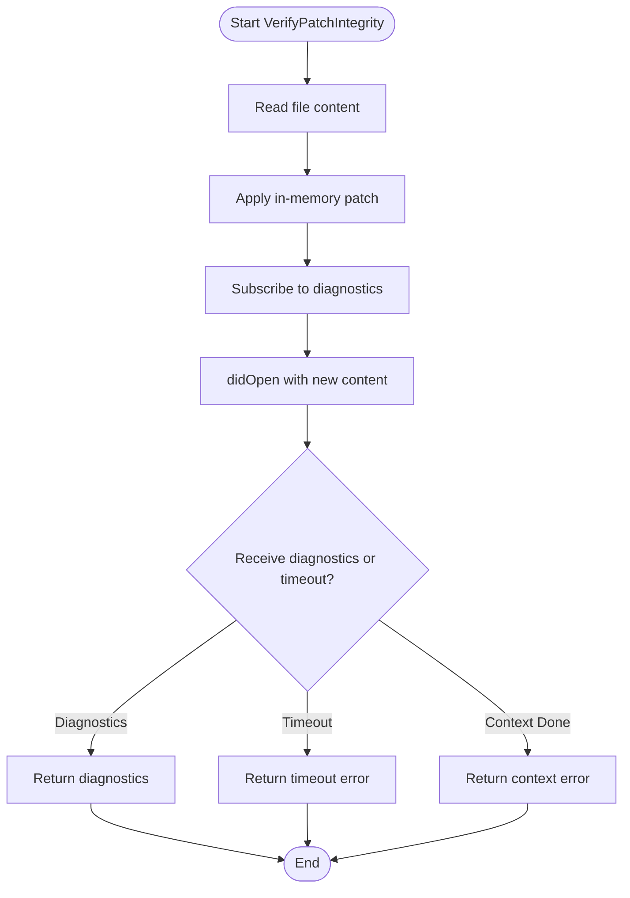
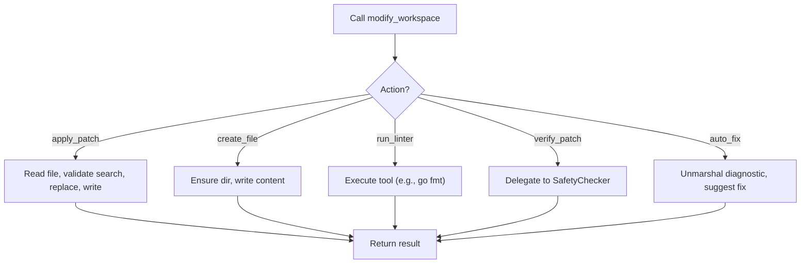
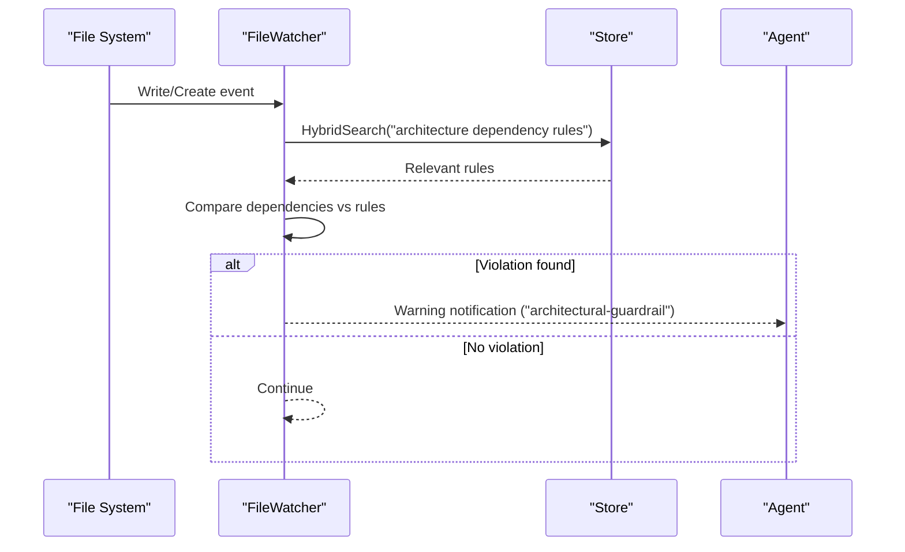
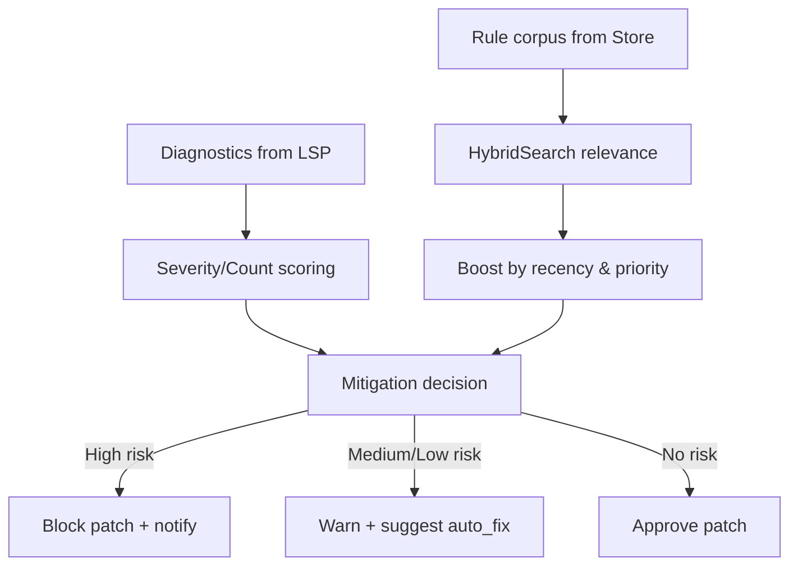
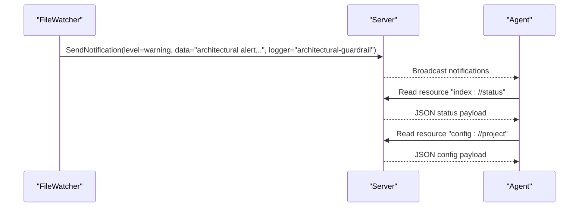
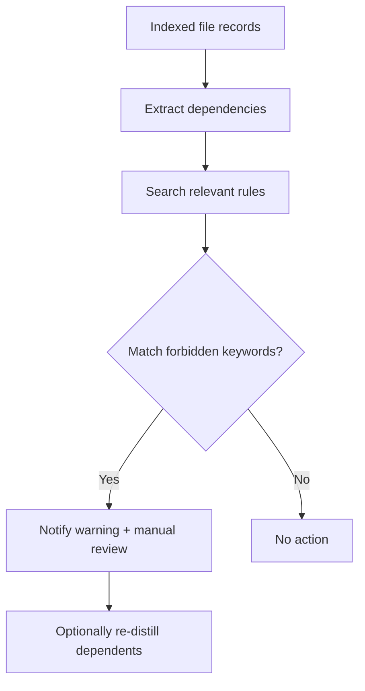
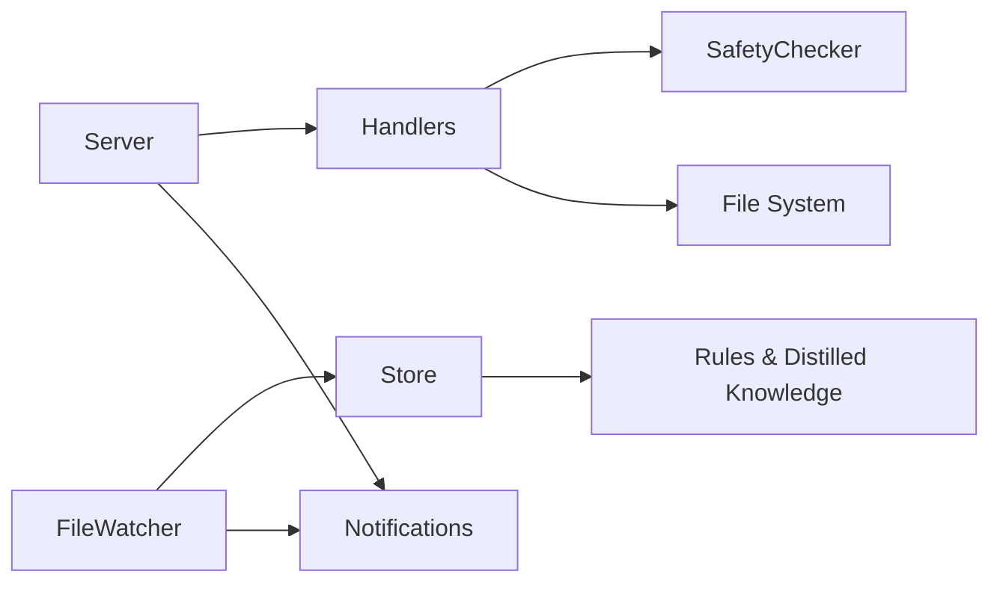

# Compliance Checking and Risk Assessment

<cite>
**Referenced Files in This Document**
- [README.md](file://README.md)
- [docs/technology-modernization-plan.md](file://docs/technology-modernization-plan.md)
- [internal/mcp/server.go](file://internal/mcp/server.go)
- [internal/mcp/handlers_safety.go](file://internal/mcp/handlers_safety.go)
- [internal/mcp/handlers_mutation.go](file://internal/mcp/handlers_mutation.go)
- [internal/mutation/safety.go](file://internal/mutation/safety.go)
- [internal/watcher/watcher.go](file://internal/watcher/watcher.go)
- [internal/db/store.go](file://internal/db/store.go)
- [internal/util/guardrails.go](file://internal/util/guardrails.go)
- [internal/config/config.go](file://internal/config/config.go)
- [mcp-config.json.example](file://mcp-config.json.example)
- [benchmark/retrieval_bench_test.go](file://benchmark/retrieval_bench_test.go)
- [benchmark/fixtures/polyglot/kpi_thresholds.json](file://benchmark/fixtures/polyglot/kpi_thresholds.json)
</cite>

## Table of Contents
1. [Introduction](#introduction)
2. [Project Structure](#project-structure)
3. [Core Components](#core-components)
4. [Architecture Overview](#architecture-overview)
5. [Detailed Component Analysis](#detailed-component-analysis)
6. [Dependency Analysis](#dependency-analysis)
7. [Performance Considerations](#performance-considerations)
8. [Troubleshooting Guide](#troubleshooting-guide)
9. [Conclusion](#conclusion)
10. [Appendices](#appendices)

## Introduction
This document describes the compliance checking and risk assessment systems in Vector MCP Go. It focuses on how code mutations are validated for safety, how compliance requirements are integrated with mutation workflows, and how risks are quantified and mitigated. It also documents the compliance reporting mechanisms, risk scoring algorithms, policy violation tracking, configuration options for thresholds, custom policy development, and audit trail requirements.

Vector MCP Go adopts a deterministic, local-first architecture with a “fat tool” pattern. Mutation safety is enforced through pre/post patch verification using the Language Server Protocol (LSP), while architectural and policy compliance is monitored proactively during file changes and re-indexing. Guardrails and KPIs ensure reliability and safety hardening.

## Project Structure
The compliance and risk assessment features span several modules:
- MCP server and tool registration
- Mutation safety checker and LSP integration
- File watcher for proactive compliance checks
- Vector store for retrieving rules and distilled knowledge
- Utility guardrails for safe parameter handling
- Configuration and environment controls
- Benchmarking and KPI thresholds for quality gates

**Diagram sources**
- [internal/mcp/server.go:86-117](file://internal/mcp/server.go#L86-L117)
- [internal/mcp/handlers_safety.go:13-59](file://internal/mcp/handlers_safety.go#L13-L59)
- [internal/mcp/handlers_mutation.go:93-154](file://internal/mcp/handlers_mutation.go#L93-L154)
- [internal/mutation/safety.go:33-126](file://internal/mutation/safety.go#L33-L126)
- [internal/watcher/watcher.go:198-244](file://internal/watcher/watcher.go#L198-L244)
- [internal/db/store.go:223-336](file://internal/db/store.go#L223-L336)
- [internal/util/guardrails.go:3-61](file://internal/util/guardrails.go#L3-L61)
- [internal/config/config.go:30-130](file://internal/config/config.go#L30-L130)

**Section sources**
- [README.md:1-40](file://README.md#L1-L40)
- [docs/technology-modernization-plan.md:65-107](file://docs/technology-modernization-plan.md#L65-L107)

## Core Components
- SafetyChecker: Verifies patch integrity using LSP diagnostics and provides auto-fix suggestions.
- Handlers for safety and mutation: Expose MCP tools for verifying patches and applying safe mutations.
- FileWatcher: Proactively enforces architectural compliance and triggers re-distillation.
- Store: Provides hybrid search to retrieve rules and distilled knowledge for policy checks.
- Guardrails: Clamp numeric parameters and truncate output safely to prevent abuse and encoding issues.
- Configuration: Loads environment variables and runtime settings affecting indexing, logging, and behavior.

**Section sources**
- [internal/mutation/safety.go:33-126](file://internal/mutation/safety.go#L33-L126)
- [internal/mcp/handlers_safety.go:13-59](file://internal/mcp/handlers_safety.go#L13-L59)
- [internal/mcp/handlers_mutation.go:93-154](file://internal/mcp/handlers_mutation.go#L93-L154)
- [internal/watcher/watcher.go:198-244](file://internal/watcher/watcher.go#L198-L244)
- [internal/db/store.go:223-336](file://internal/db/store.go#L223-L336)
- [internal/util/guardrails.go:3-61](file://internal/util/guardrails.go#L3-L61)
- [internal/config/config.go:30-130](file://internal/config/config.go#L30-L130)

## Architecture Overview
The compliance and risk assessment architecture integrates mutation safety with policy and architectural checks:

**Diagram sources**
- [internal/mcp/handlers_mutation.go:93-154](file://internal/mcp/handlers_mutation.go#L93-L154)
- [internal/mutation/safety.go:42-114](file://internal/mutation/safety.go#L42-L114)
- [internal/watcher/watcher.go:198-244](file://internal/watcher/watcher.go#L198-L244)
- [internal/db/store.go:223-336](file://internal/db/store.go#L223-L336)

## Detailed Component Analysis

### Mutation Safety Checker
The SafetyChecker performs a dry-run verification of a proposed search-and-replace patch by:
- Loading the file content
- Applying the patch in-memory
- Opening the modified content via LSP to collect diagnostics
- Returning diagnostics or timeouts/errors

**Diagram sources**
- [internal/mutation/safety.go:42-114](file://internal/mutation/safety.go#L42-L114)

**Section sources**
- [internal/mutation/safety.go:33-126](file://internal/mutation/safety.go#L33-L126)
- [internal/mcp/handlers_safety.go:13-59](file://internal/mcp/handlers_safety.go#L13-L59)

### Mutation Handlers
The modify_workspace tool consolidates mutation operations:
- apply_patch: Applies a search-and-replace patch after validating presence of the search string
- create_file: Creates a new file with provided content
- run_linter: Executes supported tools (e.g., go fmt)
- verify_patch: Delegates to SafetyChecker for integrity verification
- auto_fix: Generates a human-readable suggestion based on a diagnostic

**Diagram sources**
- [internal/mcp/handlers_mutation.go:93-154](file://internal/mcp/handlers_mutation.go#L93-L154)

**Section sources**
- [internal/mcp/handlers_mutation.go:93-154](file://internal/mcp/handlers_mutation.go#L93-L154)

### Architectural Compliance Checks
The FileWatcher enforces architectural guardrails:
- On file write/create, it re-indexes and checks for violations against stored rules
- It searches for relevant ADRs and distilled summaries using hybrid search
- It emits warnings and notifications when forbidden dependencies are detected

**Diagram sources**
- [internal/watcher/watcher.go:198-244](file://internal/watcher/watcher.go#L198-L244)
- [internal/db/store.go:223-336](file://internal/db/store.go#L223-L336)

**Section sources**
- [internal/watcher/watcher.go:198-244](file://internal/watcher/watcher.go#L198-L244)

### Risk Scoring and Mitigation Algorithms
Risk is assessed through:
- Diagnostic severity and counts from LSP
- Forbidden dependency detection via keyword matching in rules
- Hybrid search boosting and recency factors for rule relevance

Risk scoring is conceptual:
- Quantitative risk = f(severity, count, recency_boost, lexical_weight)
- Mitigations:
  - Block patch application until diagnostics are resolved
  - Suggest auto-fix messages derived from diagnostics
  - Warn on architectural violations and require manual review

**Diagram sources**
- [internal/mutation/safety.go:116-126](file://internal/mutation/safety.go#L116-L126)
- [internal/watcher/watcher.go:210-243](file://internal/watcher/watcher.go#L210-L243)
- [internal/db/store.go:254-336](file://internal/db/store.go#L254-L336)

**Section sources**
- [internal/mutation/safety.go:116-126](file://internal/mutation/safety.go#L116-L126)
- [internal/watcher/watcher.go:210-243](file://internal/watcher/watcher.go#L210-L243)
- [internal/db/store.go:254-336](file://internal/db/store.go#L254-L336)

### Compliance Reporting and Audit Trail
- Notifications: The server emits structured notifications for warnings and informational events, enabling audit trails for compliance actions.
- Logging: Structured logs are configured with JSON output and file rotation.
- Status resource: index status and configuration resources expose runtime state for observability.

**Diagram sources**
- [internal/watcher/watcher.go:237-240](file://internal/watcher/watcher.go#L237-L240)
- [internal/mcp/server.go:196-240](file://internal/mcp/server.go#L196-L240)

**Section sources**
- [internal/mcp/server.go:196-240](file://internal/mcp/server.go#L196-L240)
- [internal/config/config.go:71-81](file://internal/config/config.go#L71-L81)

### Policy Violation Tracking
- Violations are detected by matching rule keywords against discovered dependencies.
- Violations trigger warnings and notifications; manual review is recommended.
- Dependent packages may be automatically re-distilled to keep policy knowledge fresh.

**Diagram sources**
- [internal/watcher/watcher.go:210-243](file://internal/watcher/watcher.go#L210-L243)

**Section sources**
- [internal/watcher/watcher.go:210-243](file://internal/watcher/watcher.go#L210-L243)

### Automated Remediation Processes
- Auto-fix suggestions are generated from diagnostics to guide corrections.
- LSP-driven diagnostics inform safe patch application and help resolve type mismatches and missing imports.

**Section sources**
- [internal/mutation/safety.go:116-126](file://internal/mutation/safety.go#L116-L126)
- [internal/mcp/handlers_safety.go:44-58](file://internal/mcp/handlers_safety.go#L44-L58)

### Configuration Options for Compliance Thresholds and Policies
- Environment variables control runtime behavior (data directories, model names, watchers, ports).
- KPI thresholds define quality gates for retrieval performance, ensuring regressions are caught early.
- Numeric clamping and rune-safe truncation provide guardrails for safe parameter handling and output limits.

**Section sources**
- [internal/config/config.go:30-130](file://internal/config/config.go#L30-L130)
- [benchmark/retrieval_bench_test.go:70-90](file://benchmark/retrieval_bench_test.go#L70-L90)
- [benchmark/fixtures/polyglot/kpi_thresholds.json:1-5](file://benchmark/fixtures/polyglot/kpi_thresholds.json#L1-L5)
- [internal/util/guardrails.go:3-61](file://internal/util/guardrails.go#L3-L61)

### Custom Policy Development
- Store custom policies and architectural decisions as context entries.
- Retrieve and combine with hybrid search to enforce policies during mutation and file changes.
- Extend rule keywords and heuristics in the watcher’s compliance checks.

**Section sources**
- [internal/db/store.go:223-336](file://internal/db/store.go#L223-L336)
- [internal/watcher/watcher.go:210-243](file://internal/watcher/watcher.go#L210-L243)

## Dependency Analysis
The compliance subsystem exhibits low coupling and high cohesion:
- Server composes SafetyChecker and delegates to handlers
- Handlers depend on SafetyChecker and file system operations
- FileWatcher depends on Store for rule retrieval and emits notifications
- Store provides hybrid search and record management

**Diagram sources**
- [internal/mcp/server.go:86-117](file://internal/mcp/server.go#L86-L117)
- [internal/mcp/handlers_mutation.go:93-154](file://internal/mcp/handlers_mutation.go#L93-L154)
- [internal/mutation/safety.go:33-126](file://internal/mutation/safety.go#L33-L126)
- [internal/watcher/watcher.go:198-244](file://internal/watcher/watcher.go#L198-L244)
- [internal/db/store.go:223-336](file://internal/db/store.go#L223-L336)

**Section sources**
- [internal/mcp/server.go:86-117](file://internal/mcp/server.go#L86-L117)
- [internal/mcp/handlers_mutation.go:93-154](file://internal/mcp/handlers_mutation.go#L93-L154)
- [internal/mutation/safety.go:33-126](file://internal/mutation/safety.go#L33-L126)
- [internal/watcher/watcher.go:198-244](file://internal/watcher/watcher.go#L198-L244)
- [internal/db/store.go:223-336](file://internal/db/store.go#L223-L336)

## Performance Considerations
- LSP diagnostics are collected asynchronously with timeouts to avoid blocking.
- Hybrid search uses concurrent vector and lexical retrieval with reciprocal rank fusion and dynamic weighting.
- Guardrails prevent excessive resource usage via clamping and truncation.
- KPI thresholds and benchmarks ensure performance regressions are detected early.

[No sources needed since this section provides general guidance]

## Troubleshooting Guide
Common issues and resolutions:
- LSP provider not configured: Ensure environment and session initialization are correct.
- Timeout waiting for diagnostics: Increase timeout or reduce workspace size; verify LSP server availability.
- Search string not found: Confirm the search term exists in the file content.
- Forbidden dependency detected: Review the emitted warning and adjust imports or policy rules.
- Permission errors on file writes: Verify file permissions and path resolution.

**Section sources**
- [internal/mutation/safety.go:42-114](file://internal/mutation/safety.go#L42-L114)
- [internal/mcp/handlers_mutation.go:13-44](file://internal/mcp/handlers_mutation.go#L13-L44)
- [internal/watcher/watcher.go:234-240](file://internal/watcher/watcher.go#L234-L240)

## Conclusion
Vector MCP Go’s compliance and risk assessment system combines deterministic mutation safety with proactive architectural and policy checks. By integrating LSP diagnostics, hybrid search over stored rules, and guardrails, it provides quantifiable risk signals and automated remediation pathways. Configuration and KPI thresholds ensure consistent behavior and performance, while notifications and resources deliver audit-ready compliance reporting.

[No sources needed since this section summarizes without analyzing specific files]

## Appendices

### Compliance Scenarios and Workflows
- Scenario A: Apply a patch to a Go file
  - Action: verify_patch → apply_patch
  - Outcome: diagnostics reviewed; patch applied only if no errors
- Scenario B: Add a new file
  - Action: create_file
  - Outcome: file created under project root; re-index triggered
- Scenario C: Architectural violation detected
  - Action: FileWatcher detects forbidden dependency
  - Outcome: Warning notification and manual review required

**Section sources**
- [internal/mcp/handlers_mutation.go:93-154](file://internal/mcp/handlers_mutation.go#L93-L154)
- [internal/mutation/safety.go:42-114](file://internal/mutation/safety.go#L42-L114)
- [internal/watcher/watcher.go:234-240](file://internal/watcher/watcher.go#L234-L240)

### Configuration Reference
- Environment variables:
  - DATA_DIR, DB_PATH, MODELS_DIR, LOG_PATH, PROJECT_ROOT
  - MODEL_NAME, RERANKER_MODEL_NAME, HF_TOKEN
  - DISABLE_FILE_WATCHER, ENABLE_LIVE_INDEXING
  - EMBEDDER_POOL_SIZE, API_PORT
- Example MCP server configuration for runtime environment variables

**Section sources**
- [internal/config/config.go:30-130](file://internal/config/config.go#L30-L130)
- [mcp-config.json.example:1-12](file://mcp-config.json.example#L1-L12)