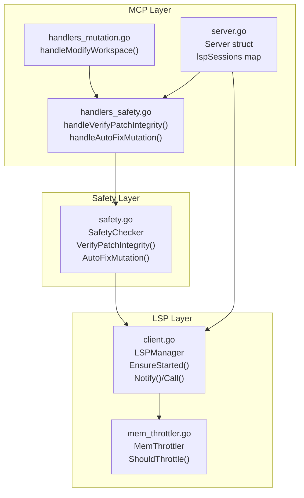
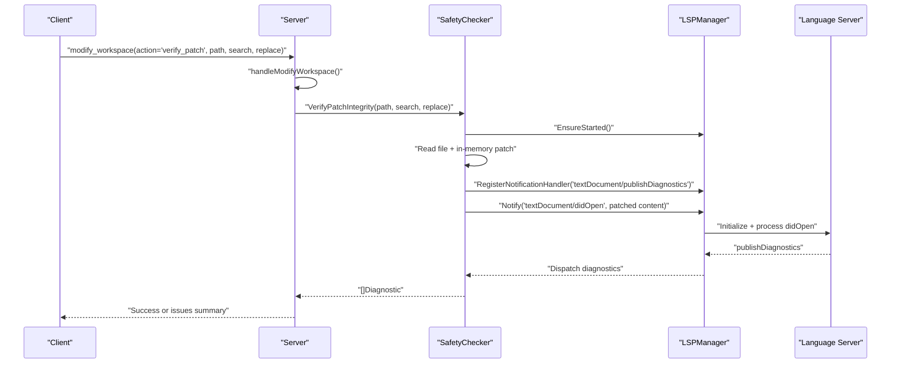
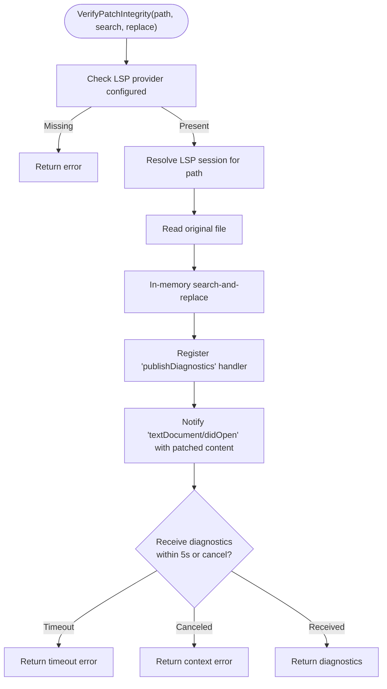
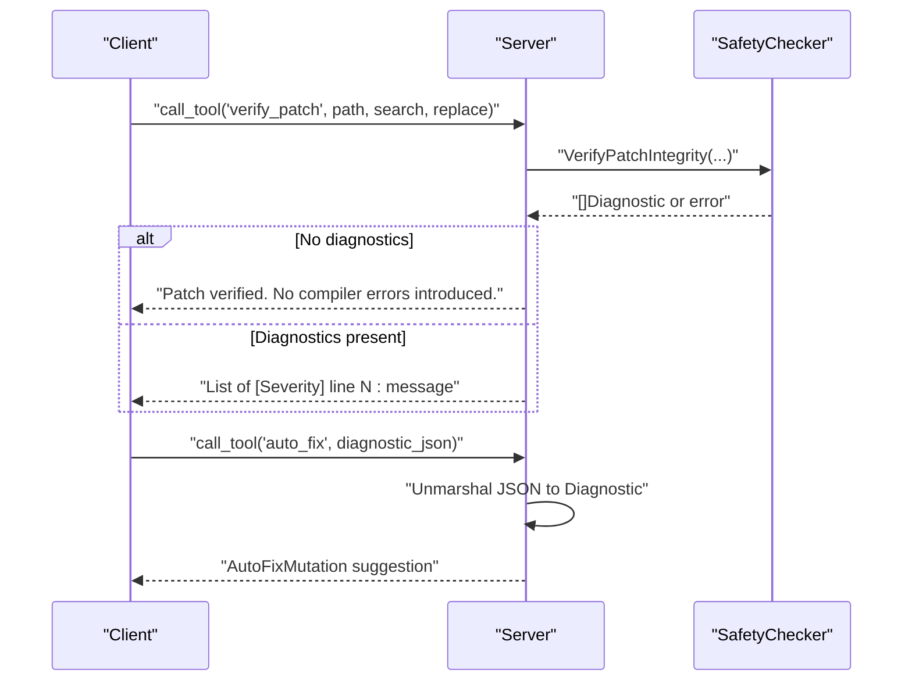
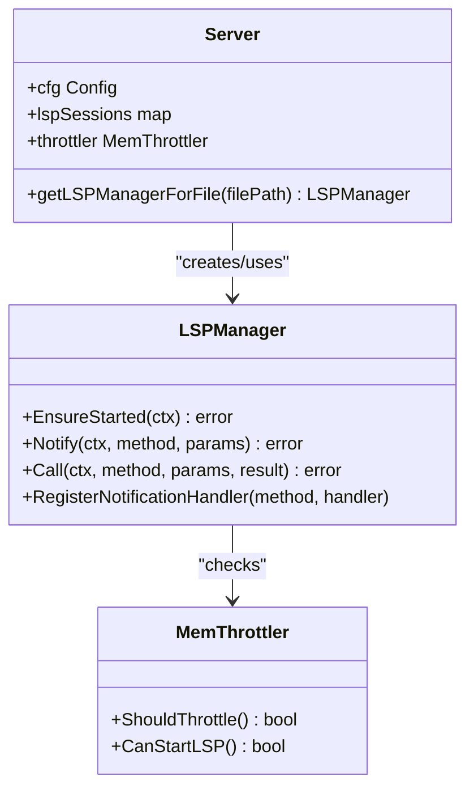
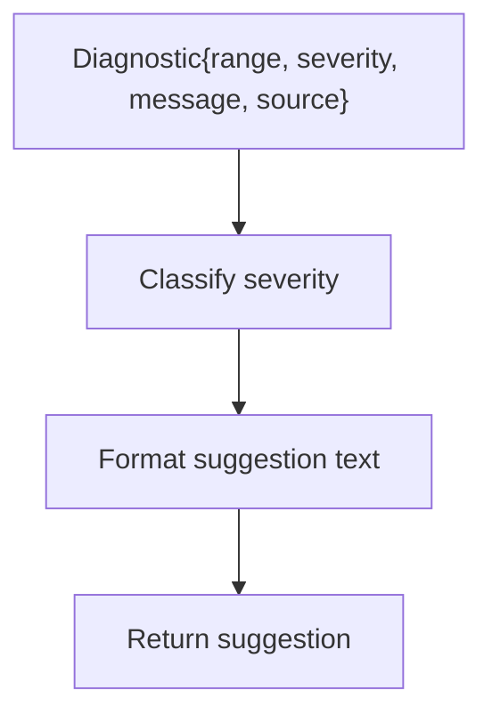
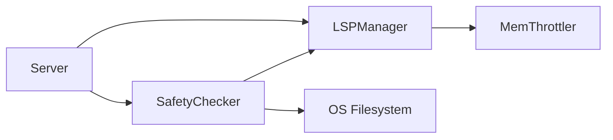

# Mutation Safety and Verification

<cite>
**Referenced Files in This Document**
- [safety.go](file://internal/mutation/safety.go)
- [handlers_safety.go](file://internal/mcp/handlers_safety.go)
- [handlers_mutation.go](file://internal/mcp/handlers_mutation.go)
- [client.go](file://internal/lsp/client.go)
- [server.go](file://internal/mcp/server.go)
- [mem_throttler.go](file://internal/system/mem_throttler.go)
- [config.go](file://internal/config/config.go)
</cite>

## Table of Contents
1. [Introduction](#introduction)
2. [Project Structure](#project-structure)
3. [Core Components](#core-components)
4. [Architecture Overview](#architecture-overview)
5. [Detailed Component Analysis](#detailed-component-analysis)
6. [Dependency Analysis](#dependency-analysis)
7. [Performance Considerations](#performance-considerations)
8. [Troubleshooting Guide](#troubleshooting-guide)
9. [Conclusion](#conclusion)

## Introduction
This document explains the mutation safety and verification mechanisms in Vector MCP Go. It focuses on how the system validates proposed code changes (search-and-replace patches) using Language Server Protocol (LSP) diagnostics, classifies errors by severity, and provides automated fix suggestions. It documents the handleVerifyPatchIntegrity function, the diagnostic analysis workflow, and AutoFixMutation capabilities. It also covers configuration options, supported diagnostic types, and troubleshooting steps for verification failures.

## Project Structure
The mutation safety features are implemented across three layers:
- MCP tool handlers that expose mutation and safety APIs to clients
- A safety checker that orchestrates LSP-based verification
- An LSP client that communicates with language servers (e.g., gopls) and streams diagnostics

**Diagram sources**
- [handlers_safety.go:13-58](file://internal/mcp/handlers_safety.go#L13-L58)
- [handlers_mutation.go:93-154](file://internal/mcp/handlers_mutation.go#L93-L154)
- [server.go:66-117](file://internal/mcp/server.go#L66-L117)
- [safety.go:33-125](file://internal/mutation/safety.go#L33-L125)
- [client.go:36-143](file://internal/lsp/client.go#L36-L143)
- [mem_throttler.go:21-103](file://internal/system/mem_throttler.go#L21-L103)

**Section sources**
- [handlers_safety.go:13-58](file://internal/mcp/handlers_safety.go#L13-L58)
- [handlers_mutation.go:93-154](file://internal/mcp/handlers_mutation.go#L93-L154)
- [server.go:66-117](file://internal/mcp/server.go#L66-L117)
- [safety.go:33-125](file://internal/mutation/safety.go#L33-L125)
- [client.go:36-143](file://internal/lsp/client.go#L36-L143)
- [mem_throttler.go:21-103](file://internal/system/mem_throttler.go#L21-L103)

## Core Components
- SafetyChecker: Encapsulates mutation verification and auto-fix logic. It reads the target file, simulates a patch in-memory, triggers LSP diagnostics via didOpen, and returns diagnostic results.
- MCP Handlers:
  - handleVerifyPatchIntegrity: Validates a proposed patch and returns a human-readable summary of diagnostics.
  - handleAutoFixMutation: Converts a diagnostic into a suggested explanation and remediation hint.
  - handleModifyWorkspace: Unified tool that routes actions including verify_patch and auto_fix.
- LSPManager: Manages language server lifecycle, initialization, and JSON-RPC communication, including notification handlers for diagnostics.
- Server: Integrates SafetyChecker and LSP sessions, wires tool registrations, and provides LSP session resolution per file.

Key responsibilities:
- Patch integrity verification: Read file → apply search-and-replace in-memory → notify LSP with didOpen → wait for publishDiagnostics → return diagnostics
- Severity classification: Treats severity 2 as Warning; others as Error
- Auto-fix suggestions: Provides a generic, actionable message suggesting re-analysis and checking imports/type mismatches

**Section sources**
- [safety.go:33-125](file://internal/mutation/safety.go#L33-L125)
- [handlers_safety.go:13-58](file://internal/mcp/handlers_safety.go#L13-L58)
- [handlers_mutation.go:93-154](file://internal/mcp/handlers_mutation.go#L93-L154)
- [client.go:231-304](file://internal/lsp/client.go#L231-L304)
- [server.go:66-117](file://internal/mcp/server.go#L66-L117)

## Architecture Overview
The verification pipeline is event-driven and asynchronous:
1. Client invokes modify_workspace with action=verify_patch and provides path, search, replace.
2. Server’s handleModifyWorkspace delegates to handleVerifyPatchIntegrity.
3. handleVerifyPatchIntegrity calls SafetyChecker.VerifyPatchIntegrity.
4. VerifyPatchIntegrity:
   - Resolves an LSP session for the file
   - Reads the file and applies the patch in-memory
   - Registers a one-shot handler for textDocument/publishDiagnostics
   - Sends textDocument/didOpen with the patched content
   - Waits up to a fixed timeout for diagnostics
5. Diagnostics are returned to the client as a formatted list or “No compiler errors introduced.”

**Diagram sources**
- [handlers_mutation.go:132-141](file://internal/mcp/handlers_mutation.go#L132-L141)
- [handlers_safety.go:23-41](file://internal/mcp/handlers_safety.go#L23-L41)
- [safety.go:43-114](file://internal/mutation/safety.go#L43-L114)
- [client.go:231-236](file://internal/lsp/client.go#L231-L236)
- [client.go:208-229](file://internal/lsp/client.go#L208-L229)

## Detailed Component Analysis

### SafetyChecker: VerifyPatchIntegrity
Responsibilities:
- Validate prerequisites (LSP provider present)
- Resolve an LSP session for the target file
- Read file content and apply the patch in-memory
- Register a one-time handler for publishDiagnostics
- Send didOpen with the patched content
- Await diagnostics with timeout and cancellation support
- Return diagnostics or error

Implementation highlights:
- Uses a channel with a sync.Once to ensure only the first diagnostics payload is captured
- Timeout is fixed at five seconds; context cancellation is respected
- Severity classification is performed by the handler that formats results

**Diagram sources**
- [safety.go:43-114](file://internal/mutation/safety.go#L43-L114)

**Section sources**
- [safety.go:43-114](file://internal/mutation/safety.go#L43-L114)

### MCP Handlers: handleVerifyPatchIntegrity and handleAutoFixMutation
Responsibilities:
- handleVerifyPatchIntegrity: Validates arguments, calls SafetyChecker, and formats diagnostics into a readable summary
- handleAutoFixMutation: Accepts a diagnostic JSON payload, deserializes it, and returns a human-friendly suggestion

Behavior:
- handleVerifyPatchIntegrity:
  - Requires path and search
  - On success with zero diagnostics: indicates “No compiler errors introduced”
  - On diagnostics: prints severity, line number, and message
- handleAutoFixMutation:
  - Requires diagnostic_json
  - Returns a generic suggestion encouraging re-analysis and checking imports/type mismatches

**Diagram sources**
- [handlers_safety.go:14-42](file://internal/mcp/handlers_safety.go#L14-L42)
- [handlers_safety.go:45-58](file://internal/mcp/handlers_safety.go#L45-L58)
- [safety.go:119-125](file://internal/mutation/safety.go#L119-L125)

**Section sources**
- [handlers_safety.go:14-42](file://internal/mcp/handlers_safety.go#L14-L42)
- [handlers_safety.go:45-58](file://internal/mcp/handlers_safety.go#L45-L58)
- [safety.go:119-125](file://internal/mutation/safety.go#L119-L125)

### LSP Integration and Real-time Validation
- Session management:
  - Server maintains a map of LSP sessions keyed by root path and language server command
  - getLSPManagerForFile resolves workspace root, selects command by file extension, and lazily starts the server
- Lifecycle:
  - EnsureStarted spawns the language server, sets up read/write pipes, and initializes the protocol
  - Notifications (e.g., didOpen) are sent without expecting a response
  - PublishDiagnostics notifications are dispatched to registered handlers
- Memory throttling:
  - MemThrottler checks system memory and can prevent starting LSP if thresholds are exceeded

**Diagram sources**
- [server.go:119-148](file://internal/mcp/server.go#L119-L148)
- [client.go:66-117](file://internal/lsp/client.go#L66-L117)
- [client.go:231-236](file://internal/lsp/client.go#L231-L236)
- [mem_throttler.go:87-103](file://internal/system/mem_throttler.go#L87-L103)

**Section sources**
- [server.go:119-148](file://internal/mcp/server.go#L119-L148)
- [client.go:66-117](file://internal/lsp/client.go#L66-L117)
- [client.go:231-236](file://internal/lsp/client.go#L231-L236)
- [mem_throttler.go:87-103](file://internal/system/mem_throttler.go#L87-L103)

### AutoFixMutation Capabilities
- Purpose: Convert a raw diagnostic into a human-readable explanation and a suggested remediation
- Current behavior: Classifies severity (Error vs Warning), includes the message and line number, and suggests re-analyzing the block and checking imports/type mismatches
- Future enhancement: Could integrate with an LLM to propose a corrected patch

**Diagram sources**
- [safety.go:119-125](file://internal/mutation/safety.go#L119-L125)

**Section sources**
- [safety.go:119-125](file://internal/mutation/safety.go#L119-L125)

## Dependency Analysis
- SafetyChecker depends on:
  - LSPManager for language server communication
  - File system for reading/writing content
- Server composes:
  - SafetyChecker with a provider that resolves LSP sessions per file
  - MCP tool registry for mutation and safety tools
- LSPManager depends on:
  - OS process spawning for language servers
  - MemThrottler for memory-aware startup decisions

**Diagram sources**
- [safety.go:34-36](file://internal/mutation/safety.go#L34-L36)
- [server.go:107-111](file://internal/mcp/server.go#L107-L111)
- [client.go:37-52](file://internal/lsp/client.go#L37-L52)
- [mem_throttler.go:22-28](file://internal/system/mem_throttler.go#L22-L28)

**Section sources**
- [safety.go:34-36](file://internal/mutation/safety.go#L34-L36)
- [server.go:107-111](file://internal/mcp/server.go#L107-L111)
- [client.go:37-52](file://internal/lsp/client.go#L37-L52)
- [mem_throttler.go:22-28](file://internal/system/mem_throttler.go#L22-L28)

## Performance Considerations
- Fixed timeout: The verification waits up to five seconds for diagnostics. This prevents indefinite blocking but may miss late diagnostics if the language server is slow.
- Single-shot handler: A one-time handler avoids accumulating stale diagnostics after the first notification.
- Memory throttling: LSP startup is gated by MemThrottler to avoid overcommitting system resources.
- In-memory patching: Applying the patch only in memory avoids disk writes during verification.

Recommendations:
- Tune the timeout if working with very large projects or slow language servers
- Consider batching verification requests to reduce LSP churn
- Monitor system memory thresholds to ensure reliable LSP availability

**Section sources**
- [safety.go:105-113](file://internal/mutation/safety.go#L105-L113)
- [client.go:76-83](file://internal/lsp/client.go#L76-L83)
- [mem_throttler.go:87-103](file://internal/system/mem_throttler.go#L87-L103)

## Troubleshooting Guide
Common verification failures and resolutions:
- LSP provider not configured
  - Symptom: Error indicating LSP provider not configured
  - Resolution: Ensure SafetyChecker is constructed with a provider that resolves LSP sessions per file
- Failed to get LSP session
  - Symptom: Error mentioning failure to get LSP session
  - Resolution: Verify file path, workspace root resolution, and language server availability
- Search string not found
  - Symptom: Error stating the search string was not found
  - Resolution: Confirm the search term exists in the file content
- Timeout waiting for LSP diagnostics
  - Symptom: Timeout error while waiting for diagnostics
  - Resolution: Retry after ensuring language server is responsive; consider increasing timeout if appropriate
- Context canceled
  - Symptom: Context error returned
  - Resolution: Cancelation indicates upstream cancellation; retry with a fresh context
- Diagnostics present
  - Symptom: Non-empty diagnostic list
  - Resolution: Review messages and line numbers; use handleAutoFixMutation for suggested remediation

Operational tips:
- Use handleModifyWorkspace with action=verify_patch to dry-run a change before applying
- Use handleAutoFixMutation to get a human-readable suggestion for a given diagnostic
- Ensure the project root and environment variables are set correctly for accurate workspace resolution

**Section sources**
- [safety.go:44-46](file://internal/mutation/safety.go#L44-L46)
- [safety.go:48-51](file://internal/mutation/safety.go#L48-L51)
- [safety.go:61-63](file://internal/mutation/safety.go#L61-L63)
- [safety.go:109-113](file://internal/mutation/safety.go#L109-L113)
- [handlers_safety.go:24-26](file://internal/mcp/handlers_safety.go#L24-L26)

## Conclusion
Vector MCP Go’s mutation safety system provides a robust, LSP-backed mechanism to verify proposed code changes before they are applied. By simulating patches in-memory and leveraging language server diagnostics, it catches compiler errors and presents actionable feedback. The modular design separates concerns across MCP handlers, the safety checker, and the LSP client, enabling maintainability and future enhancements such as automated patch generation via LLM integration.