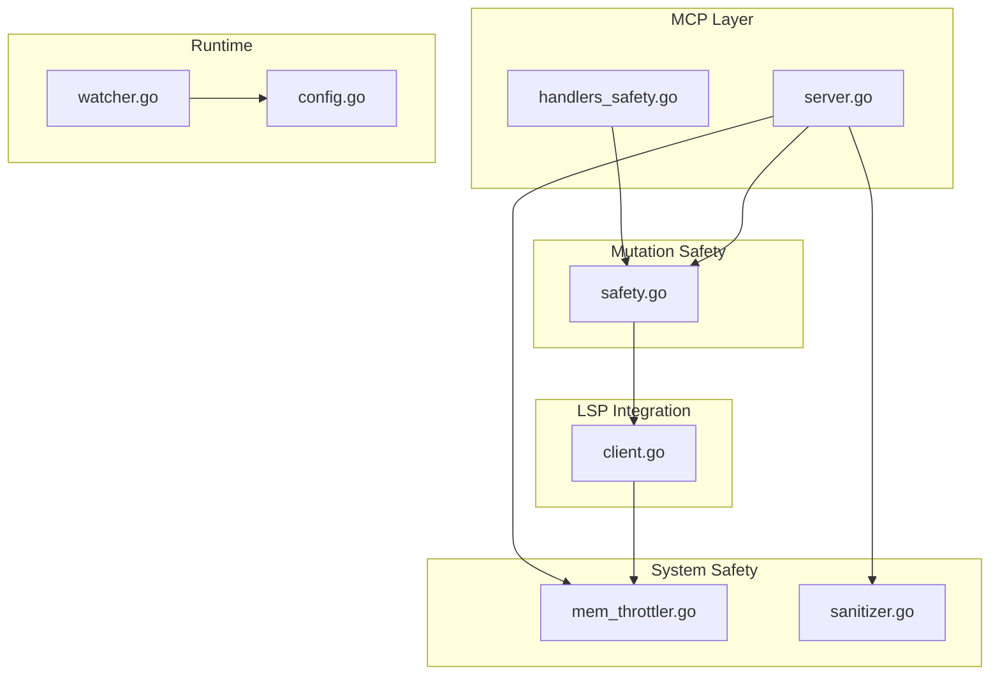
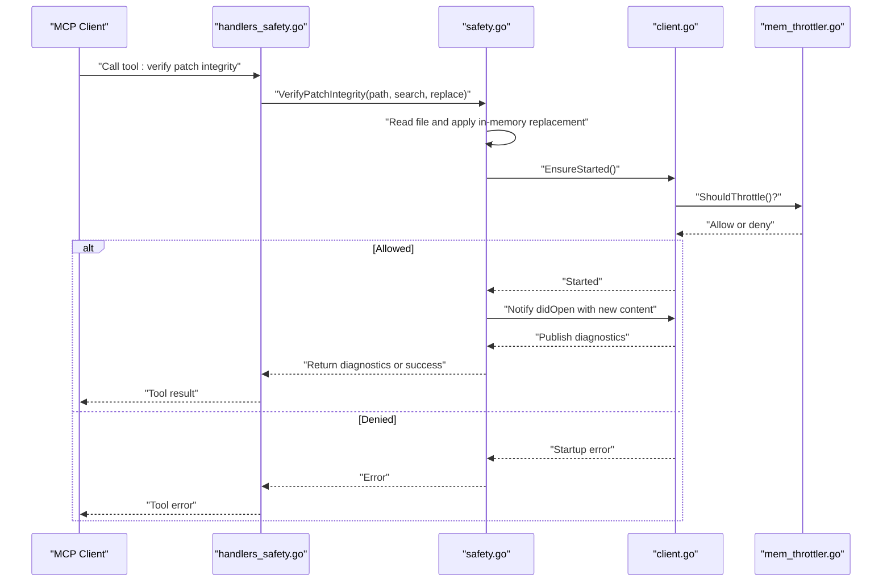
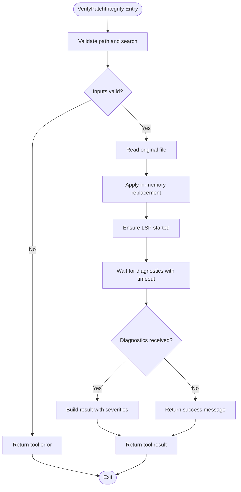
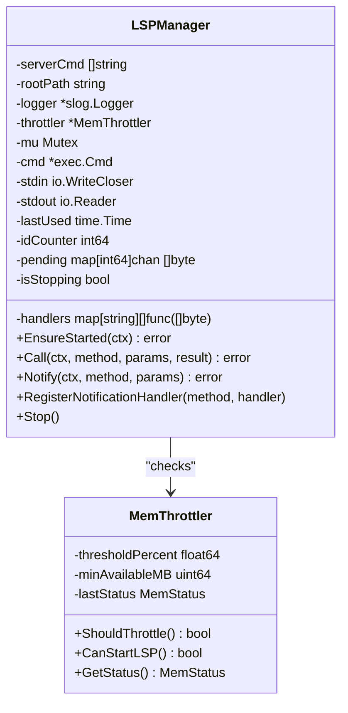
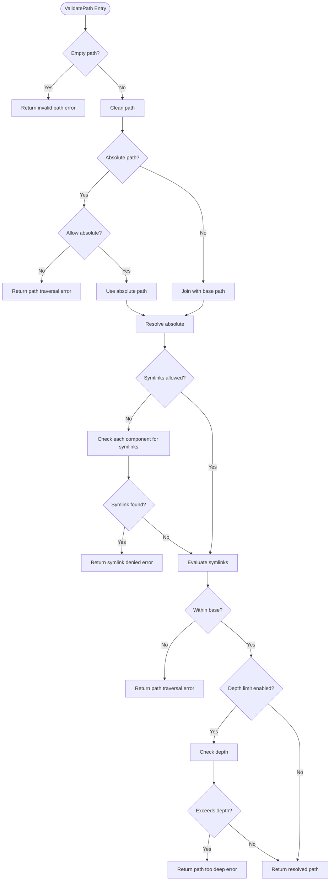
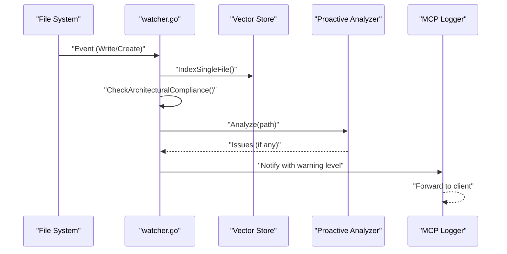
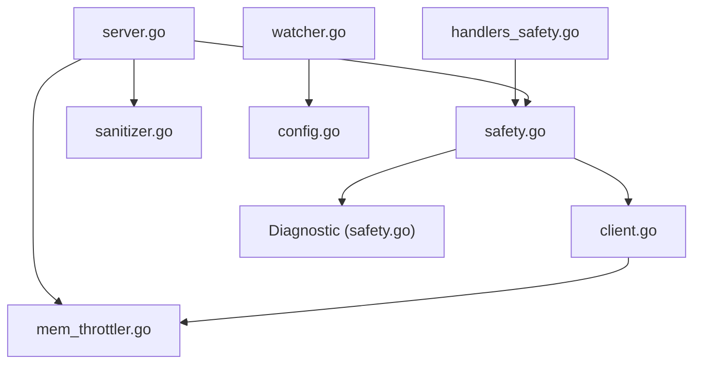

# Safety Configuration and Troubleshooting

<cite>
**Referenced Files in This Document**
- [handlers_safety.go](file://internal/mcp/handlers_safety.go)
- [safety.go](file://internal/mutation/safety.go)
- [client.go](file://internal/lsp/client.go)
- [mem_throttler.go](file://internal/system/mem_throttler.go)
- [sanitizer.go](file://internal/security/pathguard/sanitizer.go)
- [server.go](file://internal/mcp/server.go)
- [config.go](file://internal/config/config.go)
- [watcher.go](file://internal/watcher/watcher.go)
- [mcp-config.json.example](file://mcp-config.json.example)
</cite>

## Table of Contents
1. [Introduction](#introduction)
2. [Project Structure](#project-structure)
3. [Core Components](#core-components)
4. [Architecture Overview](#architecture-overview)
5. [Detailed Component Analysis](#detailed-component-analysis)
6. [Dependency Analysis](#dependency-analysis)
7. [Performance Considerations](#performance-considerations)
8. [Troubleshooting Guide](#troubleshooting-guide)
9. [Conclusion](#conclusion)
10. [Appendices](#appendices)

## Introduction
This document provides comprehensive safety configuration options and troubleshooting procedures for Vector MCP Go. It focuses on:
- Safety thresholds and mutation limits
- Compliance rules enforcement
- Troubleshooting methodologies for safety-related issues
- Diagnostic tools for safety verification failures
- Log analysis techniques and performance monitoring for safety systems
- Configuration examples for different deployment scenarios
- Workflows for common safety violations
- Best practices for maintaining system safety
- Debugging techniques, error code interpretation, and recovery procedures for safety-critical failures

## Project Structure
Vector MCP Go organizes safety-critical logic across several modules:
- MCP safety tool handlers for patch integrity verification and auto-fix suggestions
- Mutation safety checker integrating with the Language Server Protocol (LSP)
- LSP client managing language server lifecycle and notifications
- Memory throttler to prevent resource exhaustion during LSP operations
- Path guard utilities to prevent path traversal and enforce safe file operations
- Watcher module for architectural guardrails and proactive analysis
- Configuration loader for runtime parameters affecting safety behavior

**Diagram sources**
- [handlers_safety.go:1-59](file://internal/mcp/handlers_safety.go#L1-L59)
- [safety.go:1-126](file://internal/mutation/safety.go#L1-L126)
- [client.go:1-355](file://internal/lsp/client.go#L1-L355)
- [mem_throttler.go:1-151](file://internal/system/mem_throttler.go#L1-L151)
- [sanitizer.go:1-289](file://internal/security/pathguard/sanitizer.go#L1-L289)
- [server.go:109-145](file://internal/mcp/server.go#L109-L145)
- [config.go:1-139](file://internal/config/config.go#L1-L139)
- [watcher.go:1-281](file://internal/watcher/watcher.go#L1-L281)

**Section sources**
- [handlers_safety.go:1-59](file://internal/mcp/handlers_safety.go#L1-L59)
- [safety.go:1-126](file://internal/mutation/safety.go#L1-L126)
- [client.go:1-355](file://internal/lsp/client.go#L1-L355)
- [mem_throttler.go:1-151](file://internal/system/mem_throttler.go#L1-L151)
- [sanitizer.go:1-289](file://internal/security/pathguard/sanitizer.go#L1-L289)
- [server.go:109-145](file://internal/mcp/server.go#L109-L145)
- [config.go:1-139](file://internal/config/config.go#L1-L139)
- [watcher.go:1-281](file://internal/watcher/watcher.go#L1-L281)

## Core Components
This section outlines the primary safety-related components and their roles.

- Safety Checker
  - Verifies patch integrity by simulating a search-and-replace operation and triggering LSP diagnostics.
  - Provides auto-fix suggestions based on diagnostic severity and location.
  - Implements timeouts and context cancellation to avoid hanging operations.

- LSP Manager
  - Manages language server lifecycle, initialization, and notifications.
  - Enforces memory throttling to prevent startup under high memory pressure.
  - Publishes diagnostics via registered notification handlers.

- Memory Throttler
  - Monitors system memory and decides whether to allow LSP startup.
  - Uses percentage-based and absolute-available thresholds.

- Path Guard
  - Validates and sanitizes paths to prevent traversal and symlink abuse.
  - Enforces maximum path depth and optional symlink allowances.

- Watcher
  - Applies architectural guardrails and proactive analysis on file changes.
  - Emits warnings for forbidden dependencies and notifies via MCP logging channels.

**Section sources**
- [safety.go:42-125](file://internal/mutation/safety.go#L42-L125)
- [client.go:67-117](file://internal/lsp/client.go#L67-L117)
- [client.go:231-236](file://internal/lsp/client.go#L231-L236)
- [mem_throttler.go:87-103](file://internal/system/mem_throttler.go#L87-L103)
- [sanitizer.go:25-42](file://internal/security/pathguard/sanitizer.go#L25-L42)
- [watcher.go:198-244](file://internal/watcher/watcher.go#L198-L244)

## Architecture Overview
The safety architecture integrates MCP tooling, mutation verification, LSP diagnostics, and system safeguards.

**Diagram sources**
- [handlers_safety.go:14-42](file://internal/mcp/handlers_safety.go#L14-L42)
- [safety.go:43-114](file://internal/mutation/safety.go#L43-L114)
- [client.go:67-117](file://internal/lsp/client.go#L67-L117)
- [client.go:231-236](file://internal/lsp/client.go#L231-L236)
- [mem_throttler.go:87-103](file://internal/system/mem_throttler.go#L87-L103)

## Detailed Component Analysis

### Safety Checker and MCP Handlers
- Responsibilities
  - Validate proposed patches before application.
  - Convert diagnostics into actionable messages.
  - Provide auto-fix guidance based on diagnostic metadata.

- Key Behaviors
  - Requires path and search parameters; returns explicit errors otherwise.
  - Reads file content, applies replacement in-memory, and triggers LSP diagnostics.
  - Aggregates diagnostics and reports severity and line numbers.
  - Auto-fix returns a human-readable suggestion based on severity.

**Diagram sources**
- [handlers_safety.go:14-42](file://internal/mcp/handlers_safety.go#L14-L42)
- [safety.go:43-114](file://internal/mutation/safety.go#L43-L114)

**Section sources**
- [handlers_safety.go:14-58](file://internal/mcp/handlers_safety.go#L14-L58)
- [safety.go:42-125](file://internal/mutation/safety.go#L42-L125)

### LSP Manager and Memory Throttling
- Responsibilities
  - Manage language server lifecycle and JSON-RPC communication.
  - Enforce memory throttling to prevent resource exhaustion.
  - Publish diagnostics via notification handlers.

- Key Behaviors
  - Starts language servers only when memory allows.
  - Initializes LSP with capabilities and root URI.
  - Registers notification handlers for diagnostics.
  - Monitors TTL to shut down idle servers.

**Diagram sources**
- [client.go:37-64](file://internal/lsp/client.go#L37-L64)
- [client.go:67-117](file://internal/lsp/client.go#L67-L117)
- [client.go:231-236](file://internal/lsp/client.go#L231-L236)
- [mem_throttler.go:22-44](file://internal/system/mem_throttler.go#L22-L44)
- [mem_throttler.go:87-103](file://internal/system/mem_throttler.go#L87-L103)

**Section sources**
- [client.go:67-117](file://internal/lsp/client.go#L67-L117)
- [client.go:231-236](file://internal/lsp/client.go#L231-L236)
- [mem_throttler.go:87-103](file://internal/system/mem_throttler.go#L87-L103)

### Path Guard and Security Controls
- Responsibilities
  - Validate and sanitize paths to prevent traversal and symlink abuse.
  - Enforce maximum path depth and optionally allow absolute paths.

- Key Behaviors
  - Rejects attempts to escape the base directory.
  - Disallows symlinks unless explicitly permitted.
  - Limits path depth to mitigate excessive nesting.

**Diagram sources**
- [sanitizer.go:76-131](file://internal/security/pathguard/sanitizer.go#L76-L131)
- [sanitizer.go:169-200](file://internal/security/pathguard/sanitizer.go#L169-L200)
- [sanitizer.go:202-224](file://internal/security/pathguard/sanitizer.go#L202-L224)

**Section sources**
- [sanitizer.go:25-42](file://internal/security/pathguard/sanitizer.go#L25-L42)
- [sanitizer.go:76-131](file://internal/security/pathguard/sanitizer.go#L76-L131)
- [sanitizer.go:169-200](file://internal/security/pathguard/sanitizer.go#L169-L200)
- [sanitizer.go:202-224](file://internal/security/pathguard/sanitizer.go#L202-L224)

### Watcher and Architectural Guardrails
- Responsibilities
  - Monitor file system events and trigger indexing.
  - Enforce architectural guardrails and proactive analysis.
  - Emit warnings for forbidden dependencies and notify via MCP logging.

- Key Behaviors
  - Debounces events and processes writes/creates for supported languages.
  - Checks for architectural violations and logs warnings.
  - Notifies MCP clients about issues.

**Diagram sources**
- [watcher.go:141-196](file://internal/watcher/watcher.go#L141-L196)
- [watcher.go:198-244](file://internal/watcher/watcher.go#L198-L244)

**Section sources**
- [watcher.go:141-196](file://internal/watcher/watcher.go#L141-L196)
- [watcher.go:198-244](file://internal/watcher/watcher.go#L198-L244)

## Dependency Analysis
Safety-related dependencies and interactions:

**Diagram sources**
- [handlers_safety.go:1-59](file://internal/mcp/handlers_safety.go#L1-L59)
- [safety.go:1-126](file://internal/mutation/safety.go#L1-L126)
- [client.go:1-355](file://internal/lsp/client.go#L1-L355)
- [mem_throttler.go:1-151](file://internal/system/mem_throttler.go#L1-L151)
- [sanitizer.go:1-289](file://internal/security/pathguard/sanitizer.go#L1-L289)
- [server.go:109-145](file://internal/mcp/server.go#L109-L145)
- [config.go:1-139](file://internal/config/config.go#L1-L139)
- [watcher.go:1-281](file://internal/watcher/watcher.go#L1-L281)

**Section sources**
- [handlers_safety.go:1-59](file://internal/mcp/handlers_safety.go#L1-L59)
- [safety.go:1-126](file://internal/mutation/safety.go#L1-L126)
- [client.go:1-355](file://internal/lsp/client.go#L1-L355)
- [mem_throttler.go:1-151](file://internal/system/mem_throttler.go#L1-L151)
- [sanitizer.go:1-289](file://internal/security/pathguard/sanitizer.go#L1-L289)
- [server.go:109-145](file://internal/mcp/server.go#L109-L145)
- [config.go:1-139](file://internal/config/config.go#L1-L139)
- [watcher.go:1-281](file://internal/watcher/watcher.go#L1-L281)

## Performance Considerations
- LSP Startup and Memory Pressure
  - LSP startup is gated by memory throttling to prevent system instability.
  - Thresholds include percentage-based usage and absolute available memory limits.
  - Recommendations:
    - Monitor memory usage and adjust thresholds if frequent throttling occurs.
    - Ensure adequate free memory before triggering heavy LSP operations.

- Diagnostic Timeout
  - Safety verification waits up to a fixed timeout for diagnostics.
  - Recommendations:
    - Increase timeout only if diagnostics consistently lag in large repositories.
    - Investigate slow language servers or large file sizes impacting responsiveness.

- Watcher Debouncing
  - Debounce interval balances responsiveness and resource usage.
  - Recommendations:
    - Tune debounce duration based on project size and change frequency.
    - Disable file watcher if unnecessary to reduce overhead.

**Section sources**
- [mem_throttler.go:87-103](file://internal/system/mem_throttler.go#L87-L103)
- [safety.go:105-113](file://internal/mutation/safety.go#L105-L113)
- [watcher.go:121-139](file://internal/watcher/watcher.go#L121-L139)

## Troubleshooting Guide

### Safety Configuration Parameters
- Environment Variables
  - DATA_DIR: Data directory root for logs, models, and LanceDB.
  - DB_PATH: Vector database path.
  - MODELS_DIR: Model storage directory.
  - LOG_PATH: Server log file path.
  - PROJECT_ROOT: Project root used for path validation and LSP workspace resolution.
  - MODEL_NAME: Embedding model identifier.
  - RERANKER_MODEL_NAME: Optional reranker model; set to "none" to disable.
  - DISABLE_FILE_WATCHER: Set to "true" to disable file watching.
  - ENABLE_LIVE_INDEXING: Enable live indexing mode.
  - EMBEDDER_POOL_SIZE: Number of embedder workers.
  - API_PORT: Port for the API server.
  - HF_TOKEN: Hugging Face token for model downloads.

- MCP Configuration
  - mcpServers.vector-mcp.command: Path to the binary.
  - mcpServers.vector-mcp.env.ONNX_LIB_PATH: ONNX runtime library path.

- Path Guard Options
  - AllowSymlinks: Permit symlinks within base path.
  - MaxPathDepth: Maximum allowed path depth.
  - AllowAbsolute: Permit absolute paths resolving within base.

- Memory Throttler Settings
  - thresholdPercent: Percentage threshold for memory usage.
  - minAvailableMB: Minimum available MB threshold.

**Section sources**
- [config.go:30-130](file://internal/config/config.go#L30-L130)
- [mcp-config.json.example:1-12](file://mcp-config.json.example#L1-L12)
- [sanitizer.go:25-42](file://internal/security/pathguard/sanitizer.go#L25-L42)
- [mem_throttler.go:33-44](file://internal/system/mem_throttler.go#L33-L44)

### Common Safety Violations and Resolutions
- Path Traversal Attempt
  - Symptoms: Validation errors indicating traversal attempts.
  - Resolution: Restrict inputs to paths within base directory; enable strict path guard options.

- Symlink Denial
  - Symptoms: Errors when attempting to use symlinks.
  - Resolution: Review symlink policy; if required, configure path guard to allow symlinks carefully.

- Excessive Path Depth
  - Symptoms: Errors indicating path depth exceeded.
  - Resolution: Flatten directory structure or increase depth limit cautiously.

- Forbidden Architectural Dependencies
  - Symptoms: Warnings about forbidden dependencies detected by watcher.
  - Resolution: Refactor code to remove forbidden imports; align with documented architectural rules.

- LSP Startup Failure Due to Memory Pressure
  - Symptoms: Errors indicating LSP startup denied due to high memory usage.
  - Resolution: Free memory, reduce concurrent operations, or adjust throttling thresholds.

**Section sources**
- [sanitizer.go:14-23](file://internal/security/pathguard/sanitizer.go#L14-L23)
- [watcher.go:233-242](file://internal/watcher/watcher.go#L233-L242)
- [client.go:77-79](file://internal/lsp/client.go#L77-L79)
- [mem_throttler.go:87-103](file://internal/system/mem_throttler.go#L87-L103)

### Diagnostic Tools and Log Analysis
- MCP Tool Outputs
  - Patch verification returns either success or a list of diagnostics with severity and line numbers.
  - Auto-fix tool returns a human-readable suggestion based on diagnostic metadata.

- LSP Diagnostics
  - Published via notification handlers; collected with a timeout.
  - Analyze severity and message to determine corrective actions.

- Watcher Logs
  - Architectural alerts and proactive analysis warnings are emitted with MCP logging levels.
  - Use these logs to track recurring issues and dependency violations.

- Memory Status
  - Retrieve latest memory snapshot to assess system health.
  - Monitor trends to anticipate throttling events.

**Section sources**
- [handlers_safety.go:23-41](file://internal/mcp/handlers_safety.go#L23-L41)
- [safety.go:105-113](file://internal/mutation/safety.go#L105-L113)
- [watcher.go:169-183](file://internal/watcher/watcher.go#L169-L183)
- [mem_throttler.go:105-110](file://internal/system/mem_throttler.go#L105-L110)

### Error Code Interpretation
- Path Guard Errors
  - ErrPathTraversal: Path attempts to escape base directory.
  - ErrSymlinkDenied: Symlinks are not allowed.
  - ErrPathTooDeep: Path depth exceeds configured limit.
  - ErrInvalidPath: Empty or malformed path.

- LSP Errors
  - Startup errors indicate throttling or misconfiguration.
  - LSP error codes and messages are propagated from the language server.

- Safety Checker Errors
  - Missing inputs cause explicit tool errors.
  - Timeout waiting for diagnostics indicates LSP responsiveness issues.

**Section sources**
- [sanitizer.go:14-23](file://internal/security/pathguard/sanitizer.go#L14-L23)
- [client.go:197-200](file://internal/lsp/client.go#L197-L200)
- [handlers_safety.go:19-26](file://internal/mcp/handlers_safety.go#L19-L26)
- [safety.go:109-113](file://internal/mutation/safety.go#L109-L113)

### Recovery Procedures for Safety-Critical Failures
- Immediate Actions
  - Stop operations that trigger LSP startup if memory is critically low.
  - Review MCP tool outputs and apply suggested fixes.

- Medium-term Actions
  - Adjust memory throttling thresholds if justified by workload.
  - Tighten or relax path guard options based on operational needs.

- Long-term Actions
  - Refactor code to satisfy architectural guardrails.
  - Optimize indexing and analysis workflows to reduce resource contention.

**Section sources**
- [client.go:77-79](file://internal/lsp/client.go#L77-L79)
- [handlers_safety.go:56-57](file://internal/mcp/handlers_safety.go#L56-L57)
- [watcher.go:233-242](file://internal/watcher/watcher.go#L233-L242)

## Conclusion
Vector MCP Go’s safety mechanisms combine MCP tooling, mutation verification, LSP diagnostics, memory throttling, and path validation to maintain system integrity. By tuning configuration parameters, monitoring logs, and following the troubleshooting workflows outlined above, operators can effectively manage safety risks across diverse deployment scenarios.

## Appendices

### Configuration Examples
- Minimal Deployment
  - Set PROJECT_ROOT to project directory.
  - Keep file watcher enabled for live indexing.
  - Use default path guard options.

- Secure Production
  - Disable symlinks and enforce strict depth limits.
  - Monitor memory and adjust throttling thresholds.
  - Use dedicated model and DB directories.

- Development
  - Enable live indexing and file watcher.
  - Use smaller pool sizes for embedded environments.

**Section sources**
- [config.go:30-130](file://internal/config/config.go#L30-L130)
- [sanitizer.go:25-42](file://internal/security/pathguard/sanitizer.go#L25-L42)
- [mem_throttler.go:33-44](file://internal/system/mem_throttler.go#L33-L44)