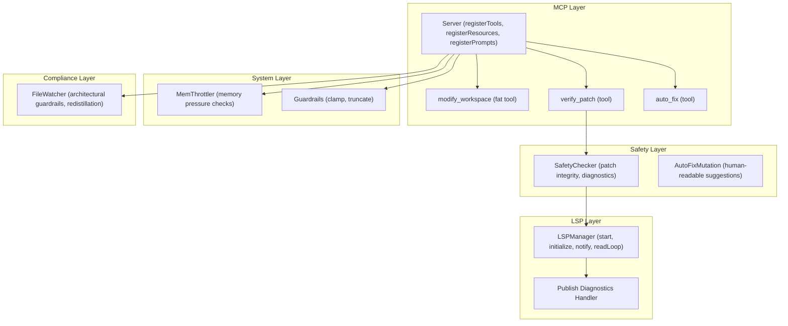
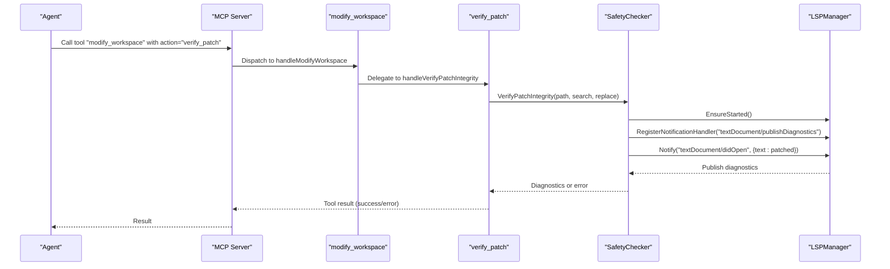
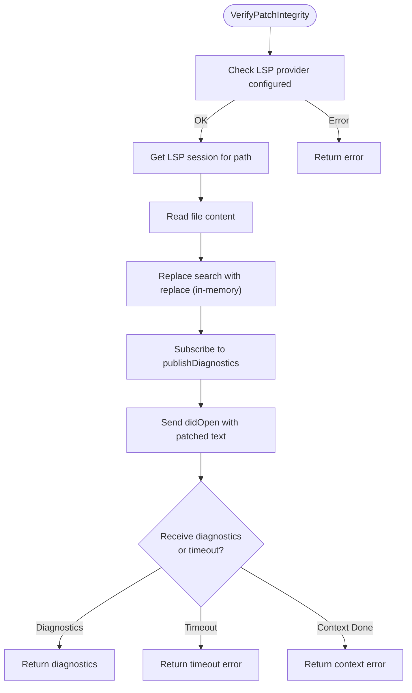
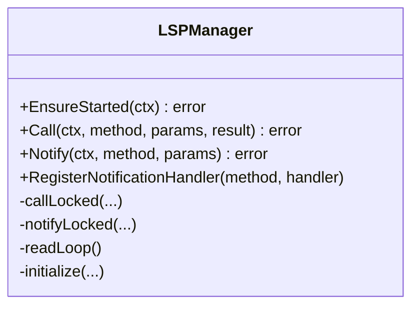
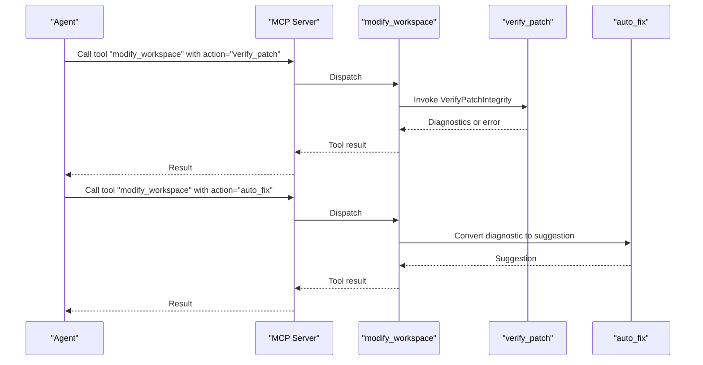
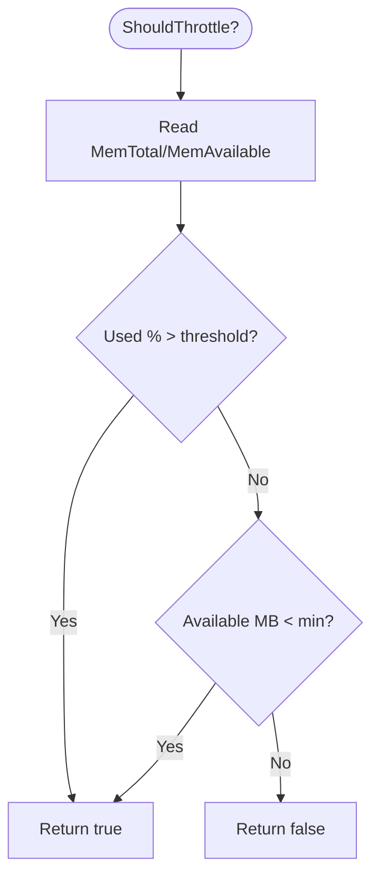
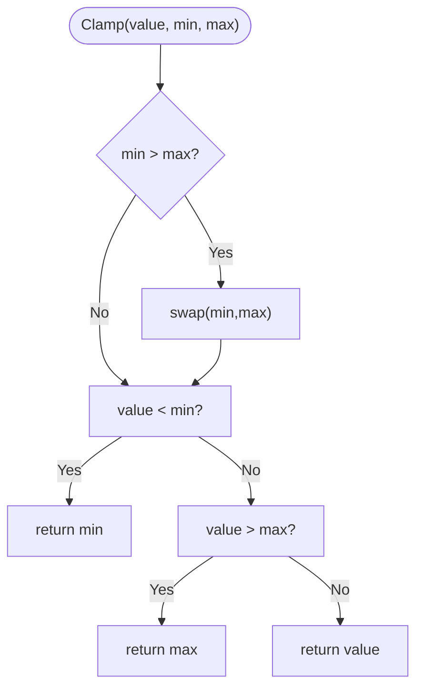
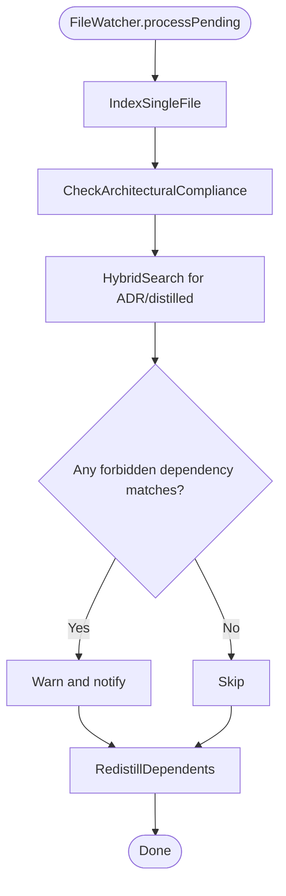
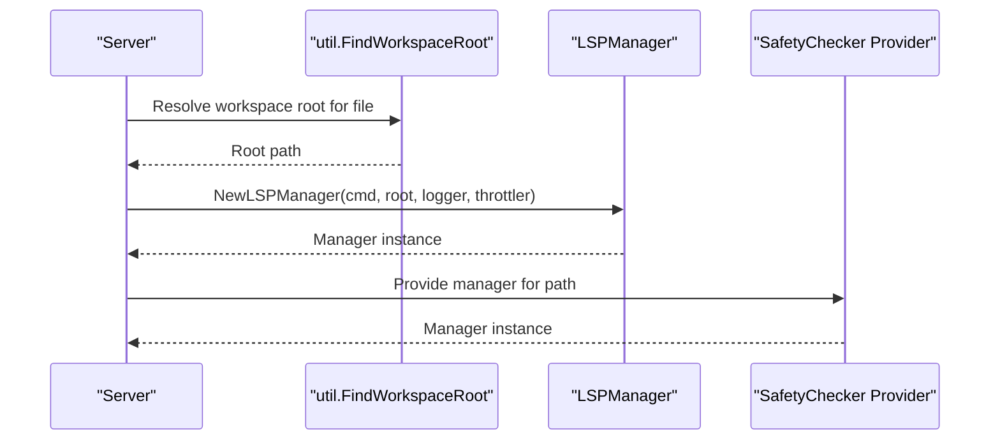
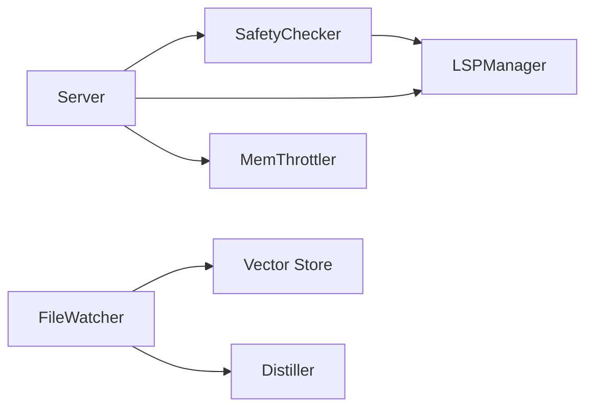

# Safety and Compliance

<cite>
**Referenced Files in This Document**
- [safety.go](file://internal/mutation/safety.go)
- [client.go](file://internal/lsp/client.go)
- [handlers_safety.go](file://internal/mcp/handlers_safety.go)
- [handlers_mutation.go](file://internal/mcp/handlers_mutation.go)
- [server.go](file://internal/mcp/server.go)
- [mem_throttler.go](file://internal/system/mem_throttler.go)
- [guardrails.go](file://internal/util/guardrails.go)
- [watcher.go](file://internal/watcher/watcher.go)
- [workspace.go](file://internal/util/workspace.go)
- [config.go](file://internal/config/config.go)
- [main.go](file://main.go)
- [README.md](file://README.md)
- [technology-modernization-plan.md](file://docs/technology-modernization-plan.md)
- [guardrails_test.go](file://internal/util/guardrails_test.go)
</cite>

## Table of Contents
1. [Introduction](#introduction)
2. [Project Structure](#project-structure)
3. [Core Components](#core-components)
4. [Architecture Overview](#architecture-overview)
5. [Detailed Component Analysis](#detailed-component-analysis)
6. [Dependency Analysis](#dependency-analysis)
7. [Performance Considerations](#performance-considerations)
8. [Troubleshooting Guide](#troubleshooting-guide)
9. [Conclusion](#conclusion)
10. [Appendices](#appendices)

## Introduction
This document explains the safety and compliance mechanisms in Vector MCP Go. It covers the architectural guardrails that prevent unsafe operations, the mutation safety checking algorithms, and the compliance enforcement systems. It details the code mutation verification process, LSP integration for safety validation, error handling strategies, policy enforcement, risk assessment, and mitigation strategies. It also documents configuration options for safety thresholds, compliance rules, and custom policy development, along with security considerations, audit trails, and compliance reporting.

## Project Structure
Vector MCP Go organizes safety and compliance across several layers:
- MCP tooling and orchestration: mutation and safety tools, resource and prompt registration.
- LSP integration: language server lifecycle, initialization, notifications, and diagnostics.
- Mutation safety: patch integrity verification and auto-fix suggestions.
- System safeguards: memory throttling and guardrail utilities.
- File watcher: architectural guardrails and autonomous redistillation.
- Configuration and runtime: environment-driven settings and startup behavior.

**Diagram sources**
- [server.go:324-407](file://internal/mcp/server.go#L324-L407)
- [handlers_mutation.go:93-153](file://internal/mcp/handlers_mutation.go#L93-L153)
- [handlers_safety.go:13-58](file://internal/mcp/handlers_safety.go#L13-L58)
- [safety.go:33-125](file://internal/mutation/safety.go#L33-L125)
- [client.go:36-355](file://internal/lsp/client.go#L36-L355)
- [mem_throttler.go:21-151](file://internal/system/mem_throttler.go#L21-L151)
- [guardrails.go:3-61](file://internal/util/guardrails.go#L3-L61)
- [watcher.go:197-281](file://internal/watcher/watcher.go#L197-L281)

**Section sources**
- [README.md:11-19](file://README.md#L11-L19)
- [server.go:324-407](file://internal/mcp/server.go#L324-L407)

## Core Components
- SafetyChecker: Verifies patch integrity by simulating a didOpen with modified content and collecting diagnostics from the LSP.
- LSPManager: Manages language server lifecycle, initialization, request/response handling, and notification dispatch.
- MemThrottler: Monitors system memory and decides whether to throttle or refuse starting heavy tasks like LSP.
- Guardrails utilities: Clamp and truncate helpers to enforce numeric bounds and safe output limits.
- FileWatcher: Enforces architectural guardrails and autonomously redistills dependent packages.
- MCP tools: Unified mutation and safety tools exposed to agents via the Model Context Protocol.

**Section sources**
- [safety.go:33-125](file://internal/mutation/safety.go#L33-L125)
- [client.go:36-355](file://internal/lsp/client.go#L36-L355)
- [mem_throttler.go:21-151](file://internal/system/mem_throttler.go#L21-L151)
- [guardrails.go:3-61](file://internal/util/guardrails.go#L3-L61)
- [watcher.go:197-281](file://internal/watcher/watcher.go#L197-L281)
- [handlers_mutation.go:93-153](file://internal/mcp/handlers_mutation.go#L93-L153)
- [handlers_safety.go:13-58](file://internal/mcp/handlers_safety.go#L13-L58)

## Architecture Overview
The safety architecture integrates MCP tools with LSP diagnostics and system safeguards. The flow is:
- Agent invokes modify_workspace with action=verify_patch.
- Server routes to verify_patch handler, which delegates to SafetyChecker.
- SafetyChecker resolves an LSP session for the file’s workspace, prepares a didOpen payload with in-memory patched content, and subscribes to publishDiagnostics.
- LSPManager initializes and sends didOpen; diagnostics are delivered asynchronously.
- SafetyChecker returns diagnostics to the agent; optional auto_fix tool suggests remediation.

**Diagram sources**
- [handlers_mutation.go:132-141](file://internal/mcp/handlers_mutation.go#L132-L141)
- [handlers_safety.go:13-42](file://internal/mcp/handlers_safety.go#L13-L42)
- [safety.go:42-114](file://internal/mutation/safety.go#L42-L114)
- [client.go:119-143](file://internal/lsp/client.go#L119-L143)
- [client.go:231-236](file://internal/lsp/client.go#L231-L236)
- [client.go:208-229](file://internal/lsp/client.go#L208-L229)

## Detailed Component Analysis

### SafetyChecker and Patch Integrity Verification
SafetyChecker performs a dry-run verification of a search-and-replace patch:
- Resolves an LSP session for the target file’s workspace.
- Reads the file content and applies the patch in-memory.
- Subscribes to publishDiagnostics notifications.
- Sends a didOpen with the patched content to trigger LSP analysis.
- Waits for diagnostics with a timeout and returns them to the caller.

**Diagram sources**
- [safety.go:42-114](file://internal/mutation/safety.go#L42-L114)

**Section sources**
- [safety.go:33-125](file://internal/mutation/safety.go#L33-L125)

### LSP Integration and Diagnostics Handling
LSPManager encapsulates:
- Lifecycle: EnsureStarted spawns and initializes the language server.
- Request/Response: Call marshals requests, tracks pending replies, and returns results.
- Notifications: Notify sends fire-and-forget messages; readLoop dispatches notifications to registered handlers.
- Diagnostics: Clients subscribe to publishDiagnostics to receive analysis results.

**Diagram sources**
- [client.go:36-355](file://internal/lsp/client.go#L36-L355)

**Section sources**
- [client.go:36-355](file://internal/lsp/client.go#L36-L355)

### MCP Tools: Mutation and Safety
- modify_workspace: A fat tool supporting apply_patch, create_file, run_linter, verify_patch, and auto_fix.
- verify_patch: Validates a proposed patch via SafetyChecker and returns diagnostics.
- auto_fix: Converts a diagnostic into a human-readable suggestion.

**Diagram sources**
- [handlers_mutation.go:93-153](file://internal/mcp/handlers_mutation.go#L93-L153)
- [handlers_safety.go:13-58](file://internal/mcp/handlers_safety.go#L13-L58)

**Section sources**
- [handlers_mutation.go:93-153](file://internal/mcp/handlers_mutation.go#L93-L153)
- [handlers_safety.go:13-58](file://internal/mcp/handlers_safety.go#L13-L58)

### System Memory Throttling
MemThrottler prevents unsafe resource consumption:
- Periodically reads /proc/meminfo to compute available and used memory.
- Enforces two thresholds: percentage used and minimum available MB.
- Provides CanStartLSP and ShouldThrottle helpers for gatekeeping.

**Diagram sources**
- [mem_throttler.go:69-103](file://internal/system/mem_throttler.go#L69-L103)

**Section sources**
- [mem_throttler.go:21-151](file://internal/system/mem_throttler.go#L21-L151)

### Guardrails Utilities
Guardrails provide deterministic safety for numeric and string operations:
- ClampInt/Int64/Float64: Enforce inclusive bounds with automatic bound swap.
- TruncateRuneSafe: Safely truncate strings by rune count to avoid UTF-8 corruption.

**Diagram sources**
- [guardrails.go:3-61](file://internal/util/guardrails.go#L3-L61)

**Section sources**
- [guardrails.go:3-61](file://internal/util/guardrails.go#L3-L61)
- [guardrails_test.go:5-106](file://internal/util/guardrails_test.go#L5-L106)

### Architectural Guardrails and Compliance Enforcement
FileWatcher enforces architectural guardrails:
- On file writes, it indexes the file and checks for violations against stored ADRs/distilled summaries.
- It detects forbidden dependencies by scanning rule content and current file dependencies.
- It triggers autonomous redistillation for dependent packages to keep architectural knowledge fresh.

**Diagram sources**
- [watcher.go:141-196](file://internal/watcher/watcher.go#L141-L196)
- [watcher.go:197-281](file://internal/watcher/watcher.go#L197-L281)

**Section sources**
- [watcher.go:197-281](file://internal/watcher/watcher.go#L197-L281)

### Workspace Resolution and Session Management
Server resolves the appropriate LSP session per file:
- Determines workspace root using util.FindWorkspaceRoot.
- Selects language server command by file extension.
- Creates or retrieves LSPManager keyed by root and server command.
- Initializes SafetyChecker with a provider that returns the correct session.

**Diagram sources**
- [server.go:119-148](file://internal/mcp/server.go#L119-L148)
- [workspace.go:9-46](file://internal/util/workspace.go#L9-L46)

**Section sources**
- [server.go:119-148](file://internal/mcp/server.go#L119-L148)
- [workspace.go:9-46](file://internal/util/workspace.go#L9-L46)

## Dependency Analysis
- SafetyChecker depends on LSPManager for diagnostics.
- Server composes SafetyChecker and LSPManager, wiring them into MCP tool handlers.
- FileWatcher depends on the vector store for rule retrieval and on the distiller for redistillation.
- MemThrottler is injected into LSPManager to gate startup.

**Diagram sources**
- [server.go:86-117](file://internal/mcp/server.go#L86-L117)
- [safety.go:33-40](file://internal/mutation/safety.go#L33-L40)
- [client.go:36-64](file://internal/lsp/client.go#L36-L64)
- [mem_throttler.go:30-44](file://internal/system/mem_throttler.go#L30-L44)
- [watcher.go:197-281](file://internal/watcher/watcher.go#L197-L281)

**Section sources**
- [server.go:86-117](file://internal/mcp/server.go#L86-L117)
- [safety.go:33-40](file://internal/mutation/safety.go#L33-L40)
- [client.go:36-64](file://internal/lsp/client.go#L36-L64)
- [mem_throttler.go:30-44](file://internal/system/mem_throttler.go#L30-L44)
- [watcher.go:197-281](file://internal/watcher/watcher.go#L197-L281)

## Performance Considerations
- LSP lifecycle: EnsureStarted spawns and initializes the language server; readLoop and TTL monitor manage long-running sessions efficiently.
- Memory throttling: MemThrottler prevents thrashing during live indexing and mutation workflows.
- Guardrails: Clamp and truncate utilities bound computation and output sizes to maintain responsiveness.
- File watcher debouncing: Reduces redundant indexing and analysis on bursty edits.

[No sources needed since this section provides general guidance]

## Troubleshooting Guide
Common safety-related issues and resolutions:
- LSP provider not configured: Verify that the LSP provider function is set in SafetyChecker.
- Failed to get LSP session: Confirm the file extension maps to a configured language server and that the workspace root is resolvable.
- Search string not found: Ensure the search term exists in the file content before attempting a patch.
- Timeout waiting for diagnostics: Increase timeout or reduce the scope of the patch; check LSP logs for errors.
- Memory pressure preventing LSP start: Adjust thresholds or free memory; the system refuses to start LSP under high memory pressure.
- Architectural violation detected: Review the reported rule and dependency; refactor to comply with ADRs.

Operational tips:
- Use verify_patch before applying destructive changes.
- Use auto_fix to get suggested remediations for diagnostics.
- Monitor notifications for warnings and alerts from FileWatcher.
- Validate configuration via config://project resource.

**Section sources**
- [handlers_safety.go:19-30](file://internal/mcp/handlers_safety.go#L19-L30)
- [safety.go:44-50](file://internal/mutation/safety.go#L44-L50)
- [safety.go:61-63](file://internal/mutation/safety.go#L61-L63)
- [safety.go:109-113](file://internal/mutation/safety.go#L109-L113)
- [mem_throttler.go:77-79](file://internal/system/mem_throttler.go#L77-L79)
- [watcher.go:234-243](file://internal/watcher/watcher.go#L234-L243)

## Conclusion
Vector MCP Go implements layered safety and compliance:
- Mutation safety via LSP-backed verification and controlled application.
- System safeguards through memory throttling and deterministic guardrails.
- Architectural guardrails enforced by automated rule checks and redistillation.
- Comprehensive MCP tooling exposing safe, auditable operations to agents.

These mechanisms collectively reduce risk, improve reliability, and support enterprise-grade compliance and auditing.

[No sources needed since this section summarizes without analyzing specific files]

## Appendices

### Configuration Options for Safety and Compliance
- Memory throttling thresholds:
  - thresholdPercent: Percentage of memory used to trigger throttling.
  - minAvailableMB: Minimum available MB to allow heavy tasks.
- Environment variables:
  - HF_TOKEN: Hugging Face token for model downloads.
  - DISABLE_FILE_WATCHER: Disable file watcher if needed.
  - ENABLE_LIVE_INDEXING: Enable live indexing.
  - EMBEDDER_POOL_SIZE: Concurrency for embedding operations.
  - API_PORT: Port for the API server.
- Project root and paths:
  - PROJECT_ROOT, DATA_DIR, MODELS_DIR, DB_PATH, LOG_PATH influence where safety checks run and where artifacts are stored.

**Section sources**
- [mem_throttler.go:30-44](file://internal/system/mem_throttler.go#L30-L44)
- [config.go:30-130](file://internal/config/config.go#L30-L130)
- [main.go:69](file://main.go#L69)

### Policy Enforcement and Risk Assessment
- Policy enforcement:
  - Architectural rules retrieved via hybrid search and matched heuristically against dependencies.
  - Violations surfaced as warnings and notifications.
- Risk assessment:
  - Numeric parameter clamping and safe truncation mitigate out-of-range and overflow risks.
  - Memory pressure checks prevent resource exhaustion during LSP startup and indexing.
- Mitigation strategies:
  - Debounced file watching reduces redundant work.
  - Autonomous redistillation keeps architectural knowledge current.
  - Fat tools consolidate operations to minimize agent error surfaces.

**Section sources**
- [watcher.go:197-281](file://internal/watcher/watcher.go#L197-L281)
- [guardrails.go:3-61](file://internal/util/guardrails.go#L3-L61)
- [technology-modernization-plan.md:65-107](file://docs/technology-modernization-plan.md#L65-L107)

### Security Considerations
- Local execution: Embeddings and vector storage remain local; sensitive code remains on disk.
- Deterministic outputs: Reduce variability and improve auditability.
- Controlled tool surface: Fat tools limit agent choices and reduce misuse.
- LSP isolation: Language servers are started per workspace and monitored for TTL.

**Section sources**
- [README.md:32-40](file://README.md#L32-L40)
- [client.go:330-347](file://internal/lsp/client.go#L330-L347)

### Audit Trails and Compliance Reporting
- Notifications: FileWatcher emits warnings and informational messages for architectural issues.
- Logging: Structured JSON logs capture system events and errors.
- Resources: config://project and index://status expose runtime configuration and indexing telemetry for compliance checks.

**Section sources**
- [watcher.go:170-183](file://internal/watcher/watcher.go#L170-L183)
- [server.go:191-272](file://internal/mcp/server.go#L191-L272)