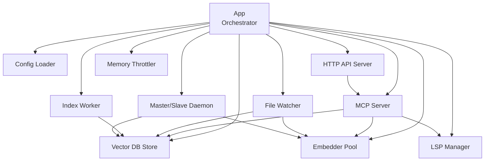
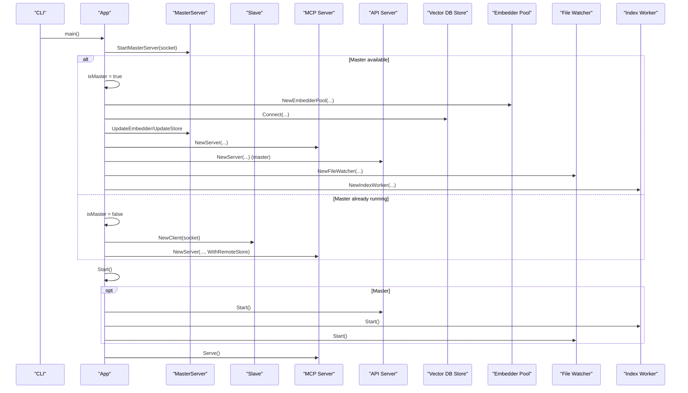
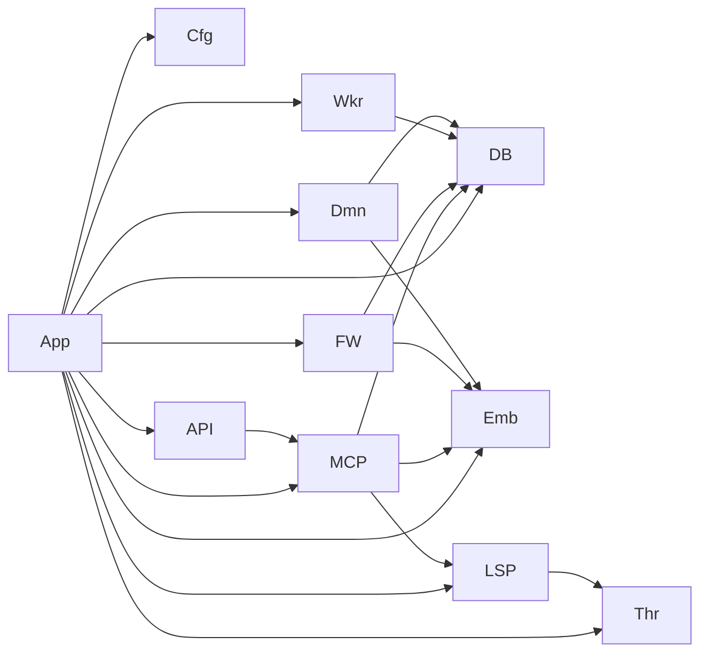

# Core Components and Interactions

<cite>
**Referenced Files in This Document**
- [main.go](file://main.go)
- [server.go](file://internal/mcp/server.go)
- [config.go](file://internal/config/config.go)
- [store.go](file://internal/db/store.go)
- [session.go](file://internal/embedding/session.go)
- [watcher.go](file://internal/watcher/watcher.go)
- [mem_throttler.go](file://internal/system/mem_throttler.go)
- [daemon.go](file://internal/daemon/daemon.go)
- [worker.go](file://internal/worker/worker.go)
- [server.go](file://internal/api/server.go)
- [resolver.go](file://internal/indexer/resolver.go)
- [analyzer.go](file://internal/analysis/analyzer.go)
- [client.go](file://internal/lsp/client.go)
- [graph.go](file://internal/db/graph.go)
</cite>

## Table of Contents
1. [Introduction](#introduction)
2. [Project Structure](#project-structure)
3. [Core Components](#core-components)
4. [Architecture Overview](#architecture-overview)
5. [Detailed Component Analysis](#detailed-component-analysis)
6. [Dependency Analysis](#dependency-analysis)
7. [Performance Considerations](#performance-considerations)
8. [Troubleshooting Guide](#troubleshooting-guide)
9. [Conclusion](#conclusion)

## Introduction
This document explains the core component architecture of Vector MCP Go, focusing on the main application orchestrator (App struct) and how it coordinates subsystems including the MCP server, vector database, embedding system, and file watcher. It covers initialization sequences, dependency injection patterns, inter-component communication, configuration management, memory throttling, resource pooling, lifecycle management, graceful shutdown, error propagation, master-slave detection, and practical examples of component interactions for search queries, file indexing, and code analysis.

## Project Structure
The application is organized around a central orchestrator (App) that wires together:
- Configuration loader
- MCP server with tool and resource registration
- Vector database (persistent collection)
- Embedding engine with pooling
- File watcher and background indexing worker
- API server for HTTP transport
- Daemon for master/slave coordination
- LSP integration and memory throttling

**Diagram sources**
- [main.go:37-176](file://main.go#L37-L176)
- [server.go:86-117](file://internal/mcp/server.go#L86-L117)
- [store.go:35-64](file://internal/db/store.go#L35-L64)
- [session.go:38-65](file://internal/embedding/session.go#L38-L65)
- [watcher.go:38-56](file://internal/watcher/watcher.go#L38-L56)
- [worker.go:34-44](file://internal/worker/worker.go#L34-L44)
- [server.go:35-109](file://internal/api/server.go#L35-L109)
- [daemon.go:327-399](file://internal/daemon/daemon.go#L327-L399)
- [client.go:36-64](file://internal/lsp/client.go#L36-L64)
- [mem_throttler.go:21-44](file://internal/system/mem_throttler.go#L21-L44)

**Section sources**
- [main.go:37-176](file://main.go#L37-L176)
- [config.go:30-130](file://internal/config/config.go#L30-L130)

## Core Components
- App: Central orchestrator that initializes subsystems, detects master/slave mode, injects dependencies, and manages lifecycle.
- MCP Server: Registers tools/resources/prompts, delegates to store/embedder/LSP, and exposes notifications.
- Vector DB Store: Persistent collection-backed storage with hybrid search, lexical filtering, and graph population.
- Embedder Pool: Resource pool for ONNX-based embeddings and optional reranking.
- File Watcher: Monitors filesystem changes, triggers indexing, and performs proactive analysis.
- Index Worker: Background worker consuming the index queue to index projects/packages.
- API Server: HTTP transport for MCP, search, context, and tool management.
- Daemon: Master/Slave RPC service exposing embedding and store operations.
- LSP Manager: Manages language servers per workspace root and file extension.
- Memory Throttler: Monitors system memory and advises when to throttle or refuse LSP startup.

**Section sources**
- [main.go:37-176](file://main.go#L37-L176)
- [server.go:66-117](file://internal/mcp/server.go#L66-L117)
- [store.go:19-64](file://internal/db/store.go#L19-L64)
- [session.go:34-85](file://internal/embedding/session.go#L34-L85)
- [watcher.go:22-56](file://internal/watcher/watcher.go#L22-L56)
- [worker.go:24-44](file://internal/worker/worker.go#L24-L44)
- [server.go:24-31](file://internal/api/server.go#L24-L31)
- [daemon.go:17-399](file://internal/daemon/daemon.go#L17-L399)
- [client.go:36-64](file://internal/lsp/client.go#L36-L64)
- [mem_throttler.go:21-44](file://internal/system/mem_throttler.go#L21-L44)

## Architecture Overview
The system operates in two modes:
- Master: Initializes ONNX models, embedding pool, vector store, MCP server, API server, file watcher, and index worker. Exposes RPC service for slaves.
- Slave: Starts MCP server only, connects to master RPC for embeddings and store operations, disables file watcher.

**Diagram sources**
- [main.go:93-176](file://main.go#L93-L176)
- [daemon.go:333-399](file://internal/daemon/daemon.go#L333-L399)
- [server.go:86-117](file://internal/mcp/server.go#L86-L117)
- [server.go:35-109](file://internal/api/server.go#L35-L109)
- [watcher.go:58-86](file://internal/watcher/watcher.go#L58-L86)
- [worker.go:46-61](file://internal/worker/worker.go#L46-L61)

## Detailed Component Analysis

### App Orchestrator
Responsibilities:
- Load configuration and create App with shared resources.
- Detect master vs slave via Unix socket presence.
- Initialize embedding pool, vector store, MCP server, API server, file watcher, and index worker (master only).
- Provide store accessor with master-only enforcement.
- Manage lifecycle: start, run live indexing, and graceful stop.

Key behaviors:
- Master/Slave detection uses a dedicated socket path; if another master is present, operate as slave and disable file watcher.
- Embedder pool is created only on master; slaves use remote embedder via RPC.
- Store is lazily created and cached; master-only to prevent inconsistent writes.
- Live indexing runs on master to pre-populate knowledge graph.

**Section sources**
- [main.go:37-176](file://main.go#L37-L176)
- [main.go:73-91](file://main.go#L73-L91)
- [main.go:93-176](file://main.go#L93-L176)
- [main.go:178-202](file://main.go#L178-L202)
- [main.go:204-278](file://main.go#L204-L278)

### MCP Server
Responsibilities:
- Register resources, prompts, and tools.
- Provide unified search tool (vector, lexical, hybrid, index status).
- Manage LSP sessions per workspace root and file extension.
- Provide graph population from store records.
- Expose notifications to clients.

Interfaces:
- Searcher, StatusProvider, StoreManager, IndexerStore compose store operations.
- Embedder is injected for semantic operations.
- Remote store delegation for slave mode.

**Section sources**
- [server.go:66-117](file://internal/mcp/server.go#L66-L117)
- [server.go:150-163](file://internal/mcp/server.go#L150-L163)
- [server.go:165-182](file://internal/mcp/server.go#L165-L182)
- [server.go:190-407](file://internal/mcp/server.go#L190-L407)
- [server.go:409-459](file://internal/mcp/server.go#L409-L459)

### Vector Database Store
Responsibilities:
- Persistent collection-backed storage with dimension probing.
- Vector search with similarity boosting and priority adjustments.
- Lexical search with parallel filtering and metadata parsing cache.
- Hybrid search combining vector and lexical with Reciprocal Rank Fusion and dynamic weighting.
- Project-scoped operations (clear, delete by prefix/path, status).
- Graph population from records.

Optimization highlights:
- Parallel lexical filtering with CPU-aware chunking.
- Metadata cache for JSON arrays to avoid repeated unmarshalling.
- Priority and recency boosting for ranking.

**Section sources**
- [store.go:35-64](file://internal/db/store.go#L35-L64)
- [store.go:80-409](file://internal/db/store.go#L80-L409)
- [store.go:223-336](file://internal/db/store.go#L223-L336)
- [store.go:633-663](file://internal/db/store.go#L633-L663)
- [graph.go:35-105](file://internal/db/graph.go#L35-L105)

### Embedding System and Pooling
Responsibilities:
- Load ONNX models and tokenizers.
- Create embedder sessions with tensor buffers.
- Provide embedding and reranking operations.
- Pool embedders for concurrency and resource reuse.
- Normalize vectors and handle model-specific differences.

Pooling:
- Fixed-size channel-based pool.
- Get/Put semantics with context-aware timeouts.
- Proper cleanup on close.

**Section sources**
- [session.go:38-85](file://internal/embedding/session.go#L38-L85)
- [session.go:67-78](file://internal/embedding/session.go#L67-L78)
- [session.go:87-174](file://internal/embedding/session.go#L87-L174)
- [session.go:176-280](file://internal/embedding/session.go#L176-L280)
- [session.go:300-367](file://internal/embedding/session.go#L300-L367)

### File Watcher and Index Worker
Responsibilities:
- Monitor filesystem events under project root.
- Debounce and batch events.
- Index single files on write/create; remove on rename/delete.
- Proactively analyze files and enforce architectural rules.
- Trigger re-distillation for dependent packages.
- Report progress via progress map and store status.

Worker:
- Consumes index queue, processes paths, updates status, and logs errors.

**Section sources**
- [watcher.go:22-56](file://internal/watcher/watcher.go#L22-L56)
- [watcher.go:58-196](file://internal/watcher/watcher.go#L58-L196)
- [watcher.go:198-281](file://internal/watcher/watcher.go#L198-L281)
- [worker.go:24-44](file://internal/worker/worker.go#L24-L44)
- [worker.go:46-112](file://internal/worker/worker.go#L46-L112)

### API Server
Responsibilities:
- Expose MCP via Streamable HTTP transport.
- Provide health, search, context, todo endpoints.
- Tool management endpoints: list repos, status, trigger index, skeleton, list tools, call tool.
- CORS handling for browser clients.

**Section sources**
- [server.go:24-31](file://internal/api/server.go#L24-L31)
- [server.go:35-109](file://internal/api/server.go#L35-L109)
- [server.go:111-139](file://internal/api/server.go#L111-L139)

### Daemon (Master/Slave)
Responsibilities:
- Master RPC service exposing embedding and store operations.
- Slave client to delegate embedding and store calls to master.
- Update embedder/store dynamically while running.
- Socket-based IPC with graceful cleanup.

**Section sources**
- [daemon.go:17-399](file://internal/daemon/daemon.go#L17-L399)
- [daemon.go:401-474](file://internal/daemon/daemon.go#L401-L474)
- [daemon.go:502-622](file://internal/daemon/daemon.go#L502-L622)

### LSP Manager
Responsibilities:
- Start language servers per file extension and workspace root.
- Manage JSON-RPC communication, request/response mapping, and notifications.
- Memory throttling to avoid starting LSP under memory pressure.
- TTL-based auto-shutdown after inactivity.

**Section sources**
- [client.go:36-64](file://internal/lsp/client.go#L36-L64)
- [client.go:66-117](file://internal/lsp/client.go#L66-L117)
- [client.go:145-206](file://internal/lsp/client.go#L145-L206)
- [client.go:208-247](file://internal/lsp/client.go#L208-L247)
- [client.go:249-355](file://internal/lsp/client.go#L249-L355)

### Memory Throttler
Responsibilities:
- Periodically read /proc/meminfo and compute usage percentage and available MB.
- Provide ShouldThrottle and CanStartLSP checks.
- Stop monitoring on shutdown.

**Section sources**
- [mem_throttler.go:21-44](file://internal/system/mem_throttler.go#L21-L44)
- [mem_throttler.go:46-110](file://internal/system/mem_throttler.go#L46-L110)
- [mem_throttler.go:112-151](file://internal/system/mem_throttler.go#L112-L151)

### Configuration Management
Responsibilities:
- Load environment variables and defaults.
- Ensure directories exist.
- Provide structured logger and relative path utilities.

**Section sources**
- [config.go:30-130](file://internal/config/config.go#L30-L130)
- [config.go:132-139](file://internal/config/config.go#L132-L139)

### Knowledge Graph
Responsibilities:
- Build graph from store records.
- Detect implementations and relationships.
- Provide lookup and traversal helpers.

**Section sources**
- [graph.go:18-33](file://internal/db/graph.go#L18-L33)
- [graph.go:35-105](file://internal/db/graph.go#L35-L105)
- [graph.go:107-155](file://internal/db/graph.go#L107-L155)

## Dependency Analysis
- App depends on Config, MCP Server, Vector DB Store, Embedder Pool, File Watcher, Index Worker, API Server, Daemon, LSP Manager, and Memory Throttler.
- MCP Server depends on Store (local or remote), Embedder, LSP Manager, Memory Throttler, and Knowledge Graph.
- Vector DB Store depends on persistent collection and provides search, lexical, hybrid, and graph population.
- Embedder Pool depends on ONNX runtime and tokenizer.
- File Watcher depends on Store, Embedder, Analyzer, and MCP notifications.
- Index Worker depends on Store and Embedder.
- API Server depends on MCP Server.
- Daemon provides RPC service for Embedder and Store.
- LSP Manager depends on Memory Throttler.
- Memory Throttler depends on OS memory stats.

**Diagram sources**
- [main.go:37-176](file://main.go#L37-L176)
- [server.go:66-117](file://internal/mcp/server.go#L66-L117)
- [store.go:19-64](file://internal/db/store.go#L19-L64)
- [session.go:34-85](file://internal/embedding/session.go#L34-L85)
- [watcher.go:22-56](file://internal/watcher/watcher.go#L22-L56)
- [worker.go:24-44](file://internal/worker/worker.go#L24-L44)
- [server.go:24-31](file://internal/api/server.go#L24-L31)
- [daemon.go:17-399](file://internal/daemon/daemon.go#L17-L399)
- [client.go:36-64](file://internal/lsp/client.go#L36-L64)
- [mem_throttler.go:21-44](file://internal/system/mem_throttler.go#L21-L44)

**Section sources**
- [main.go:37-176](file://main.go#L37-L176)
- [server.go:66-117](file://internal/mcp/server.go#L66-L117)
- [store.go:19-64](file://internal/db/store.go#L19-L64)
- [session.go:34-85](file://internal/embedding/session.go#L34-L85)
- [watcher.go:22-56](file://internal/watcher/watcher.go#L22-L56)
- [worker.go:24-44](file://internal/worker/worker.go#L24-L44)
- [server.go:24-31](file://internal/api/server.go#L24-L31)
- [daemon.go:17-399](file://internal/daemon/daemon.go#L17-L399)
- [client.go:36-64](file://internal/lsp/client.go#L36-L64)
- [mem_throttler.go:21-44](file://internal/system/mem_throttler.go#L21-L44)

## Performance Considerations
- Embedding Pool: Use fixed-size pool to limit concurrent ONNX sessions and reduce GPU/CPU contention.
- Vector Search: Leverage hybrid search with dynamic weights and recency boosting for better recall and freshness.
- Lexical Search: Parallel filtering with CPU-aware chunking reduces latency for large indices.
- Memory Throttling: Prevent LSP startup under memory pressure; adjust thresholds to balance responsiveness and stability.
- File Watcher Debounce: 500 ms debounce reduces redundant indexing; tune based on project size and disk I/O.
- Graph Population: Batch operations and incremental updates can improve startup time.

[No sources needed since this section provides general guidance]

## Troubleshooting Guide
Common issues and resolutions:
- Dimension mismatch: If switching models, the store probes for dimension mismatches and instructs deletion of the vector database; recreate the DB after changing models.
- Master already running: Slave mode disables file watcher and uses remote store/embedder; verify socket path and permissions.
- Embedding/Rerank timeouts: Increase timeouts or reduce batch sizes; ensure models are downloaded and tokenizer files exist.
- LSP startup failures: Check memory throttling thresholds; ensure language server binaries are installed and discoverable.
- API CORS errors: Verify Access-Control headers are set; ensure client respects CORS preflight.
- Index worker panics: Recover and log; check progress map and store status for error messages.

**Section sources**
- [store.go:51-61](file://internal/db/store.go#L51-L61)
- [main.go:93-108](file://main.go#L93-L108)
- [daemon.go:448-500](file://internal/daemon/daemon.go#L448-L500)
- [daemon.go:623-647](file://internal/daemon/daemon.go#L623-L647)
- [client.go:76-79](file://internal/lsp/client.go#L76-L79)
- [server.go:89-101](file://internal/api/server.go#L89-L101)
- [worker.go:63-72](file://internal/worker/worker.go#L63-L72)

## Conclusion
Vector MCP Go’s App orchestrator coordinates a cohesive ecosystem of subsystems to deliver semantic search, code analysis, and developer tooling. Master/slave detection enables scalable operation, while embedding pooling, memory throttling, and resourceful search strategies ensure performance and reliability. The MCP server exposes a unified interface for agents and clients, and the file watcher plus background worker keep the index fresh. Together, these components provide a robust foundation for intelligent codebase navigation and maintenance.