# Data Flow and Processing Pipelines

<cite>
**Referenced Files in This Document**
- [main.go](file://main.go)
- [scanner.go](file://internal/indexer/scanner.go)
- [chunker.go](file://internal/indexer/chunker.go)
- [store.go](file://internal/db/store.go)
- [watcher.go](file://internal/watcher/watcher.go)
- [server.go](file://internal/mcp/server.go)
- [worker.go](file://internal/worker/worker.go)
- [analyzer.go](file://internal/analysis/analyzer.go)
- [graph.go](file://internal/db/graph.go)
- [session.go](file://internal/embedding/session.go)
- [config.go](file://internal/config/config.go)
- [handlers_search.go](file://internal/mcp/handlers_search.go)
- [handlers_analysis.go](file://internal/mcp/handlers_analysis.go)
- [handlers_distill.go](file://internal/mcp/handlers_distill.go)
</cite>

## Table of Contents
1. [Introduction](#introduction)
2. [Project Structure](#project-structure)
3. [Core Components](#core-components)
4. [Architecture Overview](#architecture-overview)
5. [Detailed Component Analysis](#detailed-component-analysis)
6. [Dependency Analysis](#dependency-analysis)
7. [Performance Considerations](#performance-considerations)
8. [Troubleshooting Guide](#troubleshooting-guide)
9. [Conclusion](#conclusion)

## Introduction
This document explains the end-to-end data flow and processing pipelines of Vector MCP Go. It covers how file system events are transformed into indexed vectors, how live indexing and debounced processing keep the index fresh, how chunking and metadata enrichment prepare content for embeddings, how the analysis pipeline detects issues and patterns, and how the search pipeline converts queries into embeddings and performs hybrid retrieval with reranking and ranking. It also documents concurrency patterns, queue management, backpressure handling, error handling, and performance optimizations.

## Project Structure
Vector MCP Go organizes its data pipeline across several layers:
- Application bootstrap and orchestration
- Indexing pipeline (scanner, chunker, embedding)
- Vector storage and hybrid search
- Live indexing and file watching
- MCP server and tool handlers
- Analysis and distillation
- Embedding sessions and pools

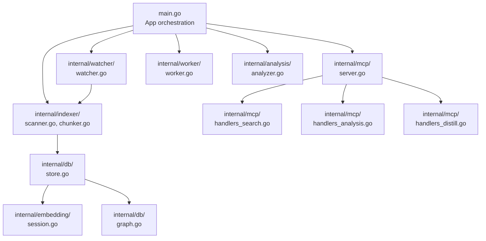

**Diagram sources**
- [main.go:37-71](file://main.go#L37-L71)
- [scanner.go:67-191](file://internal/indexer/scanner.go#L67-L191)
- [chunker.go:43-101](file://internal/indexer/chunker.go#L43-L101)
- [store.go:35-64](file://internal/db/store.go#L35-L64)
- [session.go:38-65](file://internal/embedding/session.go#L38-L65)
- [watcher.go:58-86](file://internal/watcher/watcher.go#L58-L86)
- [server.go:86-117](file://internal/mcp/server.go#L86-L117)
- [handlers_search.go:191-313](file://internal/mcp/handlers_search.go#L191-L313)
- [handlers_analysis.go:21-224](file://internal/mcp/handlers_analysis.go#L21-L224)
- [handlers_distill.go:11-31](file://internal/mcp/handlers_distill.go#L11-L31)
- [worker.go:46-61](file://internal/worker/worker.go#L46-L61)
- [analyzer.go:29-70](file://internal/analysis/analyzer.go#L29-L70)
- [graph.go:35-105](file://internal/db/graph.go#L35-L105)

**Section sources**
- [main.go:37-71](file://main.go#L37-L71)
- [config.go:30-130](file://internal/config/config.go#L30-L130)

## Core Components
- App orchestrator: Initializes configuration, embedding pool, vector store, MCP server, API server, and optional daemon/master role. It wires queues and progress tracking for live indexing and background workers.
- Indexer: Scans the project, compares hashes, processes files, chunks content, generates embeddings, and inserts records into the vector store.
- Chunker: Uses Tree-Sitter for language-aware chunking and metadata extraction; falls back to fast chunking for unsupported languages.
- Vector Store: Persistent collection backed by a vector database, supporting vector search, lexical filtering, hybrid search, and RRF reranking.
- File Watcher: Monitors file system events, debounces changes, triggers re-indexing, and performs proactive analysis and architectural guardrails.
- MCP Server: Exposes tools for search, analysis, codebase diagnostics, and context management; integrates with the vector store and embedding engine.
- Workers: Background workers consume the index queue to perform full or scoped re-indexing.
- Analysis: Runs pattern-based and vetting analyzers; supports distillation of package purpose summaries.
- Embedding Sessions: ONNX-backed embedders with pooling and normalization; optional reranking sessions; pooled for concurrency.

**Section sources**
- [main.go:37-71](file://main.go#L37-L71)
- [scanner.go:67-191](file://internal/indexer/scanner.go#L67-L191)
- [chunker.go:43-101](file://internal/indexer/chunker.go#L43-L101)
- [store.go:35-64](file://internal/db/store.go#L35-L64)
- [watcher.go:58-86](file://internal/watcher/watcher.go#L58-L86)
- [server.go:86-117](file://internal/mcp/server.go#L86-L117)
- [worker.go:46-61](file://internal/worker/worker.go#L46-L61)
- [analyzer.go:29-70](file://internal/analysis/analyzer.go#L29-L70)
- [session.go:38-65](file://internal/embedding/session.go#L38-L65)

## Architecture Overview
The system transforms raw files into semantic vectors and maintains them incrementally:
- File system events trigger debounced processing.
- Files are scanned, hashed, and compared to existing records.
- Files that changed are chunked with language-aware parsing or fallback chunking.
- Embeddings are generated per chunk; metadata enriches each record.
- Records are inserted atomically (delete old chunks, insert new) to prevent ghost-chunks.
- Vector search is performed with hybrid retrieval (vector + lexical) and optional reranking.
- Proactive analysis and architectural guardrails run alongside live indexing.

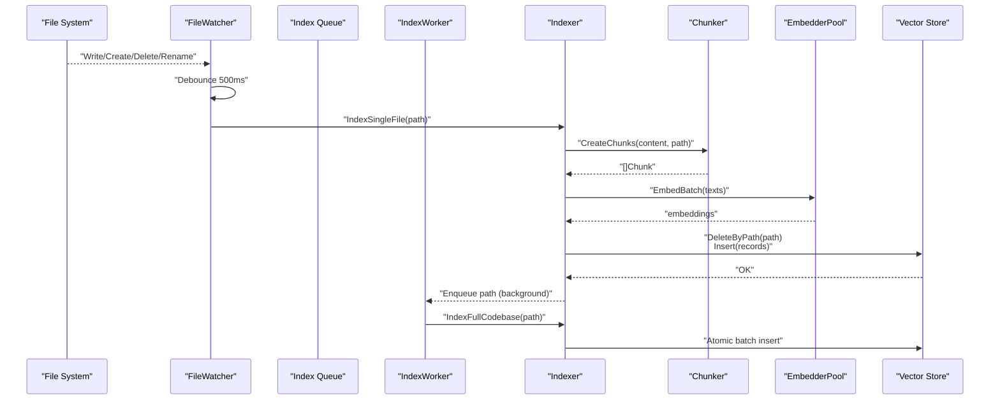

**Diagram sources**
- [watcher.go:141-196](file://internal/watcher/watcher.go#L141-L196)
- [scanner.go:337-355](file://internal/indexer/scanner.go#L337-L355)
- [chunker.go:43-101](file://internal/indexer/chunker.go#L43-L101)
- [session.go:261-271](file://internal/embedding/session.go#L261-L271)
- [store.go:66-78](file://internal/db/store.go#L66-L78)
- [worker.go:98-111](file://internal/worker/worker.go#L98-L111)

## Detailed Component Analysis

### Live Indexing Pipeline (File Watcher Integration, Debounced Processing, Incremental Updates)
- Debounce: Events are accumulated in a channel and processed after a 500 ms timer fires.
- Scope: Only specific extensions are considered for proactive indexing.
- Incremental: Hash comparison determines whether a file needs reprocessing; stale paths are cleaned.
- Post-processing: Architectural guardrails and autonomous re-distillation are triggered for affected packages.
- Proactive analysis: Pattern-based and vetting analyzers run on modified files and emit notifications.

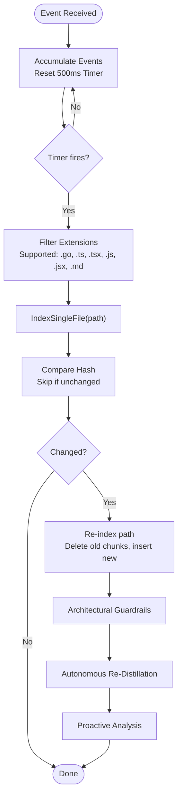

**Diagram sources**
- [watcher.go:121-139](file://internal/watcher/watcher.go#L121-L139)
- [watcher.go:141-196](file://internal/watcher/watcher.go#L141-L196)
- [scanner.go:337-355](file://internal/indexer/scanner.go#L337-L355)
- [watcher.go:198-244](file://internal/watcher/watcher.go#L198-L244)
- [watcher.go:246-280](file://internal/watcher/watcher.go#L246-L280)
- [analyzer.go:29-70](file://internal/analysis/analyzer.go#L29-L70)

**Section sources**
- [watcher.go:58-86](file://internal/watcher/watcher.go#L58-L86)
- [watcher.go:121-139](file://internal/watcher/watcher.go#L121-L139)
- [watcher.go:141-196](file://internal/watcher/watcher.go#L141-L196)
- [watcher.go:198-244](file://internal/watcher/watcher.go#L198-L244)
- [watcher.go:246-280](file://internal/watcher/watcher.go#L246-L280)
- [scanner.go:337-355](file://internal/indexer/scanner.go#L337-L355)

### Chunking Pipeline (Tree-Sitter Parsers, Relationship Extraction, Metadata Enrichment)
- Language-aware chunking: Tree-Sitter queries extract top-level entities per language (functions, classes, types, methods, tags, rulesets).
- Gap filling: Uncovered regions are split into Unknown chunks to maintain continuity.
- Metadata enrichment: Relationships, symbols, calls, docstrings, structural metadata, and line ranges are attached to each chunk.
- Contextual strings: Parent scope and structural metadata are prepended to improve embedding quality.

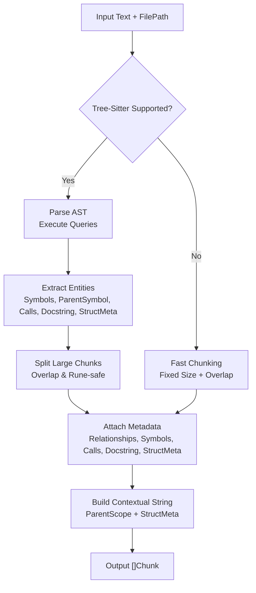

**Diagram sources**
- [chunker.go:111-421](file://internal/indexer/chunker.go#L111-L421)
- [chunker.go:43-101](file://internal/indexer/chunker.go#L43-L101)
- [chunker.go:537-577](file://internal/indexer/chunker.go#L537-L577)

**Section sources**
- [chunker.go:43-101](file://internal/indexer/chunker.go#L43-L101)
- [chunker.go:111-421](file://internal/indexer/chunker.go#L111-L421)
- [chunker.go:537-577](file://internal/indexer/chunker.go#L537-L577)

### Indexing Pipeline (Discovery, Processing, Atomic Update, Batch Insert)
- Discovery: Walk project, apply ignore rules, compute SHA-256 hashes, compare with existing records.
- Stale cleanup: Remove records for paths no longer present on disk.
- Processing: For changed files, read content, chunk, embed, and construct records with metadata.
- Atomic update: Delete old chunks for the path, then insert new batch to avoid “ghost-chunk” artifacts.
- Progress tracking: Real-time status updates and batch insertion batching.

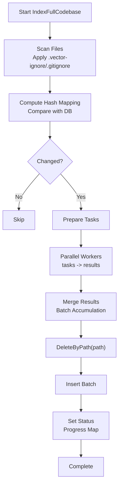

**Diagram sources**
- [scanner.go:67-191](file://internal/indexer/scanner.go#L67-L191)
- [scanner.go:193-335](file://internal/indexer/scanner.go#L193-L335)
- [scanner.go:171-188](file://internal/indexer/scanner.go#L171-L188)

**Section sources**
- [scanner.go:67-191](file://internal/indexer/scanner.go#L67-L191)
- [scanner.go:193-335](file://internal/indexer/scanner.go#L193-L335)
- [scanner.go:171-188](file://internal/indexer/scanner.go#L171-L188)

### Analysis Pipeline (Code Quality Assessment, Pattern Detection, Issue Reporting)
- PatternAnalyzer: Detects TODO, FIXME, HACK, DEPRECATED markers.
- VettingAnalyzer: Runs static analysis on Go files using the project’s toolchain.
- MultiAnalyzer: Aggregates results from multiple analyzers.
- Proactive analysis in the watcher: On file change, runs analyzers and emits notifications.

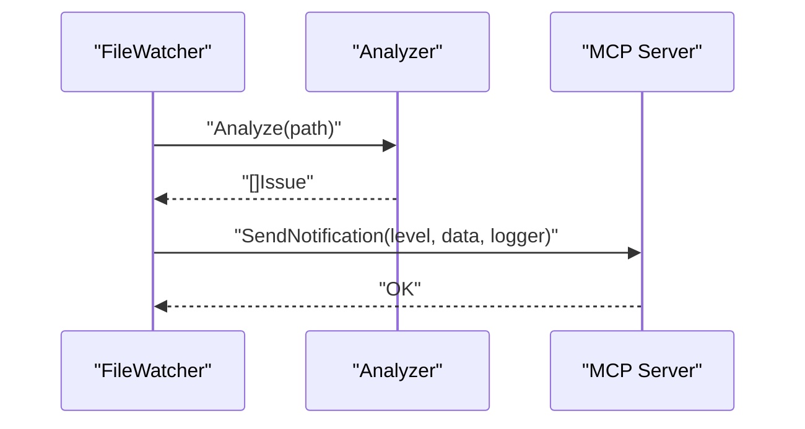

**Diagram sources**
- [watcher.go:168-183](file://internal/watcher/watcher.go#L168-L183)
- [analyzer.go:29-70](file://internal/analysis/analyzer.go#L29-L70)
- [server.go:409-429](file://internal/mcp/server.go#L409-L429)

**Section sources**
- [analyzer.go:29-70](file://internal/analysis/analyzer.go#L29-L70)
- [watcher.go:168-183](file://internal/watcher/watcher.go#L168-L183)
- [server.go:409-429](file://internal/mcp/server.go#L409-L429)

### Search Pipeline (Query Processing, Embedding Generation, Hybrid Retrieval, Reranking, Ranking)
- Query embedding: Embedder converts the query into a vector.
- Hybrid search: Concurrent vector and lexical search; results merged via Reciprocal Rank Fusion (RRF) with dynamic weights.
- Boosting: Function score, recency, and priority multipliers adjust relevance.
- Reranking: Optional cross-encoder reranking improves final ordering.
- Context truncation: Token estimation ensures results fit within requested context windows.

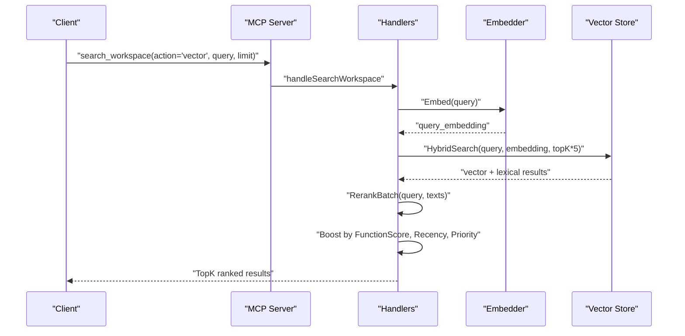

**Diagram sources**
- [handlers_search.go:315-365](file://internal/mcp/handlers_search.go#L315-L365)
- [handlers_search.go:191-313](file://internal/mcp/handlers_search.go#L191-L313)
- [store.go:223-336](file://internal/db/store.go#L223-L336)
- [session.go:300-314](file://internal/embedding/session.go#L300-L314)

**Section sources**
- [handlers_search.go:191-313](file://internal/mcp/handlers_search.go#L191-L313)
- [handlers_search.go:315-365](file://internal/mcp/handlers_search.go#L315-L365)
- [store.go:223-336](file://internal/db/store.go#L223-L336)
- [session.go:300-314](file://internal/embedding/session.go#L300-L314)

### Knowledge Graph Construction and Usage
- Population: The graph is rebuilt from all records, extracting nodes and edges from metadata.
- Implementations: Interface-to-struct implementation detection using structural metadata.
- Usage: Lookup implementations, field usage, and name-based search for downstream reasoning.

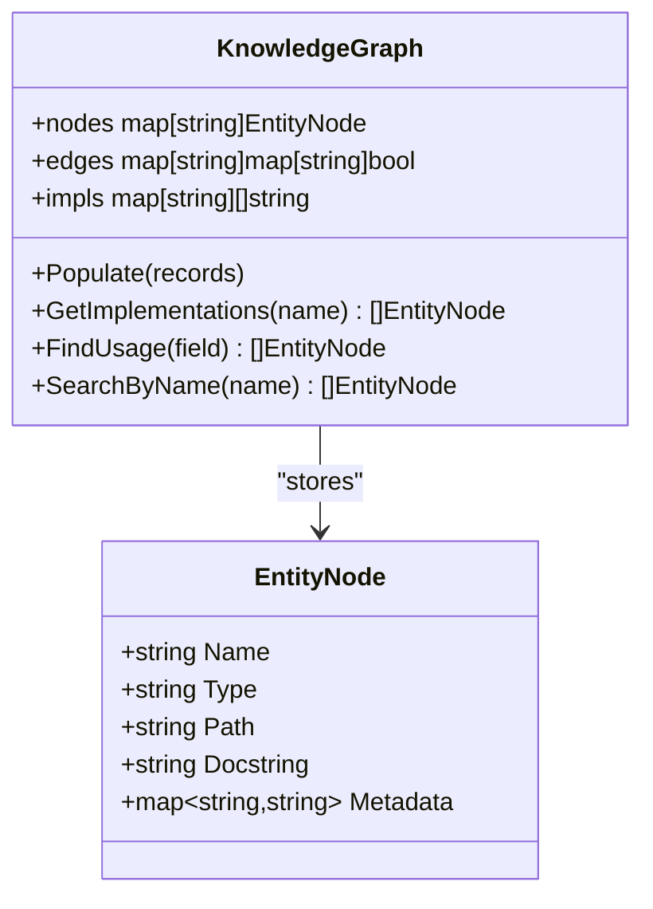

**Diagram sources**
- [graph.go:18-105](file://internal/db/graph.go#L18-L105)

**Section sources**
- [graph.go:18-105](file://internal/db/graph.go#L18-L105)
- [server.go:165-182](file://internal/mcp/server.go#L165-L182)

### Background Indexing and Queue Management
- Index queue: Buffered channel for background indexing tasks.
- IndexWorker: Consumes paths from the queue, performs full re-indexing for the target path, and updates status.
- Backpressure: Buffered channels and context cancellation ensure graceful shutdown and controlled throughput.

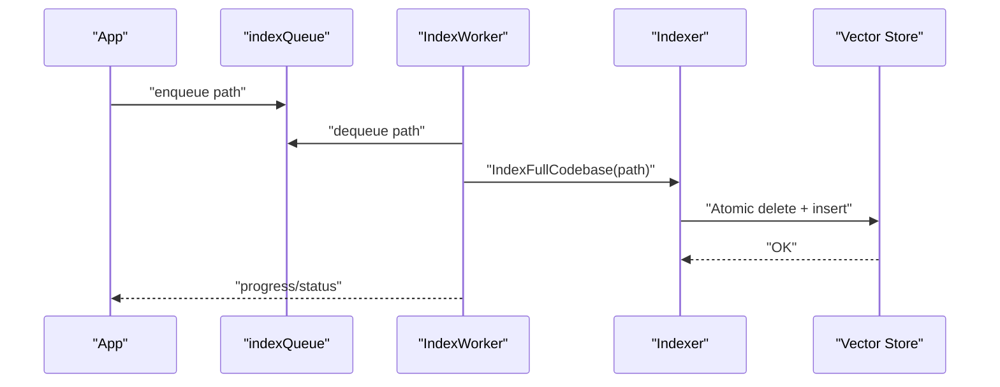

**Diagram sources**
- [main.go:63-70](file://main.go#L63-L70)
- [worker.go:46-61](file://internal/worker/worker.go#L46-L61)
- [worker.go:98-111](file://internal/worker/worker.go#L98-L111)
- [scanner.go:193-335](file://internal/indexer/scanner.go#L193-L335)

**Section sources**
- [main.go:63-70](file://main.go#L63-L70)
- [worker.go:46-61](file://internal/worker/worker.go#L46-L61)
- [worker.go:98-111](file://internal/worker/worker.go#L98-L111)
- [scanner.go:193-335](file://internal/indexer/scanner.go#L193-L335)

### Distillation of Package Purpose
- Aggregation: Collects exported API, internal details, dependencies, and type counts from records under a package.
- Embedding: Generates a summary embedding and stores a high-priority “distilled” record.
- Re-indexing: Enables future semantic retrieval with boosted relevance.

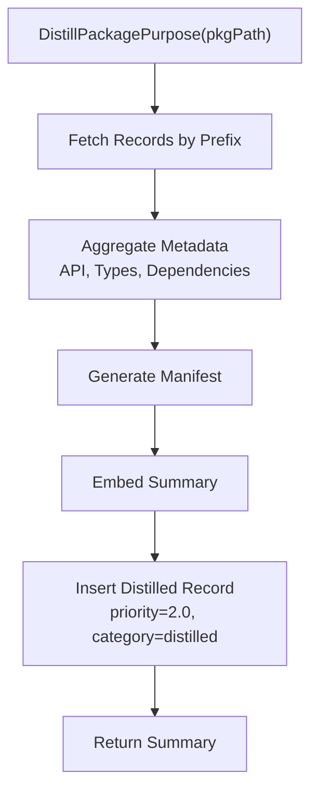

**Diagram sources**
- [handlers_distill.go:11-31](file://internal/mcp/handlers_distill.go#L11-L31)
- [distiller.go:40-190](file://internal/analysis/distiller.go#L40-L190)

**Section sources**
- [handlers_distill.go:11-31](file://internal/mcp/handlers_distill.go#L11-L31)
- [distiller.go:40-190](file://internal/analysis/distiller.go#L40-L190)

## Dependency Analysis
- Coupling: The MCP server depends on the vector store and embedder; the watcher depends on the store and embedder; the indexer depends on the chunker and embedder; the worker depends on the indexer and store.
- Cohesion: Each module encapsulates a focused responsibility (scanning, chunking, embedding, storing, searching, analysis).
- External dependencies: Vector DB, ONNX runtime, Tree-Sitter parsers, fsnotify, and MCP protocol libraries.

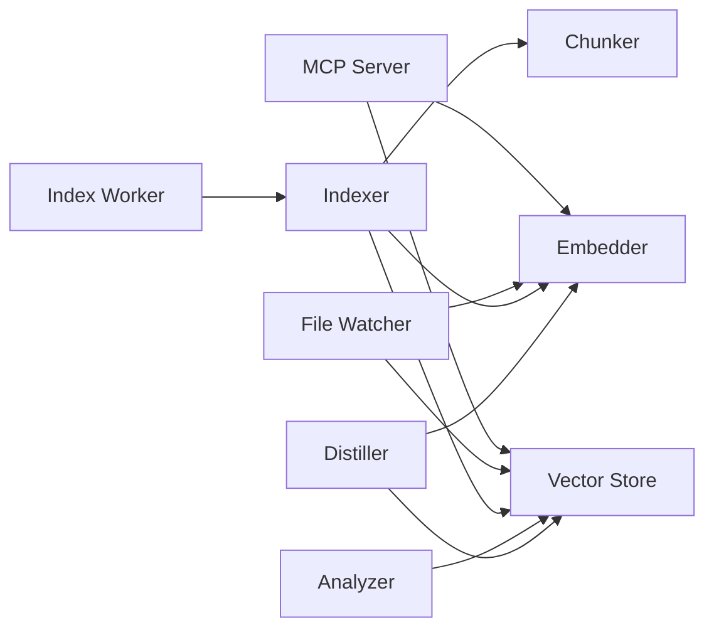

**Diagram sources**
- [server.go:86-117](file://internal/mcp/server.go#L86-L117)
- [watcher.go:58-86](file://internal/watcher/watcher.go#L58-L86)
- [scanner.go:67-191](file://internal/indexer/scanner.go#L67-L191)
- [chunker.go:43-101](file://internal/indexer/chunker.go#L43-L101)
- [worker.go:46-61](file://internal/worker/worker.go#L46-L61)
- [analyzer.go:29-70](file://internal/analysis/analyzer.go#L29-L70)
- [distiller.go:29-36](file://internal/analysis/distiller.go#L29-L36)

**Section sources**
- [server.go:86-117](file://internal/mcp/server.go#L86-L117)
- [watcher.go:58-86](file://internal/watcher/watcher.go#L58-L86)
- [scanner.go:67-191](file://internal/indexer/scanner.go#L67-L191)
- [chunker.go:43-101](file://internal/indexer/chunker.go#L43-L101)
- [worker.go:46-61](file://internal/worker/worker.go#L46-L61)
- [analyzer.go:29-70](file://internal/analysis/analyzer.go#L29-L70)
- [distiller.go:29-36](file://internal/analysis/distiller.go#L29-L36)

## Performance Considerations
- Concurrency:
  - Parallel workers process tasks concurrently; batch sizes are tuned to reduce overhead.
  - Embedding pool allows multiple concurrent sessions; semaphore controls parallel duplicate search.
- Backpressure:
  - Buffered channels (index queue, event channel) prevent overload.
  - Context cancellation and timeouts protect long-running operations.
- Memory and I/O:
  - Fast chunking with overlap avoids excessive memory fragmentation.
  - Hash-based incremental indexing minimizes I/O by skipping unchanged files.
- Vector operations:
  - Hybrid search fetches more candidates to allow filtering and reranking.
  - Reranking is optional and only applied when a reranker is available.
- Token budgeting:
  - Token estimation and truncation ensure results fit within context windows.

[No sources needed since this section provides general guidance]

## Troubleshooting Guide
- Initialization failures:
  - Master/Slave detection errors indicate another instance is running; disable watcher on slaves.
  - Embedding pool initialization errors require valid model files and tokenizer paths.
- Indexing errors:
  - Hash mismatch or dimension mismatch in the vector store indicates switching models without clearing the DB.
  - Stale path deletion errors should be logged and status updated.
- Search errors:
  - Vector search failures often stem from dimension mismatches; ensure consistent model configuration.
  - Reranking errors fall back to top-K selection.
- Watcher issues:
  - Debounce timer not firing suggests event channel saturation; consider tuning buffer sizes.
  - Architectural guardrails rely on ADR/distilled summaries; ensure prior indexing completed.
- Worker panics:
  - Recover and mark status as failed; check logs for the failing path.

**Section sources**
- [main.go:94-108](file://main.go#L94-L108)
- [session.go:38-65](file://internal/embedding/session.go#L38-L65)
- [store.go:51-61](file://internal/db/store.go#L51-L61)
- [scanner.go:104-113](file://internal/indexer/scanner.go#L104-L113)
- [store.go:80-83](file://internal/db/store.go#L80-L83)
- [session.go:300-314](file://internal/embedding/session.go#L300-L314)
- [watcher.go:121-139](file://internal/watcher/watcher.go#L121-L139)
- [worker.go:64-72](file://internal/worker/worker.go#L64-L72)

## Conclusion
Vector MCP Go’s data flow is designed for reliability, scalability, and responsiveness. Live indexing with debouncing keeps the vector index fresh while minimizing unnecessary work. Language-aware chunking and metadata enrichment produce high-quality embeddings. The hybrid search pipeline combines vector and lexical retrieval with reranking and boosting for precise results. Robust error handling, concurrency controls, and queue management ensure smooth operation under varied loads.