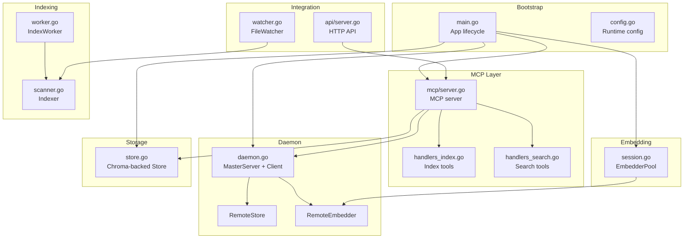
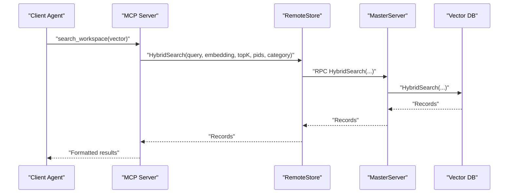
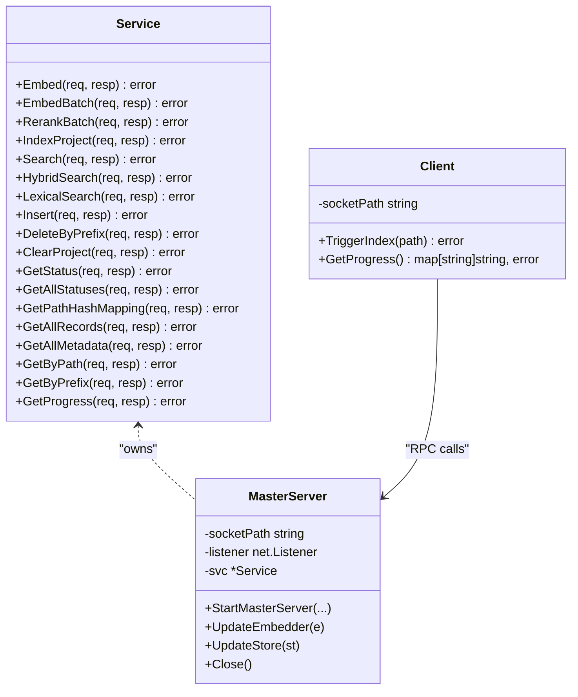
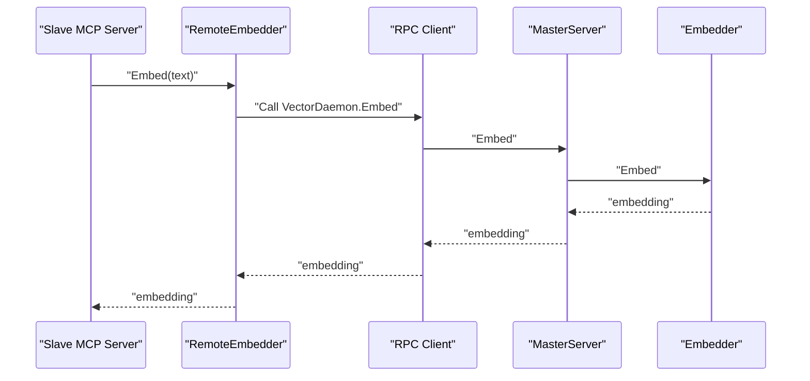
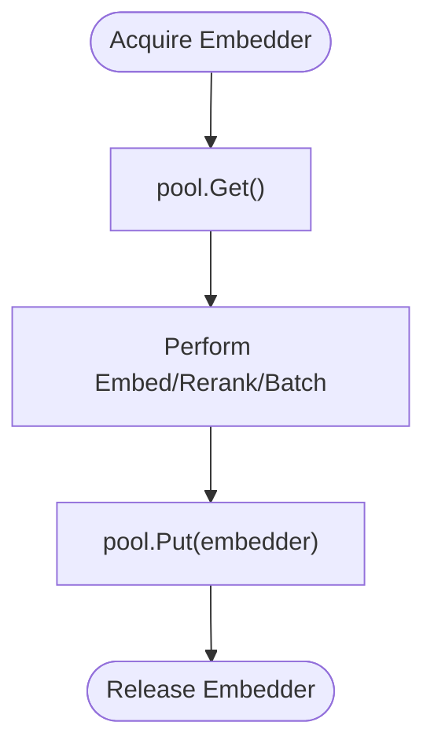
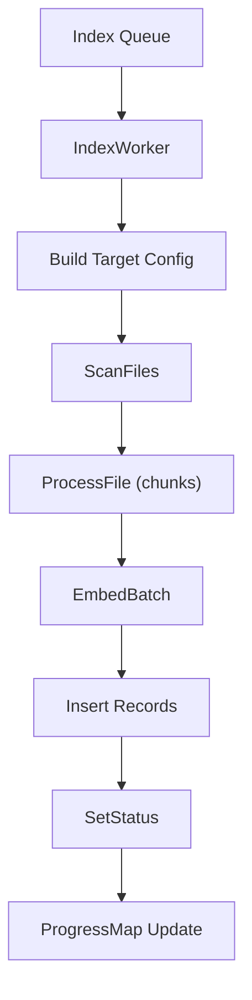
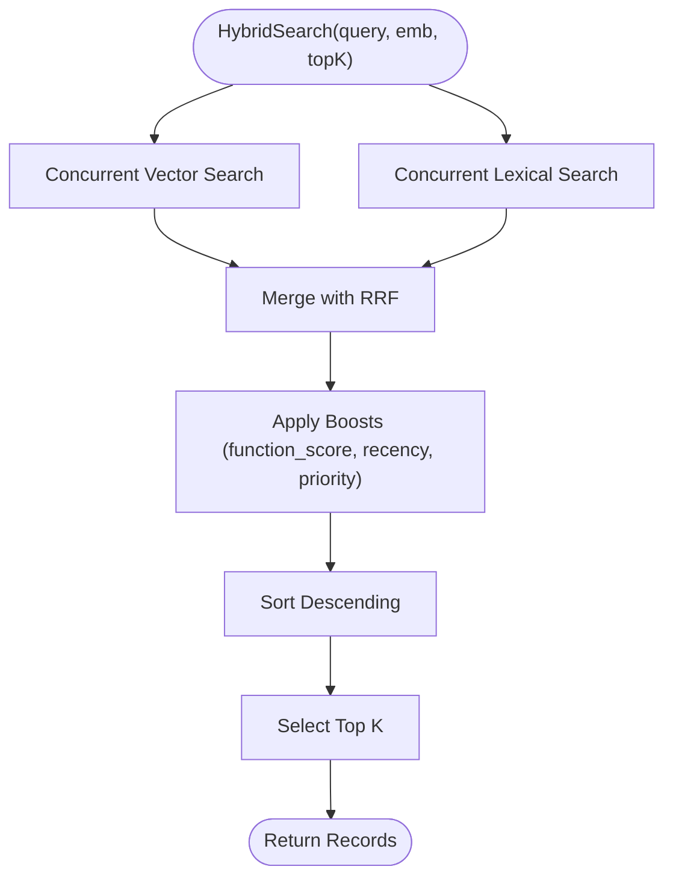
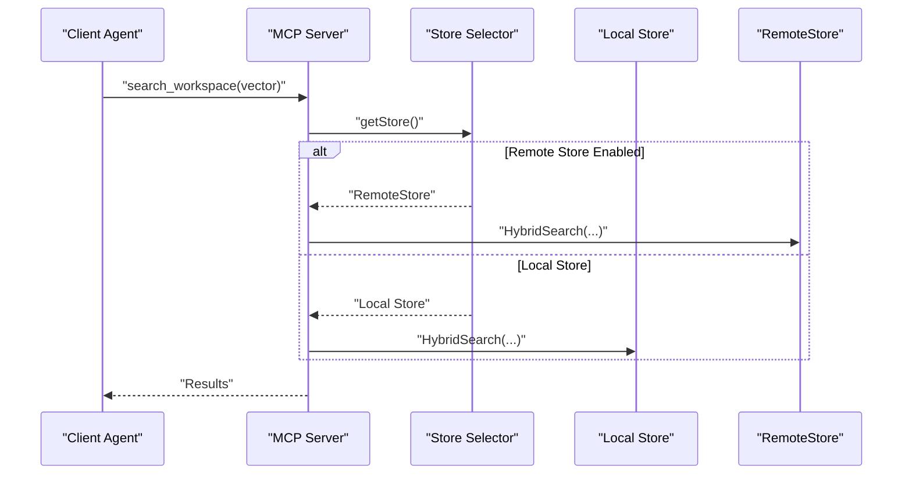
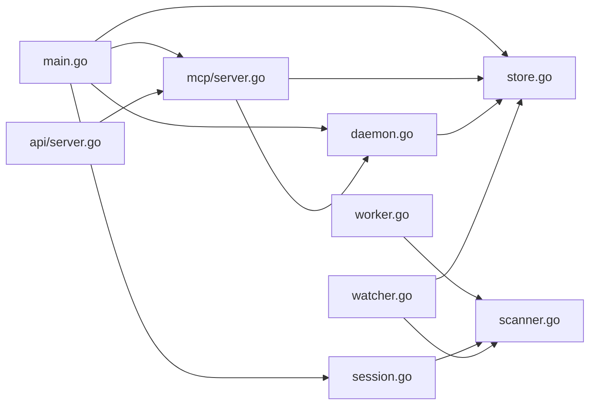

# Distributed Architecture Patterns

<cite>
**Referenced Files in This Document**
- [daemon.go](file://internal/daemon/daemon.go)
- [server.go](file://internal/mcp/server.go)
- [store.go](file://internal/db/store.go)
- [scanner.go](file://internal/indexer/scanner.go)
- [worker.go](file://internal/worker/worker.go)
- [session.go](file://internal/embedding/session.go)
- [config.go](file://internal/config/config.go)
- [main.go](file://main.go)
- [handlers_index.go](file://internal/mcp/handlers_index.go)
- [handlers_search.go](file://internal/mcp/handlers_search.go)
- [watcher.go](file://internal/watcher/watcher.go)
- [server.go](file://internal/api/server.go)
</cite>

## Table of Contents
1. [Introduction](#introduction)
2. [Project Structure](#project-structure)
3. [Core Components](#core-components)
4. [Architecture Overview](#architecture-overview)
5. [Detailed Component Analysis](#detailed-component-analysis)
6. [Dependency Analysis](#dependency-analysis)
7. [Performance Considerations](#performance-considerations)
8. [Troubleshooting Guide](#troubleshooting-guide)
9. [Conclusion](#conclusion)
10. [Appendices](#appendices)

## Introduction
This document explains the distributed architecture patterns implemented by Vector MCP Go, focusing on the master-slave communication model via a Unix-domain socket-based RPC daemon. It covers how the master coordinates embedding operations, vector database access, and index queue management, while slave instances delegate work to the master. It also documents the embedder pool distribution strategy, load balancing across slave instances, and failover mechanisms. Practical examples illustrate distributed query execution, batch processing coordination, and state synchronization between master and slave instances, along with performance implications, network communication patterns, and fault tolerance strategies.

## Project Structure
The system is organized around a layered architecture:
- Application bootstrap and lifecycle management
- MCP server for tool orchestration and protocol transport
- Daemon subsystem for master-slave RPC and remote operation delegation
- Indexer and worker subsystems for background indexing and batch processing
- Embedding pool for efficient resource utilization
- Vector database abstraction for search and persistence
- API server for HTTP-based access and streaming transport

**Diagram sources**
- [main.go:37-176](file://main.go#L37-L176)
- [daemon.go:17-648](file://internal/daemon/daemon.go#L17-L648)
- [server.go:66-459](file://internal/mcp/server.go#L66-L459)
- [handlers_index.go:16-226](file://internal/mcp/handlers_index.go#L16-L226)
- [handlers_search.go:191-366](file://internal/mcp/handlers_search.go#L191-L366)
- [worker.go:24-112](file://internal/worker/worker.go#L24-L112)
- [scanner.go:67-485](file://internal/indexer/scanner.go#L67-L485)
- [session.go:29-367](file://internal/embedding/session.go#L29-L367)
- [store.go:19-664](file://internal/db/store.go#L19-L664)
- [watcher.go:22-200](file://internal/watcher/watcher.go#L22-L200)
- [server.go:24-139](file://internal/api/server.go#L24-L139)

**Section sources**
- [main.go:37-176](file://main.go#L37-L176)
- [daemon.go:17-648](file://internal/daemon/daemon.go#L17-L648)
- [server.go:66-459](file://internal/mcp/server.go#L66-L459)

## Core Components
- MasterServer: Exposes RPC endpoints for embedding, vector search, insert/delete, status, and progress. Manages embedder and store updates and serves connections on a Unix socket.
- Client: Delegates indexing and progress queries to the master via RPC.
- RemoteEmbedder and RemoteStore: Proxy implementations that forward operations to the master over RPC, enabling slaves to act as clients.
- MCP Server: Orchestrates tools, integrates with the vector database, and routes requests to either local or remote stores.
- IndexWorker: Consumes index queue items and performs background indexing with progress reporting.
- EmbedderPool: Manages a pool of embedders for concurrent batch processing and load balancing.
- Store: Vector database abstraction backed by Chromem, providing search, hybrid search, lexical search, and CRUD operations.
- FileWatcher: Monitors filesystem changes and triggers incremental indexing and proactive analysis.

**Section sources**
- [daemon.go:17-648](file://internal/daemon/daemon.go#L17-L648)
- [server.go:66-459](file://internal/mcp/server.go#L66-L459)
- [worker.go:24-112](file://internal/worker/worker.go#L24-L112)
- [session.go:29-367](file://internal/embedding/session.go#L29-L367)
- [store.go:19-664](file://internal/db/store.go#L19-L664)
- [watcher.go:22-200](file://internal/watcher/watcher.go#L22-L200)

## Architecture Overview
The system implements a master-slave model:
- Master instance runs the RPC server, maintains the vector database, and hosts the embedder pool.
- Slave instances detect the presence of a master and operate in client mode, delegating all vector operations and indexing to the master.
- MCP tools route to local or remote stores transparently via the MCP server’s store selection logic.
- Indexing is coordinated through a bounded index queue; workers consume tasks and report progress via a thread-safe map.

**Diagram sources**
- [handlers_search.go:191-313](file://internal/mcp/handlers_search.go#L191-L313)
- [daemon.go:502-597](file://internal/daemon/daemon.go#L502-L597)
- [store.go:223-336](file://internal/db/store.go#L223-L336)

## Detailed Component Analysis

### Master-Server RPC and Command Dispatch
- Service exposes RPC methods for embedding, reranking, indexing, search, insert, delete, status, mapping, and progress.
- MasterServer registers the service under a fixed name and serves connections on a Unix socket, rejecting duplicates and cleaning stale sockets.
- Client dials the socket, calls methods by name, and receives typed responses.

**Diagram sources**
- [daemon.go:17-399](file://internal/daemon/daemon.go#L17-L399)
- [daemon.go:401-437](file://internal/daemon/daemon.go#L401-L437)

**Section sources**
- [daemon.go:17-399](file://internal/daemon/daemon.go#L17-L399)
- [daemon.go:401-437](file://internal/daemon/daemon.go#L401-L437)

### Slave Client Remote Operation Capabilities
- RemoteEmbedder and RemoteStore wrap the socket path and forward calls to the master using the VectorDaemon method namespace.
- They handle timeouts and context cancellation, returning errors on connection failures or timeouts.
- Slaves can also query progress from the master via RPC.

**Diagram sources**
- [daemon.go:439-474](file://internal/daemon/daemon.go#L439-L474)
- [daemon.go:502-545](file://internal/daemon/daemon.go#L502-L545)

**Section sources**
- [daemon.go:439-474](file://internal/daemon/daemon.go#L439-L474)
- [daemon.go:502-545](file://internal/daemon/daemon.go#L502-L545)

### Embedder Pool Distribution Strategy and Load Balancing
- EmbedderPool maintains a buffered channel of embedders, enabling concurrent batch processing and distributing load across instances.
- poolEmbedder wraps the pool to acquire and release embedders per request, ensuring thread-safe usage.
- EmbedderPool supports configurable size via configuration, enabling horizontal scaling of embedding throughput.

**Diagram sources**
- [session.go:34-85](file://internal/embedding/session.go#L34-L85)
- [session.go:199-245](file://internal/embedding/session.go#L199-L245)
- [session.go:319-348](file://internal/embedding/session.go#L319-L348)

**Section sources**
- [session.go:34-85](file://internal/embedding/session.go#L34-L85)
- [session.go:199-245](file://internal/embedding/session.go#L199-L245)
- [session.go:319-348](file://internal/embedding/session.go#L319-L348)

### Index Queue Management and Background Processing
- IndexWorker consumes paths from the index queue, constructs per-target configuration, and executes full indexing with progress reporting.
- Progress is tracked in a thread-safe map and persisted to the database as project status.
- MCP tools expose “trigger_project_index” and “index_status” to manage and monitor background tasks.

**Diagram sources**
- [worker.go:46-112](file://internal/worker/worker.go#L46-L112)
- [scanner.go:67-191](file://internal/indexer/scanner.go#L67-L191)
- [handlers_index.go:16-38](file://internal/mcp/handlers_index.go#L16-L38)

**Section sources**
- [worker.go:46-112](file://internal/worker/worker.go#L46-L112)
- [scanner.go:67-191](file://internal/indexer/scanner.go#L67-L191)
- [handlers_index.go:16-38](file://internal/mcp/handlers_index.go#L16-L38)

### Vector Database Access and Hybrid Search
- Store implements vector search, lexical search, and hybrid search with reciprocal rank fusion (RRF) and dynamic weighting.
- HybridSearch concurrently executes vector and lexical search, merges results with RRF, applies boosts (function score, recency, priority), and returns top-K results.
- SearchWithScore and LexicalSearch provide low-level primitives used by higher-level operations.

**Diagram sources**
- [store.go:223-336](file://internal/db/store.go#L223-L336)
- [store.go:338-409](file://internal/db/store.go#L338-L409)
- [store.go:85-221](file://internal/db/store.go#L85-L221)

**Section sources**
- [store.go:223-336](file://internal/db/store.go#L223-L336)
- [store.go:338-409](file://internal/db/store.go#L338-L409)
- [store.go:85-221](file://internal/db/store.go#L85-L221)

### MCP Tool Integration and Transparent Store Selection
- MCP server selects between local and remote stores based on whether a remote store is configured.
- Slaves configure a remote store via WithRemoteStore, enabling transparent delegation to the master.
- Tools like search_workspace route to vector search, regex grep, graph queries, or index status depending on action.

**Diagram sources**
- [server.go:150-163](file://internal/mcp/server.go#L150-L163)
- [server.go:316-365](file://internal/mcp/server.go#L316-L365)
- [daemon.go:502-597](file://internal/daemon/daemon.go#L502-L597)

**Section sources**
- [server.go:150-163](file://internal/mcp/server.go#L150-L163)
- [server.go:316-365](file://internal/mcp/server.go#L316-L365)
- [daemon.go:502-597](file://internal/daemon/daemon.go#L502-L597)

### Practical Examples

#### Distributed Query Execution
- A client agent invokes search_workspace with action=vector. The MCP server embeds the query locally or remotely, then delegates hybrid search to the master via RemoteStore. Results are reranked and truncated to fit context windows.

**Section sources**
- [handlers_search.go:191-313](file://internal/mcp/handlers_search.go#L191-L313)
- [daemon.go:502-597](file://internal/daemon/daemon.go#L502-L597)

#### Batch Processing Coordination
- EmbedderPool acquires embedders from the pool, performs batch embedding, and releases them back. This ensures efficient utilization of GPU/CPU resources and avoids contention.

**Section sources**
- [session.go:34-85](file://internal/embedding/session.go#L34-L85)
- [session.go:261-271](file://internal/embedding/session.go#L261-L271)

#### State Synchronization Between Master and Slave
- Slaves poll progress via GetProgress RPC; the master aggregates progress in a thread-safe map and persists status to the database. Clients can also query index status and diagnostics.

**Section sources**
- [daemon.go:315-324](file://internal/daemon/daemon.go#L315-L324)
- [handlers_index.go:96-169](file://internal/mcp/handlers_index.go#L96-L169)

## Dependency Analysis
The following diagram highlights key dependencies among components:

**Diagram sources**
- [main.go:93-176](file://main.go#L93-L176)
- [daemon.go:17-648](file://internal/daemon/daemon.go#L17-L648)
- [server.go:66-459](file://internal/mcp/server.go#L66-L459)
- [worker.go:24-112](file://internal/worker/worker.go#L24-L112)
- [scanner.go:67-485](file://internal/indexer/scanner.go#L67-L485)
- [session.go:29-367](file://internal/embedding/session.go#L29-L367)
- [store.go:19-664](file://internal/db/store.go#L19-L664)
- [watcher.go:22-200](file://internal/watcher/watcher.go#L22-L200)
- [server.go:24-139](file://internal/api/server.go#L24-L139)

**Section sources**
- [main.go:93-176](file://main.go#L93-L176)
- [daemon.go:17-648](file://internal/daemon/daemon.go#L17-L648)
- [server.go:66-459](file://internal/mcp/server.go#L66-L459)

## Performance Considerations
- Embedding throughput: Use EmbedderPool with a size tuned to available hardware to maximize concurrency and reduce latency.
- Vector search: HybridSearch uses concurrent vector and lexical search with RRF; adjust topK and category filters to balance precision and recall.
- Batch processing: Batch embedding reduces overhead; fallback to sequential embedding on failure improves resilience.
- Indexing: Incremental indexing via FileWatcher minimizes full scans; prefix deletion efficiently handles renames and deletions.
- Network communication: Unix-domain socket RPC avoids network overhead; timeouts and context cancellation prevent blocking.

[No sources needed since this section provides general guidance]

## Troubleshooting Guide
- Master already running: If starting a slave detects an existing master, it disables file watching and operates in client mode.
- RPC timeouts: Remote operations enforce timeouts; verify socket connectivity and master responsiveness.
- Indexing stuck: Check progress map and database status; ensure the index queue is not blocked and the worker is running.
- Dimension mismatch: On collection creation, dimension probing validates model consistency; recreate DB if switching models.
- Live indexing: Enablement depends on configuration; verify that live indexing is enabled and the master is started.

**Section sources**
- [main.go:93-108](file://main.go#L93-L108)
- [daemon.go:439-474](file://internal/daemon/daemon.go#L439-L474)
- [store.go:51-61](file://internal/db/store.go#L51-L61)
- [handlers_index.go:96-169](file://internal/mcp/handlers_index.go#L96-L169)

## Conclusion
Vector MCP Go’s distributed architecture centers on a robust master-slave RPC model with transparent delegation, enabling scalable vector search and indexing. The embedder pool and index queue provide efficient resource management and background processing. Slaves seamlessly integrate with the master for embedding and vector operations, while MCP tools offer a unified interface for diverse workflows. The design balances performance, fault tolerance, and operational simplicity.

[No sources needed since this section summarizes without analyzing specific files]

## Appendices

### Network Communication Patterns
- Unix-domain socket RPC for local IPC between master and slaves.
- HTTP API with streaming transport for MCP over SSE and message endpoints.
- Optional HTTP CORS headers for browser-based clients.

**Section sources**
- [daemon.go:326-399](file://internal/daemon/daemon.go#L326-L399)
- [server.go:46-71](file://internal/api/server.go#L46-L71)
- [server.go:89-101](file://internal/api/server.go#L89-L101)

### Fault Tolerance Strategies
- EmbedderPool provides resource isolation and graceful degradation.
- Remote operations include timeouts and context cancellation.
- IndexWorker wraps panics and persists error status to the database.
- FileWatcher proactively reindexes and cleans stale entries.

**Section sources**
- [session.go:34-85](file://internal/embedding/session.go#L34-L85)
- [daemon.go:439-474](file://internal/daemon/daemon.go#L439-L474)
- [worker.go:63-112](file://internal/worker/worker.go#L63-L112)
- [watcher.go:141-196](file://internal/watcher/watcher.go#L141-L196)