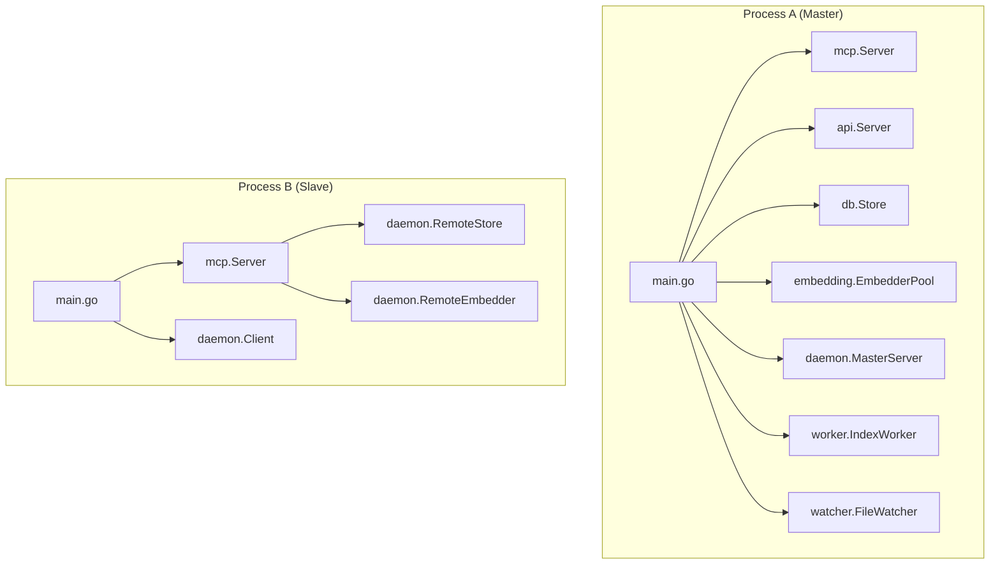
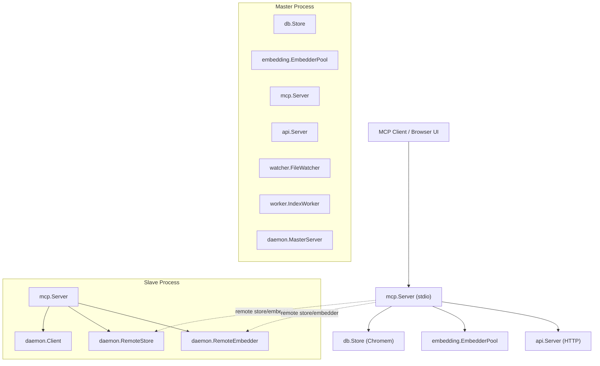
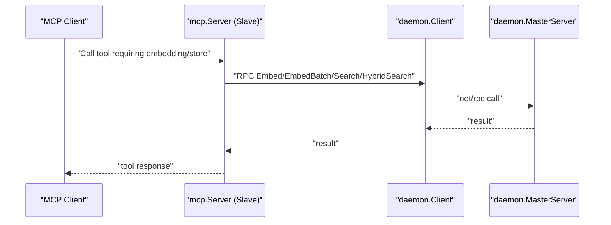
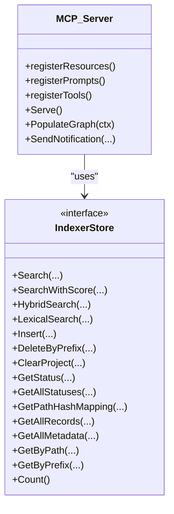
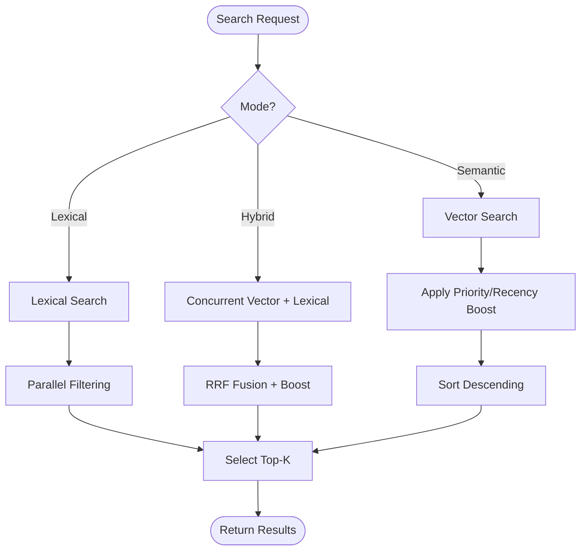
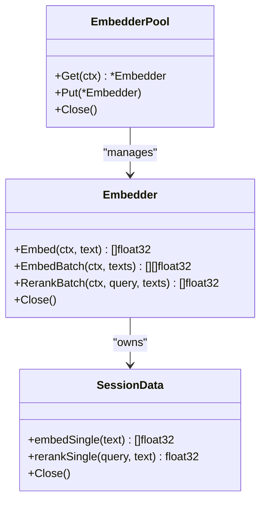
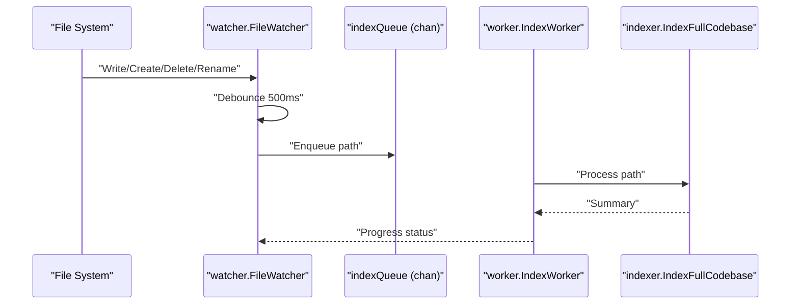
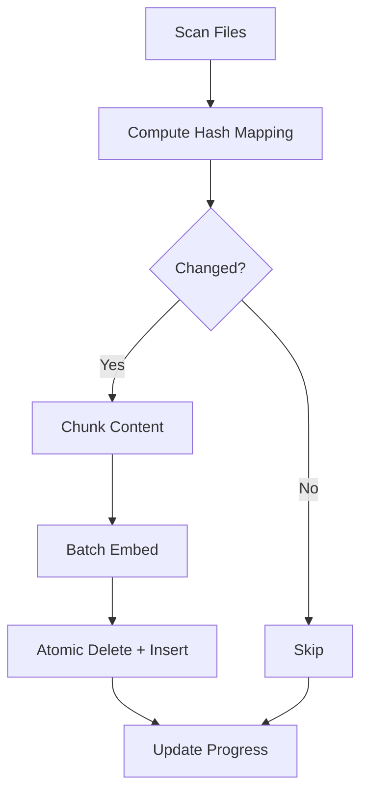
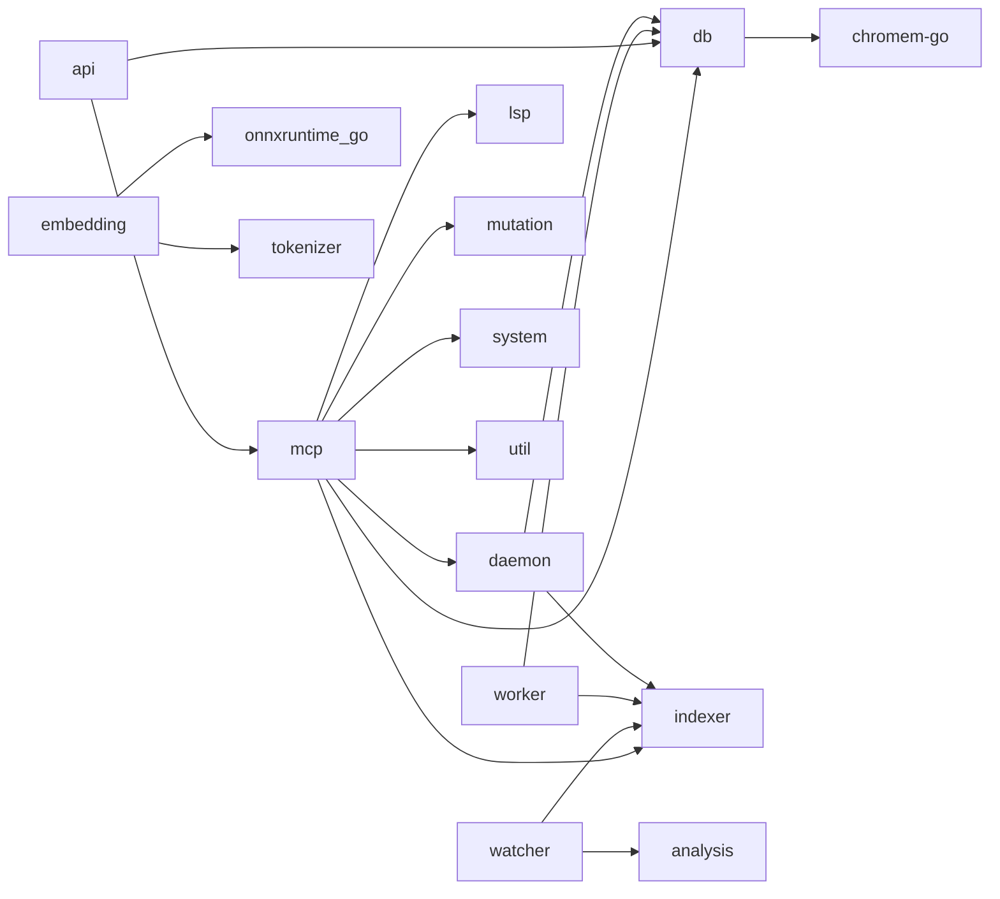
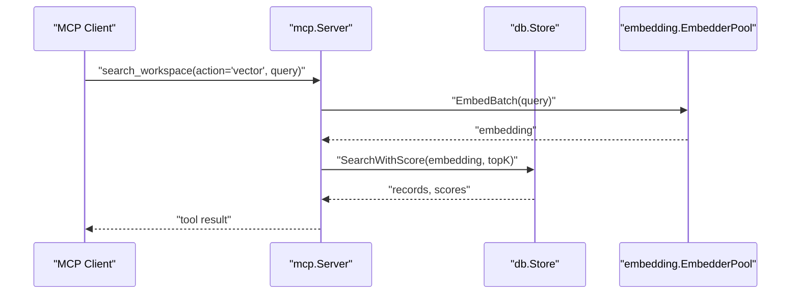

# System Architecture

<cite>
**Referenced Files in This Document**
- [main.go](file://main.go)
- [server.go](file://internal/mcp/server.go)
- [store.go](file://internal/db/store.go)
- [session.go](file://internal/embedding/session.go)
- [watcher.go](file://internal/watcher/watcher.go)
- [config.go](file://internal/config/config.go)
- [daemon.go](file://internal/daemon/daemon.go)
- [scanner.go](file://internal/indexer/scanner.go)
- [analyzer.go](file://internal/analysis/analyzer.go)
- [server.go](file://internal/api/server.go)
- [mem_throttler.go](file://internal/system/mem_throttler.go)
- [worker.go](file://internal/worker/worker.go)
- [onnx.go](file://internal/onnx/onnx.go)
- [graph.go](file://internal/db/graph.go)
- [resolver.go](file://internal/indexer/resolver.go)
</cite>

## Table of Contents
1. [Introduction](#introduction)
2. [Project Structure](#project-structure)
3. [Core Components](#core-components)
4. [Architecture Overview](#architecture-overview)
5. [Detailed Component Analysis](#detailed-component-analysis)
6. [Dependency Analysis](#dependency-analysis)
7. [Performance Considerations](#performance-considerations)
8. [Troubleshooting Guide](#troubleshooting-guide)
9. [Conclusion](#conclusion)
10. [Appendices](#appendices)

## Introduction
This document describes the system architecture of Vector MCP Go, a Model Context Protocol (MCP) server that provides semantic search, code analysis, and project context management over a vector database. The system employs a master-slave distributed pattern to scale across multiple processes and machines while maintaining deterministic operation and predictable memory usage. It integrates ONNX Runtime for efficient inference and Chromem (via the chromem-go library) for vector storage and retrieval. The architecture emphasizes modularity across internal packages (mcp, db, indexer, embedding, watcher, analysis, api, daemon, system, worker, onnx, lsp, mutation, util) with clear separation of concerns.

## Project Structure
The repository is organized around a set of cohesive internal packages:
- mcp: MCP protocol server, tool registration, and request routing
- db: Vector store abstraction, search, hybrid search, and knowledge graph
- indexer: File scanning, chunking, hashing, embedding, and batch insertion
- embedding: ONNX-based embedder, optional reranking, and connection pooling
- watcher: File system monitoring with debouncing and proactive indexing
- analysis: Proactive analysis and architectural guardrails
- api: HTTP API gateway for MCP and tool management
- daemon: Master/Slave RPC service and remote embedder/store
- system: Memory throttling and resource-awareness
- worker: Background indexing pipeline
- onnx: ONNX runtime initialization and environment setup
- lsp, mutation, util: Supporting services for LSP, mutation safety, and utilities

**Diagram sources**
- [main.go:94-176](file://main.go#L94-L176)
- [server.go:86-117](file://internal/mcp/server.go#L86-L117)
- [store.go:35-64](file://internal/db/store.go#L35-L64)
- [session.go:38-65](file://internal/embedding/session.go#L38-L65)
- [daemon.go:327-399](file://internal/daemon/daemon.go#L327-L399)
- [worker.go:47-61](file://internal/worker/worker.go#L47-L61)
- [watcher.go:58-86](file://internal/watcher/watcher.go#L58-L86)

**Section sources**
- [main.go:94-176](file://main.go#L94-L176)
- [config.go:30-130](file://internal/config/config.go#L30-L130)

## Core Components
- Application lifecycle and composition: Orchestrates master/slave detection, embedder pool, vector store, MCP server, API server, file watcher, and worker.
- MCP server: Registers tools, resources, and prompts; routes requests; coordinates with store and embedder; maintains knowledge graph.
- Vector store: Persistent collection-backed store with semantic search, lexical search, hybrid search, and metadata queries.
- Embedding system: ONNX Runtime-backed embedder with pooling and normalization; optional reranker; connection pool for concurrency.
- File watcher: Recursive monitoring with debouncing; proactive indexing; architectural compliance checks; redistillation.
- Indexer: Full codebase scanning, hash-based incremental updates, chunking, batch embedding, atomic replacement, and progress reporting.
- Daemon: Master RPC service exposing embedder and store operations; slave client for remote delegation.
- API server: HTTP transport for MCP, tool management, and search endpoints.
- System memory throttler: Periodic memory monitoring with thresholds to prevent overload.
- Worker: Background indexing pipeline consuming the index queue.
- ONNX runtime: Environment initialization and library discovery.

**Section sources**
- [main.go:37-176](file://main.go#L37-L176)
- [server.go:66-117](file://internal/mcp/server.go#L66-L117)
- [store.go:19-664](file://internal/db/store.go#L19-L664)
- [session.go:29-367](file://internal/embedding/session.go#L29-L367)
- [watcher.go:22-281](file://internal/watcher/watcher.go#L22-L281)
- [scanner.go:67-485](file://internal/indexer/scanner.go#L67-L485)
- [daemon.go:17-648](file://internal/daemon/daemon.go#L17-L648)
- [server.go:24-139](file://internal/api/server.go#L24-L139)
- [mem_throttler.go:21-151](file://internal/system/mem_throttler.go#L21-L151)
- [worker.go:24-112](file://internal/worker/worker.go#L24-L112)
- [onnx.go:12-44](file://internal/onnx/onnx.go#L12-L44)

## Architecture Overview
Vector MCP Go implements a master-slave distributed pattern:
- Master process hosts the vector store, embedder pool, MCP server, API server, file watcher, and background worker.
- Slave process connects to the master via Unix RPC and delegates vector operations and embedding to the master while serving MCP requests locally.
- The master also exposes an HTTP API for external integrations.

**Diagram sources**
- [main.go:94-176](file://main.go#L94-L176)
- [daemon.go:327-399](file://internal/daemon/daemon.go#L327-L399)
- [server.go:150-163](file://internal/mcp/server.go#L150-L163)
- [store.go:35-64](file://internal/db/store.go#L35-L64)
- [session.go:38-65](file://internal/embedding/session.go#L38-L65)
- [server.go:33-109](file://internal/api/server.go#L33-L109)

## Detailed Component Analysis

### Master/Slave Distributed Pattern
- Master detection: The application attempts to start a Unix-domain RPC server. On success, it becomes the master; otherwise, it operates as a slave and disables file watching.
- Remote delegation: Slave MCP server uses daemon.Client to forward embedding and store operations to the master.
- IPC: Uses net/rpc over Unix sockets with explicit timeouts and context handling.

**Diagram sources**
- [daemon.go:401-474](file://internal/daemon/daemon.go#L401-L474)
- [daemon.go:502-622](file://internal/daemon/daemon.go#L502-L622)

**Section sources**
- [main.go:94-108](file://main.go#L94-L108)
- [daemon.go:333-399](file://internal/daemon/daemon.go#L333-L399)
- [daemon.go:401-474](file://internal/daemon/daemon.go#L401-L474)
- [daemon.go:502-622](file://internal/daemon/daemon.go#L502-L622)

### MCP Server and Tooling
- Tool registration: Unified search, workspace management, LSP queries, code analysis, mutation, context storage/deletion, package distillation, and data flow tracing.
- Resource and prompt registration: Provides index status, project configuration, and usage guide.
- Knowledge graph: Populates from stored records for reasoning and relationship discovery.

**Diagram sources**
- [server.go:86-117](file://internal/mcp/server.go#L86-L117)
- [server.go:55-61](file://internal/mcp/server.go#L55-L61)
- [graph.go:18-33](file://internal/db/graph.go#L18-L33)

**Section sources**
- [server.go:190-459](file://internal/mcp/server.go#L190-L459)
- [graph.go:35-105](file://internal/db/graph.go#L35-L105)

### Vector Database and Search
- Semantic search: Embedding-based similarity with per-record priority boosting and recency adjustments.
- Lexical search: Parallel filtering over metadata arrays and content with CPU scaling.
- Hybrid search: Concurrent vector and lexical search with Reciprocal Rank Fusion (RRF) and dynamic weighting.
- Metadata queries: Path-based deletion, prefix deletion, and mapping retrieval for integrity.

**Diagram sources**
- [store.go:80-409](file://internal/db/store.go#L80-L409)
- [store.go:223-336](file://internal/db/store.go#L223-L336)

**Section sources**
- [store.go:80-409](file://internal/db/store.go#L80-L409)
- [store.go:223-336](file://internal/db/store.go#L223-L336)

### Embedding System and ONNX Runtime
- Embedder pool: Fixed-size pool of embedders with Get/Put semantics; supports batch and rerank operations.
- ONNX initialization: Environment setup and library discovery across platforms.
- Normalization: Cosine-normalized vectors for similarity.

**Diagram sources**
- [session.go:34-85](file://internal/embedding/session.go#L34-L85)
- [session.go:29-36](file://internal/embedding/session.go#L29-L36)
- [session.go:176-245](file://internal/embedding/session.go#L176-L245)
- [onnx.go:12-44](file://internal/onnx/onnx.go#L12-L44)

**Section sources**
- [session.go:34-85](file://internal/embedding/session.go#L34-L85)
- [session.go:176-245](file://internal/embedding/session.go#L176-L245)
- [onnx.go:12-44](file://internal/onnx/onnx.go#L12-L44)

### File Watcher and Live Indexing
- Debounced events: 500 ms debounce window aggregates fsnotify events.
- Proactive indexing: Single-file indexing on write/create for supported extensions.
- Architectural guardrails: Hybrids search for ADRs/distilled summaries and alerts on forbidden dependencies.
- Redistillation: Auto-re-distills dependent packages when a package changes.

**Diagram sources**
- [watcher.go:121-196](file://internal/watcher/watcher.go#L121-L196)
- [worker.go:47-112](file://internal/worker/worker.go#L47-L112)
- [scanner.go:67-191](file://internal/indexer/scanner.go#L67-L191)

**Section sources**
- [watcher.go:58-196](file://internal/watcher/watcher.go#L58-L196)
- [worker.go:47-112](file://internal/worker/worker.go#L47-L112)
- [scanner.go:67-191](file://internal/indexer/scanner.go#L67-L191)

### Indexer Pipeline and Determinism
- Incremental updates: Hash comparison to skip unchanged files; prefix deletion to atomically replace chunks.
- Batch embedding: Parallel workers with channelized tasks; fallback to sequential on batch failure.
- Deterministic IDs: Chunk IDs derived from project, path, and index for reproducibility.
- Priority and recency: Metadata-driven boosts for relevance.

**Diagram sources**
- [scanner.go:67-191](file://internal/indexer/scanner.go#L67-L191)
- [scanner.go:193-335](file://internal/indexer/scanner.go#L193-L335)

**Section sources**
- [scanner.go:67-191](file://internal/indexer/scanner.go#L67-L191)
- [scanner.go:193-335](file://internal/indexer/scanner.go#L193-L335)

### API Server and HTTP Transport
- MCP over HTTP: Streamable-HTTP transport with CORS support.
- Tool management: List repos, index status, trigger index, skeleton, and call tools.
- Health endpoint: Reports status and version.

**Section sources**
- [server.go:33-139](file://internal/api/server.go#L33-L139)

### Knowledge Graph and Reasoning
- Population: Builds nodes and edges from stored records’ metadata.
- Queries: Implementation lookup, usage search, name-based search.

**Section sources**
- [graph.go:18-155](file://internal/db/graph.go#L18-L155)

### Monorepo and Workspace Resolution
- Path aliases and workspaces: Parses tsconfig.json and workspace manifests to resolve import paths and package locations.

**Section sources**
- [resolver.go:16-189](file://internal/indexer/resolver.go#L16-L189)

## Dependency Analysis
- Internal package coupling:
  - mcp depends on db, indexer, daemon, lsp, mutation, system, util.
  - db depends on chromem-go.
  - embedding depends on onnxruntime_go and tokenizer.
  - daemon provides both master service and client for remote operations.
  - watcher depends on indexer and analysis.
  - api depends on mcp and db.
  - worker depends on indexer and db.
  - system depends on OS memory stats.
- External dependencies:
  - chromem-go for vector persistence and retrieval.
  - onnxruntime_go for inference.
  - fsnotify for file system events.
  - mark3labs/mcp-go for MCP protocol.

**Diagram sources**
- [server.go:8-26](file://internal/mcp/server.go#L8-L26)
- [store.go](file://internal/db/store.go#L16)
- [session.go](file://internal/embedding/session.go#L13)
- [watcher.go:14-20](file://internal/watcher/watcher.go#L14-L20)
- [daemon.go:13-15](file://internal/daemon/daemon.go#L13-L15)
- [server.go:14-19](file://internal/api/server.go#L14-L19)
- [worker.go:9-12](file://internal/worker/worker.go#L9-L12)

**Section sources**
- [server.go:8-26](file://internal/mcp/server.go#L8-L26)
- [store.go](file://internal/db/store.go#L16)
- [session.go](file://internal/embedding/session.go#L13)
- [watcher.go:14-20](file://internal/watcher/watcher.go#L14-L20)
- [daemon.go:13-15](file://internal/daemon/daemon.go#L13-L15)
- [server.go:14-19](file://internal/api/server.go#L14-L19)
- [worker.go:9-12](file://internal/worker/worker.go#L9-L12)

## Performance Considerations
- Concurrency:
  - Embedding pool: Controls parallel inference throughput; tune EmbedderPoolSize via environment variable.
  - Indexing: Parallel workers and channelized tasks; batch inserts reduce write amplification.
  - Search: Parallel lexical filtering scales with CPU; vector and lexical searches run concurrently for hybrid.
- Memory management:
  - Memory throttler: Pauses heavy tasks when thresholds are exceeded; ensures LSP startup safety.
  - Embedder tensors: Preallocated buffers reused per session; proper cleanup on close.
- Deterministic operation:
  - Fixed MaxSeqLength and deterministic chunk IDs; consistent metadata serialization.
- Scalability:
  - Master-slave RPC enables horizontal scaling; slave can be colocated with MCP clients.
  - Background worker decouples indexing from MCP latency.

[No sources needed since this section provides general guidance]

## Troubleshooting Guide
- Master already running:
  - Starting a second process detects an existing master and switches to slave mode.
- ONNX runtime errors:
  - Ensure ONNX shared library path is discoverable; initialize environment before use.
- Dimension mismatch:
  - Changing embedding models invalidates existing vectors; delete database and restart.
- RPC timeouts:
  - Embedding and rerank operations have explicit timeouts; verify master availability.
- File watcher issues:
  - Debounce window may delay indexing; verify project root and ignore rules.

**Section sources**
- [main.go:94-108](file://main.go#L94-L108)
- [onnx.go:12-44](file://internal/onnx/onnx.go#L12-L44)
- [store.go:51-61](file://internal/db/store.go#L51-L61)
- [daemon.go:463-474](file://internal/daemon/daemon.go#L463-L474)
- [watcher.go:121-139](file://internal/watcher/watcher.go#L121-L139)

## Conclusion
Vector MCP Go’s architecture balances determinism, scalability, and resilience. The master-slave pattern, combined with a robust indexing pipeline, memory-aware concurrency, and modular internal packages, delivers a production-ready system for semantic search and code analysis. Integration with ONNX Runtime and Chromem ensures efficient inference and reliable vector storage, while the MCP protocol and HTTP API provide flexible client access.

[No sources needed since this section summarizes without analyzing specific files]

## Appendices

### Request/Response Flow: MCP Client to Vector Database

**Diagram sources**
- [server.go:331-338](file://internal/mcp/server.go#L331-L338)
- [store.go:338-409](file://internal/db/store.go#L338-L409)
- [session.go:261-271](file://internal/embedding/session.go#L261-L271)