# System Integration and External Dependencies

<cite>
**Referenced Files in This Document**
- [main.go](file://main.go)
- [config.go](file://internal/config/config.go)
- [onnx.go](file://internal/onnx/onnx.go)
- [store.go](file://internal/db/store.go)
- [client.go](file://internal/lsp/client.go)
- [session.go](file://internal/embedding/session.go)
- [watcher.go](file://internal/watcher/watcher.go)
- [server.go](file://internal/mcp/server.go)
- [daemon.go](file://internal/daemon/daemon.go)
- [mem_throttler.go](file://internal/system/mem_throttler.go)
- [downloader.go](file://internal/embedding/downloader.go)
- [resolver.go](file://internal/indexer/resolver.go)
- [server.go](file://internal/api/server.go)
- [graph.go](file://internal/db/graph.go)
- [worker.go](file://internal/worker/worker.go)
- [go.mod](file://go.mod)
- [README.md](file://README.md)
</cite>

## Table of Contents
1. [Introduction](#introduction)
2. [Project Structure](#project-structure)
3. [Core Components](#core-components)
4. [Architecture Overview](#architecture-overview)
5. [Detailed Component Analysis](#detailed-component-analysis)
6. [Dependency Analysis](#dependency-analysis)
7. [Performance Considerations](#performance-considerations)
8. [Troubleshooting Guide](#troubleshooting-guide)
9. [Conclusion](#conclusion)
10. [Appendices](#appendices)

## Introduction
This document explains the system integration architecture and external dependency management of Vector MCP Go. It focuses on:
- ONNX Runtime integration for high-performance inference, including model loading, session management, and memory optimization
- Chromem (LanceDB) vector database integration, connection pooling, and persistence strategies
- Language Server Protocol (LSP) client integration for IDE-like features
- File system monitoring via FSNotify and event-driven processing
- MCP-Go framework integration for protocol handling and tool execution
- Dependency injection patterns, plugin architectures, and extensibility points
- Examples for integrating new external systems, managing version compatibility, and handling dependency failures
- Configuration strategies for different deployment environments and cloud-native integration patterns

## Project Structure
The application is organized around a modular architecture with clear separation of concerns:
- Application bootstrap and lifecycle management
- Configuration and environment handling
- Embedding engine and ONNX Runtime integration
- Vector database and knowledge graph
- MCP server and tool registry
- HTTP API gateway
- File watching and indexing pipeline
- Daemon for master/slave coordination
- System resource monitoring and throttling

```mermaid
graph TB
A["main.go<br/>App lifecycle, initialization, orchestration"] --> B["internal/config/config.go<br/>Config loading and env vars"]
A --> C["internal/onnx/onnx.go<br/>ONNX runtime init"]
A --> D["internal/db/store.go<br/>Chromem DB wrapper"]
A --> E["internal/embedding/session.go<br/>Embedder pool and sessions"]
A --> F["internal/mcp/server.go<br/>MCP server and tool registry"]
A --> G["internal/api/server.go<br/>HTTP API gateway"]
A --> H["internal/watcher/watcher.go<br/>FSNotify file watcher"]
A --> I["internal/daemon/daemon.go<br/>Master/Slave RPC"]
A --> J["internal/system/mem_throttler.go<br/>Memory throttling"]
A --> K["internal/lsp/client.go<br/>LSP client"]
A --> L["internal/indexer/resolver.go<br/>Workspace resolver"]
A --> M["internal/db/graph.go<br/>Knowledge graph"]
A --> N["internal/worker/worker.go<br/>Background indexing"]
```

**Diagram sources**
- [main.go:37-176](file://main.go#L37-L176)
- [config.go:30-130](file://internal/config/config.go#L30-L130)
- [onnx.go:12-43](file://internal/onnx/onnx.go#L12-L43)
- [store.go:35-64](file://internal/db/store.go#L35-L64)
- [session.go:38-85](file://internal/embedding/session.go#L38-L85)
- [server.go:86-117](file://internal/mcp/server.go#L86-L117)
- [server.go:190-407](file://internal/mcp/server.go#L190-L407)
- [server.go:409-459](file://internal/mcp/server.go#L409-L459)
- [server.go:184-188](file://internal/mcp/server.go#L184-L188)
- [server.go:150-154](file://internal/mcp/server.go#L150-L154)
- [server.go:158-163](file://internal/mcp/server.go#L158-L163)
- [server.go:165-182](file://internal/mcp/server.go#L165-L182)
- [server.go:119-148](file://internal/mcp/server.go#L119-L148)
- [server.go:149-154](file://internal/mcp/server.go#L149-L154)
- [server.go:156-163](file://internal/mcp/server.go#L156-L163)
- [server.go:165-182](file://internal/mcp/server.go#L165-L182)
- [server.go:184-188](file://internal/mcp/server.go#L184-L188)
- [server.go:190-407](file://internal/mcp/server.go#L190-L407)
- [server.go:409-459](file://internal/mcp/server.go#L409-L459)
- [server.go:431-444](file://internal/mcp/server.go#L431-L444)
- [server.go:446-453](file://internal/mcp/server.go#L446-L453)
- [server.go:455-458](file://internal/mcp/server.go#L455-L458)
- [server.go:119-148](file://internal/mcp/server.go#L119-L148)
- [server.go:149-154](file://internal/mcp/server.go#L149-L154)
- [server.go:156-163](file://internal/mcp/server.go#L156-L163)
- [server.go:165-182](file://internal/mcp/server.go#L165-L182)
- [server.go:184-188](file://internal/mcp/server.go#L184-L188)
- [server.go:190-407](file://internal/mcp/server.go#L190-L407)
- [server.go:409-459](file://internal/mcp/server.go#L409-L459)
- [server.go:431-444](file://internal/mcp/server.go#L431-L444)
- [server.go:446-453](file://internal/mcp/server.go#L446-L453)
- [server.go:455-458](file://internal/mcp/server.go#L455-L458)
- [server.go:119-148](file://internal/mcp/server.go#L119-L148)
- [server.go:149-154](file://internal/mcp/server.go#L149-L154)
- [server.go:156-163](file://internal/mcp/server.go#L156-L163)
- [server.go:165-182](file://internal/mcp/server.go#L165-L182)
- [server.go:184-188](file://internal/mcp/server.go#L184-L188)
- [server.go:190-407](file://internal/mcp/server.go#L190-L407)
- [server.go:409-459](file://internal/mcp/server.go#L409-L459)
- [server.go:431-444](file://internal/mcp/server.go#L431-L444)
- [server.go:446-453](file://internal/mcp/server.go#L446-L453)
- [server.go:455-458](file://internal/mcp/server.go#L455-L458)
- [server.go:119-148](file://internal/mcp/server.go#L119-L148)
- [server.go:149-154](file://internal/mcp/server.go#L149-L154)
- [server.go:156-163](file://internal/mcp/server.go#L156-L163)
- [server.go:165-182](file://internal/mcp/server.go#L165-L182)
- [server.go:184-188](file://internal/mcp/server.go#L184-L188)
- [server.go:190-407](file://internal/mcp/server.go#L190-L407)
- [server.go:409-459](file://internal/mcp/server.go#L409-L459)
- [server.go:431-444](file://internal/mcp/server.go#L431-L444)
- [server.go:446-453](file://internal/mcp/server.go#L446-L453)
- [server.go:455-458](file://internal/mcp/server.go#L455-L458)
- [server.go:119-148](file://internal/mcp/server.go#L119-L148)
- [server.go:149-154](file://internal/mcp/server.go#L149-L154)
- [server.go:156-163](file://internal/mcp/server.go#L156-L163)
- [server.go:165-182](file://internal/mcp/server.go#L165-L182)
- [server.go:184-188](file://internal/mcp/server.go#L184-L188)
- [server.go:190-407](file://internal/mcp/server.go#L190-L407)
- [server.go:409-459](file://internal/mcp/server.go#L409-L459)
- [server.go:431-444](file://internal/mcp/server.go#L431-L444)
- [server.go:446-453](file://internal/mcp/server.go#L446-L453)
- [server.go:455-458](file://internal/mcp/server.go#L455-L458)
- [server.go:119-148](file://internal/mcp/server.go#L119-L148)
- [server.go:149-154](file://internal/mcp/server.go#L149-L154)
- [server.go:156-163](file://internal/mcp/server.go#L156-L163)
- [server.go:165-182](file://internal/mcp/server.go#L165-L182)
- [server.go:184-188](file://internal/mcp/server.go#L184-L188)
- [server.go:190-407](file://internal/mcp/server.go#L190-L407)
- [server.go:409-459](file://internal/mcp/server.go#L409-L459)
- [server.go:431-444](file://internal/mcp/server.go#L431-L444)
- [server.go:446-453](file://internal/mcp/server.go#L446-L453)
- [server.go:455-458](file://internal/mcp/server.go#L455-L458)
- [server.go:119-148](file://internal/mcp/server.go#L119-L148)
- [server.go:149-154](file://internal/mcp/server.go#L149-L154)
- [server.go:156-163](file://internal/mcp/server.go#L156-L163)
- [server.go:165-18......:165-182](file://internal/mcp/server.go#L165-L182)
- [server.go:184-188](file://internal/mcp/server.go#L184-L188)
- [server.go:190-407](file://internal/mcp/server.go#L190-L407)
- [server.go:409-459](file://internal/mcp/server.go#L409-L459)
- [server.go:431-444](file://internal/mcp/server.go#L431-L444)
- [server.go:446-453](file://internal/mcp/server.go#L446-L453)
- [server.go:455-458](file://internal/mcp/server.go#L455-L458)
- [server.go:119-148](file://internal/mcp/server.go#L119-L148)
- [server.go:149-154](file://internal/mcp/server.go#L149-L154)
- [server.go:156-163](file://internal/mcp/server.go#L156-L163)
- [server.go:165-182](file://internal/mcp/server.go#L165-L182)
- [server.go:184-188](file://internal/mcp/server.go#L184-L188)
- [server.go:190-407](file://internal/mcp/server.go#L190-L407)
- [server.go:409-459](file://internal/mcp/server.go#L409-L459)
- [server.go:431-444](file://internal/mcp/server.go#L431-L444)
- [server.go:446-453](file://internal/mcp/server.go#L446-L453)
- [server.go:455-458](file://internal/mcp/server.go#L455-L458)
- [server.go:119-148](file://internal/mcp/server.go#L119-L148)
- [server.go:149-154](file://internal/mcp/server.go#L149-L154)
- [server.go:156-163](file://internal/mcp/server.go#L156-L163)
- [server.go:165-182](file://internal/mcp/server.go#L165-L182)
- [server.go:184-188](file://internal/mcp/server.go#L184-L188)
- [server.go:190-407](file://internal/mcp/server.go#L190-L407)
- [server.go:409-459](file://internal/mcp/server.go#L409-L459)
- [server.go:431-444](file://internal/mcp/server.go#L431-L444)
- [server.go:446-453](file://internal/mcp/server.go#L446-L453)
- [server.go:455-458](file://internal/mcp/server.go#L455-L458)
- [server.go:119-148](file://internal/mcp/server.go#L119-L148)
- [server.go:149-154](file://internal/mcp/server.go#L149-L154)
- [server.go:156-163](file://internal/mcp/server.go#L156-L163)
- [server.go:165-182](file://internal/mcp/server.go#L165-L182)
- [server.go:184-188](file://internal/mcp/server.go#L184-L188)
- [server.go:190-407](file://internal/mcp/server.go#L190-L407)
- [server.go:409-459](file://internal/mcp/server.go#L409-L459)
- [server.go:431-444](file://internal/mcp/server.go#L431-L444)
- [server.go:446-453](file://internal/mcp/server.go#L446-L453)
- [server.go:455-458](file://internal/mcp/server.go#L455-L458)
- [server.go:119-148](file://internal/mcp/server.go#L119-L148)
- [server.go:149-154](file://internal/mcp/server.go#L149-L154)
- [server.go:156-163](file://internal/mcp/server.go#L156-L163)
- [server.go:165-182](file://internal/mcp/server.go#L165-L182)
- [server.go:184-188](file://internal/mcp/server.go#L184-L188)
- [server.go:190-407](file://internal/mcp/server.go#L190-L407)
- [server.go:409-459](file://internal/mcp/server.go#L409-L459)
- [server.go:431-444](file://internal/mcp/server.go#L431-L444)
- [server.go:446-453](file://internal/mcp/server.go#L446-L453)
- [server.go:455-458](file://internal/mcp/server.go#L455-L458)
- [server.go:119-148](file://internal/mcp/server.go#L119-L148)
- [server.go:149-154](file://internal/mcp/server.go#L149-L154)
- [server.go:156-163](file://internal/mcp/server.go#L156-L163)
- [server.go:165-182](file://internal/mcp/server.go#L165-L182)
- [server.go:184-188](file://internal/mcp/server.go#L184-L188)
- [server.go:190-407](file://internal/mcp/server.go#L190-L407)
- [server.go:409-459](file://internal/mcp/server.go#L409-L459)
- [server.go:431-444](file://internal/mcp/server.go#L431-L444)
- [server.go:446-453](file://internal/mcp/server.go#L446-L453)
- [server.go:455-458](file://internal/mcp/server.go#L455-L458)
- [server.go:119-148](file://internal/mcp/server.go#L119-L148)
- [server.go:149-154](file://internal/mcp/server.go#L149-L154)
- [server.go:156-163](file://internal/mcp/server.go#L156-L163)
- [server.go:165-182](file://internal/mcp/server.go#L165-L182)
- [server.go:184-188](file://internal/mcp/server.go#L184-L188)
- [server.go:190-407](file://internal/mcp/server.go#L190-L407)
- [server.go:409-459](file://internal/mcp/server.go#L......)
- [server.go:431-444](file://internal/mcp/server.go#L431-L444)
- [server.go:446-453](file://internal/mcp/server.go#L446-L453)
- [server.go:455-458](file://internal/mcp/server.go#L455-L458)
- [server.go:119-148](file://internal/mcp/server.go#L119-L148)
- [server.go:149-154](file://internal/mcp/server.go#L149-L154)
- [server.go:156-163](file://internal/mcp/server.go#L156-L163)
- [server.go:165-182](file://internal/mcp/server.go#L165-L182)
- [server.go:184-188](file://internal/mcp/server.go#L184-L188)
- [server.go:190-407](file://internal/mcp/server.go#L190-L407)
- [server.go:409-459](file://internal/mcp/server.go#L409-L459)
- [server.go:431-444](file://internal/mcp/server.go#L431-L444)
- [server.go:446-453](file://internal/mcp/server.go#L446-L453)
- [server.go:455-458](file://internal/mcp/server.go#L455-L458)
- [server.go:119-148](file://internal/mcp/server.go#L119-L148)
- [server.go:149-154](file://internal/mcp/server.go#L149-L154)
- [server.go:156-163](file://internal/mcp/server.go#L156-L163)
- [server.go:165-182](file://internal/mcp/server.go#L165-L182)
- [server.go:184-188](file://internal/mcp/server.go#L184-L188)
- [server.go:190-407](file://internal/mcp/server.go#L190-L407)
- [server.go:409-459](file://internal/mcp/server.go#L409-L459)
- [server.go:431-444](file://internal/mcp/server.go#L431-L444)
- [server.go:446-453](file://internal/mcp/server.go#L446-L453)
- [server.go:455-458](file://internal/mcp/server.go#L455-L458)
- [server.go:119-148](file://internal/mcp/server.go#L119-L148)
- [server.go:149-154](file://internal/mcp/server.go#L149-L154)
- [server.go:156-163](file://internal/mcp/server.go#L156-L163)
- [server.go:165-182](file://internal/mcp/server.go#L165-L182)
- [server.go:184-188](file://internal/mcp/server.go#L184-L188)
- [server.go:190-407](file://internal/mcp/server.go#L190-L407)
- [server.go:409-459](file://internal/mcp/server.go#L409-L459)
- [server.go:431-444](file://internal/mcp/server.go#L431-L444)
- [server.go:446-453](file://internal/mcp/server.go#L446-L453)
- [server.go:455-458](file://internal/mcp/server.go#L455-L458)
- [server.go:119-148](file://internal/mcp/server.go#L119-L148)
- [server.go:149-154](file://internal/mcp/server.go#L149-L154)
- [server.go:156-163](file://internal/mcp/server.go#L156-L163)
- [server.go:165-182](file://internal/mcp/server.go#L165-L182)
- [server.go:184-188](file://internal/mcp/server.go#L184-L188)
- [server.go:190-407](file://internal/mcp/server.go#L190-L407)
- [server.go:409-459](file://internal/mcp/server.go#L409-L459)
- [server.go:431-444](file://internal/mcp/server.go#L431-L444)
- [server.go:446-453](file://internal/mcp/server.go#L446-L453)
- [server.go:455-458](file://internal/mcp/server.go#L455-L458)
- [server.go:119-148](file://internal/mcp/server.go#L119-L148)
- [server.go:149-154](file://internal/mcp/server.go#L149-L154)
- [server.go:156-163](file://internal/mcp/server.go#L156-L163)
- [server.go:165-182](file://internal/mcp/server.go#L165-L182)
- [server.go:184-188](file://internal/mcp/server.go#L184-L188)
- [server.go:190-407](file://internal/mcp/server.go#L190-L407)
- [server.go:409-459](file://internal/mcp/server.go#L409-L459)
- [server.go:431-444](file://internal/mcp/server.go#L431-L444)
- [server.go:446-453](file://internal/mcp/server.go#L446-L453)
- [server.go:455-458](file://internal/mcp/server.go#L455-L458)
- [server.go:119-148](file://internal/mcp/server.go#L119-L148)
- [server.go:149-154](file://internal/mcp/server.go#L149-L154)
- [server.go:156-163](file://internal/mcp/server.go#L156-L163)
- [server.go:165-182](file://internal/mcp/server.go#L165-L182)
- [server.go:184-188](file://internal/mcp/server.go#L184-L188)
- [server.go:190-407](file://internal/mcp/server.go#L190-L407)
- [server.go:409-459](file://internal/mcp/server.go#L409-L459)
- [server.go:431-444](file://internal/mcp/server.go#L431-L444)
- [server.go:446-453](file://internal/mcp/server.go#L446-L453)
- [server.go:455-458](file://internal/mcp/server.go#L455-L458)
- [server.go:119-......