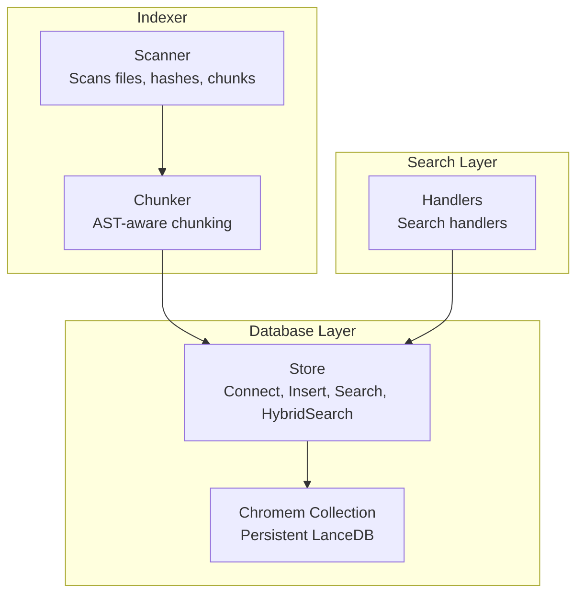
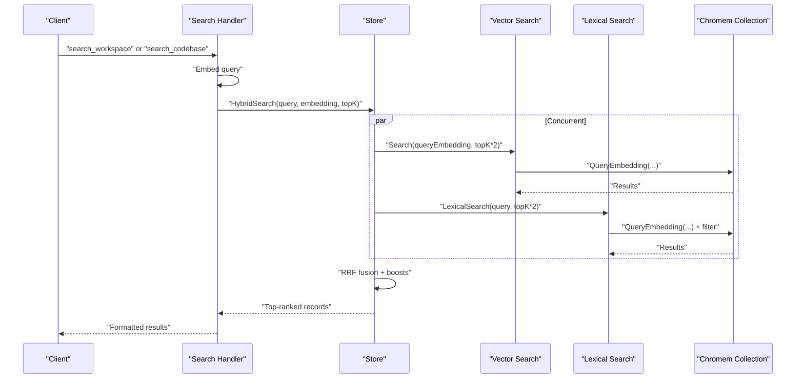
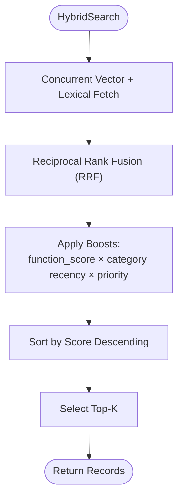
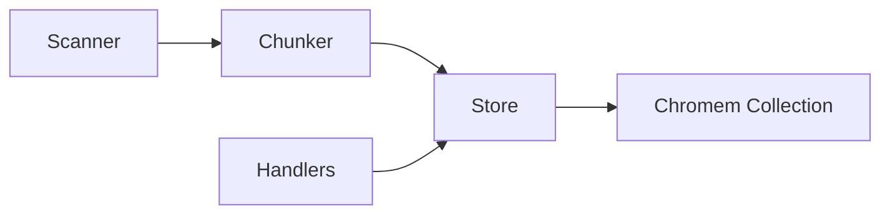

# Database Schema and Data Models

<cite>
**Referenced Files in This Document**
- [store.go](file://internal/db/store.go)
- [scanner.go](file://internal/indexer/scanner.go)
- [chunker.go](file://internal/indexer/chunker.go)
- [config.go](file://internal/config/config.go)
- [handlers_search.go](file://internal/mcp/handlers_search.go)
- [resolver.go](file://internal/indexer/resolver.go)
- [README.md](file://README.md)
</cite>

## Table of Contents
1. [Introduction](#introduction)
2. [Project Structure](#project-structure)
3. [Core Components](#core-components)
4. [Architecture Overview](#architecture-overview)
5. [Detailed Component Analysis](#detailed-component-analysis)
6. [Dependency Analysis](#dependency-analysis)
7. [Performance Considerations](#performance-considerations)
8. [Troubleshooting Guide](#troubleshooting-guide)
9. [Conclusion](#conclusion)
10. [Appendices](#appendices)

## Introduction
This document describes the vector database schema and data models used by Vector MCP Go. It focuses on the Record structure, the metadata schema, and how chromem-go integrates with LanceDB for persistent storage and collection management. It also explains how vector embeddings and metadata combine to support hybrid search, including constraints, validation rules, and optimization strategies.

## Project Structure
Vector MCP Go organizes its data model around:
- A persistent vector store backed by chromem-go/LanceDB
- An indexing pipeline that generates chunks, embeddings, and metadata
- A search layer that supports vector, lexical, and hybrid retrieval

**Diagram sources**
- [scanner.go:67-191](file://internal/indexer/scanner.go#L67-L191)
- [chunker.go:43-101](file://internal/indexer/chunker.go#L43-L101)
- [store.go:35-64](file://internal/db/store.go#L35-L64)
- [handlers_search.go:191-313](file://internal/mcp/handlers_search.go#L191-L313)

**Section sources**
- [README.md:1-40](file://README.md#L1-L40)
- [config.go:132-139](file://internal/config/config.go#L132-L139)

## Core Components
- Record: The primary data unit stored in the vector database. It includes a unique ID, textual content, a dense embedding vector, a metadata map, and an optional similarity score.
- Metadata: A string-keyed map containing structured fields that drive filtering, ranking, and presentation.
- Chromem Integration: Persistent database connection and collection management via chromem-go/LanceDB.

Key characteristics:
- Record fields:
  - id: string
  - content: string
  - embedding: []float32
  - metadata: map[string]string
  - similarity: float32 (optional)
- Metadata fields:
  - project_id: string
  - path: string
  - hash: string
  - category: string
  - type: string
  - function_score: string (float32)
  - updated_at: string (unix epoch seconds)
  - priority: string (float32)
  - symbols: JSON array of strings
  - calls: JSON array of strings
  - relationships: JSON array of strings
  - name: string
  - parent_symbol: string
  - docstring: string
  - structural_metadata: JSON map
  - start_line, end_line: strings (int)

Constraints and validation:
- Embedding dimension must match the configured dimension; mismatch triggers an error.
- Metadata values are stored as strings; numeric values are serialized to strings.
- JSON arrays (symbols, calls, relationships) are stored as JSON strings and parsed on demand with caching.

**Section sources**
- [store.go:27-33](file://internal/db/store.go#L27-L33)
- [scanner.go:286-332](file://internal/indexer/scanner.go#L286-L332)
- [store.go:51-61](file://internal/db/store.go#L51-L61)

## Architecture Overview
The system uses a hybrid search pipeline:
- Vector search retrieves nearest neighbors by embedding similarity.
- Lexical search filters across metadata fields and content.
- Hybrid search combines both using Reciprocal Rank Fusion (RRF) with dynamic weighting and post-retrieval boosts.

**Diagram sources**
- [handlers_search.go:191-313](file://internal/mcp/handlers_search.go#L191-L313)
- [store.go:223-336](file://internal/db/store.go#L223-L336)

## Detailed Component Analysis

### Record and Metadata Schema
- Record definition and embedding dimension enforcement:
  - The Record struct defines the canonical shape for persisted documents.
  - On first connect, the system probes for dimension mismatches and errors if incompatible.
- Metadata fields and their roles:
  - project_id: scopes records to a project root.
  - path: relative path to the source file or metadata record.
  - hash: SHA-256 of the file content for up-to-date detection.
  - category: "code" or "document" to influence recency boosting.
  - type: "chunk" for content chunks, "file_meta" for metadata-only records.
  - function_score: float32 score used to boost relevance during hybrid ranking.
  - updated_at: unix epoch seconds for recency boosting of documents.
  - priority: float32 multiplier to increase importance of specific files.
  - symbols: JSON array of identifiers (functions, classes, variables).
  - calls: JSON array of function or method names invoked.
  - relationships: JSON array of imported/required module names.
  - name: human-friendly label derived from the first symbol.
  - parent_symbol: scope context (e.g., class or tag).
  - docstring: associated comment text.
  - structural_metadata: JSON map of structural properties (e.g., fields, methods).
  - start_line, end_line: line range for the chunk.

Validation and constraints:
- Embedding dimension must match the configured dimension; otherwise, a restart with a fresh database is required.
- Numeric fields are stored as strings; parsers convert them when needed.
- JSON arrays are cached to avoid repeated unmarshalling during lexical filtering.

**Section sources**
- [store.go:27-33](file://internal/db/store.go#L27-L33)
- [store.go:51-61](file://internal/db/store.go#L51-L61)
- [scanner.go:286-332](file://internal/indexer/scanner.go#L286-L332)
- [store.go:633-663](file://internal/db/store.go#L633-L663)

### Chromem-Go Integration and Collection Management
- Persistent database:
  - Uses chromem-go to open a persistent LanceDB at the configured path.
  - Creates a collection if it does not exist.
- Dimension probing:
  - On connect, probes with a dummy vector to detect dimension mismatches.
- CRUD operations:
  - Insert: converts Record to chromem.Document and adds to collection.
  - Query: supports vector similarity and metadata filtering.
  - Delete: supports deletion by path, prefix, or project scope.
  - Status: stores lightweight status records for project indexing state.

Indexing strategy:
- Files are scanned, hashed, and compared to existing records.
- Stale records are cleaned up; only changed files are re-indexed.
- Chunks are inserted in batches to reduce overhead.

**Section sources**
- [store.go:35-64](file://internal/db/store.go#L35-L64)
- [store.go:66-78](file://internal/db/store.go#L66-L78)
- [scanner.go:67-191](file://internal/indexer/scanner.go#L67-L191)
- [scanner.go:317-335](file://internal/indexer/scanner.go#L317-L335)

### Hybrid Search Pipeline
- Dual retrieval:
  - Vector search retrieves top candidates by embedding similarity.
  - Lexical search scans metadata and content for matches.
- Reciprocal Rank Fusion (RRF):
  - Merges results with dynamic weights; boosts lexical when identifiers are present.
  - Applies boosts from function_score, category recency (documents), and priority.
- Final ranking:
  - Sorts by fused score and returns topK.

**Diagram sources**
- [store.go:223-336](file://internal/db/store.go#L223-L336)

**Section sources**
- [store.go:223-336](file://internal/db/store.go#L223-L336)

### Typical Metadata Configurations by File Type
- Code files (.go, .ts, .js, .py, .rs, .php, .html, .css):
  - category: "code"
  - symbols: JSON array of identifiers (e.g., functions, classes)
  - calls: JSON array of invoked functions
  - relationships: JSON array of imports/requirements
  - parent_symbol: scope context (e.g., class or tag)
  - structural_metadata: JSON map of fields/methods/properties
  - start_line, end_line: chunk boundaries
- Documentation (.md, .txt, .pdf):
  - category: "document"
  - updated_at: unix timestamp for recency boosting
  - priority: optional multiplier for important docs
- Configuration and environment files (.env, .yaml, .yml, .json):
  - category: "code"
  - symbols: often empty; relationships may include referenced modules
  - structural_metadata: key-value pairs extracted from structure

**Section sources**
- [scanner.go:214-218](file://internal/indexer/scanner.go#L214-L218)
- [scanner.go:286-332](file://internal/indexer/scanner.go#L286-L332)
- [chunker.go:454-531](file://internal/indexer/chunker.go#L454-L531)

### Relationship Between Embeddings and Metadata
- Embeddings capture semantic similarity for retrieval.
- Metadata enables efficient filtering (by project_id, category, path) and precise boosting (function_score, priority, recency).
- Hybrid search leverages both:
  - Vector similarity for broad semantic recall.
  - Metadata filters and boosts for precision and relevance.

**Section sources**
- [store.go:80-121](file://internal/db/store.go#L80-L121)
- [store.go:223-336](file://internal/db/store.go#L223-L336)

## Dependency Analysis
- Store depends on chromem-go for persistence and collection operations.
- Scanner and Chunker produce Records with metadata for insertion.
- Handlers coordinate embedding generation and hybrid search orchestration.

**Diagram sources**
- [scanner.go:67-191](file://internal/indexer/scanner.go#L67-L191)
- [chunker.go:43-101](file://internal/indexer/chunker.go#L43-L101)
- [store.go:35-64](file://internal/db/store.go#L35-L64)
- [handlers_search.go:191-313](file://internal/mcp/handlers_search.go#L191-L313)

**Section sources**
- [store.go:35-64](file://internal/db/store.go#L35-L64)
- [scanner.go:67-191](file://internal/indexer/scanner.go#L67-L191)
- [handlers_search.go:191-313](file://internal/mcp/handlers_search.go#L191-L313)

## Performance Considerations
- Dimension consistency:
  - Changing embedding models requires clearing the database to avoid dimension mismatches.
- Batch insertions:
  - Indexer inserts records in batches to reduce overhead.
- Parallel lexical filtering:
  - Filtering across large collections is parallelized to improve throughput.
- JSON parsing cache:
  - Parsed JSON arrays are cached to avoid repeated unmarshalling.
- Reranking:
  - Optional cross-encoder reranking improves final ranking quality at the cost of latency.

[No sources needed since this section provides general guidance]

## Troubleshooting Guide
- Dimension mismatch error:
  - Symptom: Error indicating vectors must have the same length.
  - Cause: Switched embedding models without clearing the database.
  - Resolution: Delete the existing vector database directory and restart.
- Empty results:
  - Verify project_id, category, and path filters.
  - Confirm that indexing completed and records exist.
- Slow lexical search:
  - Ensure filters are selective (project_id, category).
  - Consider narrowing the path filter.
- JSON parsing errors:
  - Ensure symbols, calls, and relationships are valid JSON arrays.

**Section sources**
- [store.go:51-61](file://internal/db/store.go#L51-L61)
- [store.go:85-221](file://internal/db/store.go#L85-L221)
- [store.go:633-663](file://internal/db/store.go#L633-L663)

## Conclusion
Vector MCP Go’s schema centers on a compact Record with a dense embedding and a rich metadata map. The chromem-go integration provides robust, persistent storage with efficient vector and metadata operations. Hybrid search combines semantic recall with structured filtering and boosting to deliver precise, relevant results across diverse file types.

[No sources needed since this section summarizes without analyzing specific files]

## Appendices

### Data Types and Constraints Summary
- Record fields:
  - id: string (unique)
  - content: string
  - embedding: []float32 (fixed dimension)
  - metadata: map[string]string
  - similarity: float32 (optional)
- Metadata fields:
  - project_id: string
  - path: string
  - hash: string (SHA-256)
  - category: string ("code" | "document")
  - type: string ("chunk" | "file_meta")
  - function_score: string (float32)
  - updated_at: string (unix epoch seconds)
  - priority: string (float32)
  - symbols: JSON array of strings
  - calls: JSON array of strings
  - relationships: JSON array of strings
  - name: string
  - parent_symbol: string
  - docstring: string
  - structural_metadata: JSON map
  - start_line, end_line: strings (int)

**Section sources**
- [store.go:27-33](file://internal/db/store.go#L27-L33)
- [scanner.go:286-332](file://internal/indexer/scanner.go#L286-L332)