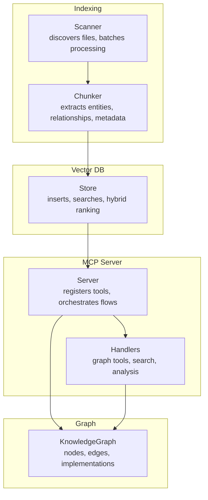
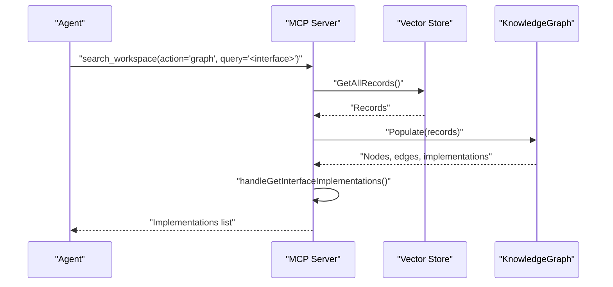
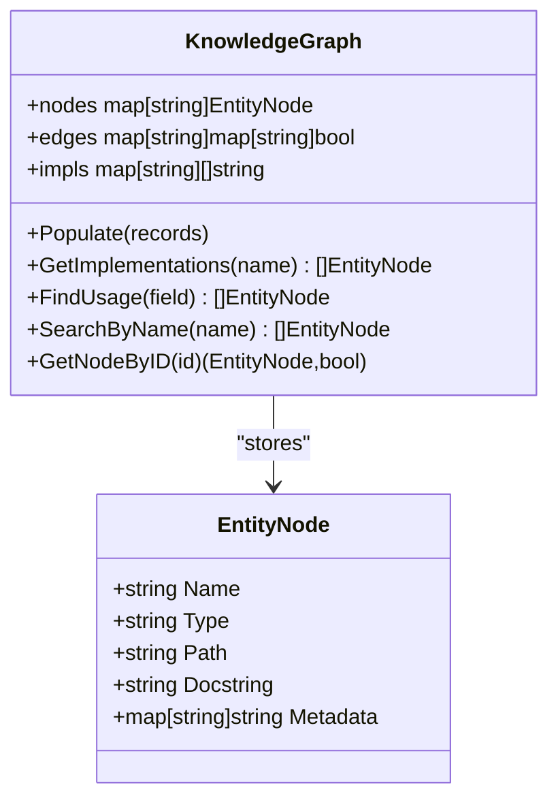
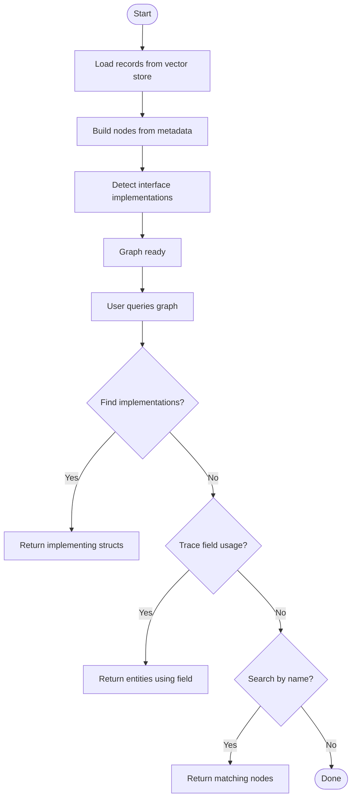
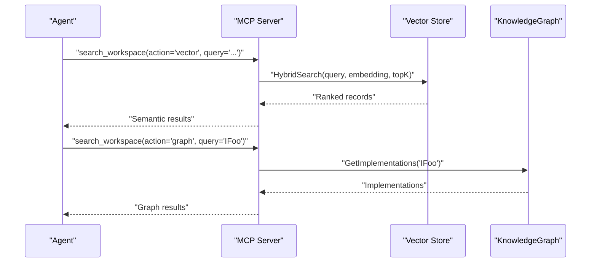
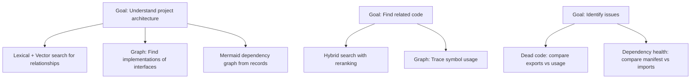
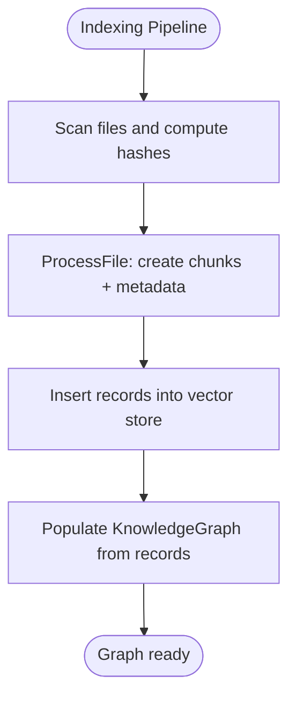
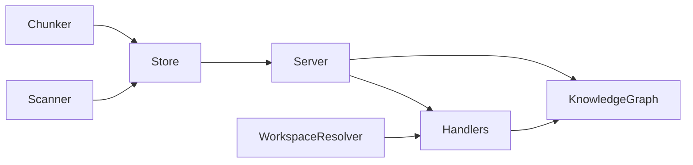

# Knowledge Graph Operations

<cite>
**Referenced Files in This Document**
- [graph.go](file://internal/db/graph.go)
- [server.go](file://internal/mcp/server.go)
- [handlers_graph.go](file://internal/mcp/handlers_graph.go)
- [chunker.go](file://internal/indexer/chunker.go)
- [scanner.go](file://internal/indexer/scanner.go)
- [store.go](file://internal/db/store.go)
- [handlers_search.go](file://internal/mcp/handlers_search.go)
- [handlers_analysis.go](file://internal/mcp/handlers_analysis.go)
- [resolver.go](file://internal/indexer/resolver.go)
- [distiller.go](file://internal/analysis/distiller.go)
</cite>

## Table of Contents
1. [Introduction](#introduction)
2. [Project Structure](#project-structure)
3. [Core Components](#core-components)
4. [Architecture Overview](#architecture-overview)
5. [Detailed Component Analysis](#detailed-component-analysis)
6. [Dependency Analysis](#dependency-analysis)
7. [Performance Considerations](#performance-considerations)
8. [Troubleshooting Guide](#troubleshooting-guide)
9. [Conclusion](#conclusion)
10. [Appendices](#appendices)

## Introduction
This document explains the knowledge graph system embedded in the vector database. It covers how the graph is constructed from indexed code chunks, how entities and relationships are extracted, and how the graph supports semantic exploration and dependency analysis. It also documents the integration between vector search and graph operations, query patterns for discovering related code entities and understanding project architecture, and maintenance operations for adding nodes, updating relationships, and cleaning up the graph. Finally, it outlines performance optimization strategies and scalability considerations for large knowledge graphs.

## Project Structure
The knowledge graph spans several modules:
- Indexing and chunking: Extracts entities, relationships, and structural metadata from source files.
- Vector storage: Stores chunk records with embeddings and metadata for semantic search.
- Graph construction: Builds a lightweight in-memory graph from stored records.
- MCP tools: Exposes graph-aware tools for interface implementation lookup, data flow tracing, and precise impact analysis.

**Diagram sources**
- [chunker.go:43-101](file://internal/indexer/chunker.go#L43-L101)
- [scanner.go:67-191](file://internal/indexer/scanner.go#L67-L191)
- [store.go:66-78](file://internal/db/store.go#L66-L78)
- [server.go:165-182](file://internal/mcp/server.go#L165-L182)
- [handlers_graph.go:10-95](file://internal/mcp/handlers_graph.go#L10-L95)

**Section sources**
- [chunker.go:43-101](file://internal/indexer/chunker.go#L43-L101)
- [scanner.go:67-191](file://internal/indexer/scanner.go#L67-L191)
- [store.go:66-78](file://internal/db/store.go#L66-L78)
- [server.go:165-182](file://internal/mcp/server.go#L165-L182)
- [handlers_graph.go:10-95](file://internal/mcp/handlers_graph.go#L10-L95)

## Core Components
- KnowledgeGraph: An in-memory directed graph that maps code entities to their relationships and implementations. It maintains nodes keyed by record ID, adjacency sets for relationships, and interface-to-implementation mappings.
- Chunker: Produces semantically meaningful chunks with associated metadata (relationships, symbols, calls, structural metadata).
- Store: Persistent vector database with hybrid search, lexical filtering, and metadata caching.
- MCP Server and Handlers: Orchestrate graph population and expose tools for graph queries and semantic search.

Key responsibilities:
- Graph construction: Populate nodes and implementation edges from records.
- Graph queries: Find implementations, usage of fields, and search by name.
- Integration: Hybrid search combines vector and lexical results; graph tools complement semantic search.

**Section sources**
- [graph.go:18-155](file://internal/db/graph.go#L18-L155)
- [chunker.go:22-35](file://internal/indexer/chunker.go#L22-L35)
- [store.go:19-33](file://internal/db/store.go#L19-L33)
- [server.go:165-182](file://internal/mcp/server.go#L165-L182)

## Architecture Overview
The knowledge graph is populated from the vector database’s persisted records. The MCP server triggers graph population, then handlers expose tools that leverage both the vector DB and the in-memory graph.

**Diagram sources**
- [server.go:165-182](file://internal/mcp/server.go#L165-L182)
- [graph.go:35-105](file://internal/db/graph.go#L35-L105)
- [handlers_graph.go:10-31](file://internal/mcp/handlers_graph.go#L10-L31)

## Detailed Component Analysis

### KnowledgeGraph Construction and Queries
- Construction: The graph populates nodes from records, extracting structural metadata and building implementation mappings for interfaces. It clears previous state and rebuilds from scratch.
- Queries:
  - GetImplementations(interfaceName): Returns structs implementing a given interface.
  - FindUsage(fieldName): Finds entities that reference a field.
  - SearchByName(name): Case-insensitive substring search across node names.
  - GetNodeByID(id): Retrieves a node by its record ID.

**Diagram sources**
- [graph.go:18-155](file://internal/db/graph.go#L18-L155)

**Section sources**
- [graph.go:35-155](file://internal/db/graph.go#L35-L155)

### Graph Traversal and Exploration
- Interface implementations: The graph tracks which structs implement interfaces using structural metadata. This enables precise impact analysis and dependency mapping.
- Field usage tracing: By scanning node metadata for field references, the system can enumerate entities that use a specific symbol across the codebase.
- Name-based search: Enables quick discovery of candidate nodes for further analysis.

**Diagram sources**
- [graph.go:35-155](file://internal/db/graph.go#L35-L155)

**Section sources**
- [graph.go:107-155](file://internal/db/graph.go#L107-L155)

### Integration Between Vector Search and Graph Operations
- Hybrid search: The vector store performs both vector and lexical search concurrently, then merges and ranks results using reciprocal rank fusion with dynamic weighting and boosts (priority, recency).
- Graph tools: MCP handlers route “graph” actions to graph queries (e.g., interface implementations), while “vector” actions use hybrid search over embeddings.
- Relationship resolution: The workspace resolver helps translate import paths to physical locations for cross-file context retrieval.

**Diagram sources**
- [handlers_search.go:315-365](file://internal/mcp/handlers_search.go#L315-L365)
- [store.go:223-336](file://internal/db/store.go#L223-L336)
- [handlers_graph.go:10-31](file://internal/mcp/handlers_graph.go#L10-L31)

**Section sources**
- [handlers_search.go:315-365](file://internal/mcp/handlers_search.go#L315-L365)
- [store.go:223-336](file://internal/db/store.go#L223-L336)
- [resolver.go:169-188](file://internal/indexer/resolver.go#L169-L188)

### Graph Query Patterns and Use Cases
- Finding related code entities:
  - Use hybrid search for semantic similarity.
  - Use graph tools to discover structural relationships (implementations, usage).
- Understanding project architecture:
  - Analyze package-level dependencies via relationships and generate Mermaid graphs.
- Identifying potential issues:
  - Dead code detection by comparing exported symbols with usage.
  - Dependency health checks by comparing manifests with indexed imports.

**Diagram sources**
- [handlers_analysis.go:557-634](file://internal/mcp/handlers_analysis.go#L557-L634)
- [handlers_analysis.go:636-777](file://internal/mcp/handlers_analysis.go#L636-L777)
- [handlers_analysis.go:313-472](file://internal/mcp/handlers_analysis.go#L313-L472)

**Section sources**
- [handlers_analysis.go:557-634](file://internal/mcp/handlers_analysis.go#L557-L634)
- [handlers_analysis.go:636-777](file://internal/mcp/handlers_analysis.go#L636-L777)
- [handlers_analysis.go:313-472](file://internal/mcp/handlers_analysis.go#L313-L472)

### Graph Maintenance Operations
- Node addition: Triggered by indexing pipeline; chunks are inserted into the vector store with metadata. Each chunk becomes a node in the knowledge graph after population.
- Relationship updates: Occur automatically during indexing when relationships and structural metadata are parsed from source files.
- Graph cleanup: The graph is rebuilt from scratch each time the vector store is repopulated. The MCP server exposes a tool to populate the graph from all records.

**Diagram sources**
- [scanner.go:67-191](file://internal/indexer/scanner.go#L67-L191)
- [scanner.go:193-335](file://internal/indexer/scanner.go#L193-L335)
- [server.go:165-182](file://internal/mcp/server.go#L165-L182)

**Section sources**
- [scanner.go:67-191](file://internal/indexer/scanner.go#L67-L191)
- [scanner.go:193-335](file://internal/indexer/scanner.go#L193-L335)
- [server.go:165-182](file://internal/mcp/server.go#L165-L182)

### Integration with MCP Tools for Enhanced Code Analysis
- Graph tools:
  - get_interface_implementations: Lists structs implementing a given interface.
  - trace_data_flow: Finds entities that use a specific field across the codebase.
  - get_impact_radius_precise: Provides a focused impact analysis around a symbol.
- Search tools:
  - search_workspace: Unified tool supporting vector, regex, and graph actions.
  - search_codebase: Performs hybrid search with reranking.
- Analysis tools:
  - analyze_architecture: Generates a Mermaid dependency graph.
  - find_dead_code: Identifies potentially unused exported symbols.
  - check_dependency_health: Validates imports against manifests.

**Section sources**
- [handlers_graph.go:10-95](file://internal/mcp/handlers_graph.go#L10-L95)
- [handlers_search.go:191-313](file://internal/mcp/handlers_search.go#L191-L313)
- [handlers_analysis.go:557-634](file://internal/mcp/handlers_analysis.go#L557-L634)
- [handlers_analysis.go:636-777](file://internal/mcp/handlers_analysis.go#L636-L777)
- [handlers_analysis.go:313-472](file://internal/mcp/handlers_analysis.go#L313-L472)

## Dependency Analysis
- Chunker to Store: Chunks carry metadata (relationships, symbols, calls, structural metadata) that the vector store persists and later feeds into the graph.
- Store to Graph: The MCP server populates the graph from all stored records.
- Handlers to Graph: Graph-aware tools query the in-memory graph for structural insights.
- Workspace Resolver: Translates import paths to physical locations to enrich cross-file context.

**Diagram sources**
- [chunker.go:43-101](file://internal/indexer/chunker.go#L43-L101)
- [scanner.go:67-191](file://internal/indexer/scanner.go#L67-L191)
- [store.go:66-78](file://internal/db/store.go#L66-L78)
- [server.go:165-182](file://internal/mcp/server.go#L165-L182)
- [handlers_graph.go:10-95](file://internal/mcp/handlers_graph.go#L10-L95)
- [resolver.go:169-188](file://internal/indexer/resolver.go#L169-L188)

**Section sources**
- [chunker.go:43-101](file://internal/indexer/chunker.go#L43-L101)
- [scanner.go:67-191](file://internal/indexer/scanner.go#L67-L191)
- [store.go:66-78](file://internal/db/store.go#L66-L78)
- [server.go:165-182](file://internal/mcp/server.go#L165-L182)
- [handlers_graph.go:10-95](file://internal/mcp/handlers_graph.go#L10-L95)
- [resolver.go:169-188](file://internal/indexer/resolver.go#L169-L188)

## Performance Considerations
- Hybrid search tuning:
  - Dynamic weights for lexical vs vector components based on query characteristics.
  - Boosts for priority and recency improve relevance.
  - Reranking with cross-encoders refines top-K results.
- Parallelization:
  - Lexical filtering leverages parallel workers and chunked processing for large datasets.
  - Batch embedding reduces overhead; fallback to sequential embedding ensures resilience.
- Memory and cache:
  - JSON metadata arrays are cached to avoid repeated unmarshalling.
  - Graph uses maps for O(1) lookups; rebuilding is acceptable given typical codebase sizes.
- Scalability:
  - Vector DB supports large-scale similarity search; graph remains in-memory for low-latency traversals.
  - Consider partitioning by project ID and incremental graph updates for very large graphs.

[No sources needed since this section provides general guidance]

## Troubleshooting Guide
- Graph appears empty:
  - Ensure the graph is populated after indexing completes. The MCP server exposes a tool to repopulate the graph from all records.
- Missing implementations:
  - Verify structural metadata contains method signatures for interfaces and fields for structs.
- Slow hybrid search:
  - Confirm embeddings are computed efficiently and reranking is applied only when needed.
- Stale records:
  - Use the indexing pipeline to reprocess files; it deletes old chunks before inserting new ones to prevent ghost-chunk artifacts.

**Section sources**
- [server.go:165-182](file://internal/mcp/server.go#L165-L182)
- [graph.go:35-105](file://internal/db/graph.go#L35-L105)
- [store.go:223-336](file://internal/db/store.go#L223-L336)
- [scanner.go:160-188](file://internal/indexer/scanner.go#L160-L188)

## Conclusion
The knowledge graph augments vector search with structural semantics, enabling precise discovery of code relationships. By combining chunk-level metadata with hybrid search and graph traversal, the system supports powerful exploration and analysis workflows. Proper indexing, periodic graph population, and judicious use of graph tools yield scalable and accurate insights into project architecture and dependencies.

[No sources needed since this section summarizes without analyzing specific files]

## Appendices

### Example Graph Queries and Patterns
- Discover implementations of an interface:
  - Action: graph
  - Query: interface name
  - Outcome: list of implementing structs with type and path
- Trace symbol usage:
  - Action: graph
  - Query: field or symbol name
  - Outcome: entities using the symbol across the codebase
- Precise impact analysis:
  - Action: graph
  - Query: symbol name
  - Outcome: structural dependents and usage context

**Section sources**
- [handlers_graph.go:10-95](file://internal/mcp/handlers_graph.go#L10-L95)

### Visualization Patterns
- Mermaid dependency graph:
  - Build adjacency lists from relationships and render edges between packages.
- Contextual usage samples:
  - Combine lexical search with cross-file symbol usage to show real-world references.

**Section sources**
- [handlers_analysis.go:557-634](file://internal/mcp/handlers_analysis.go#L557-L634)
- [handlers_analysis.go:191-224](file://internal/mcp/handlers_analysis.go#L191-L224)

### Knowledge Distillation for Large Packages
- Summarize package purpose and key entities with high priority for retrieval.
- Store distilled summaries back into the vector DB for rapid access.

**Section sources**
- [distiller.go:38-190](file://internal/analysis/distiller.go#L38-L190)