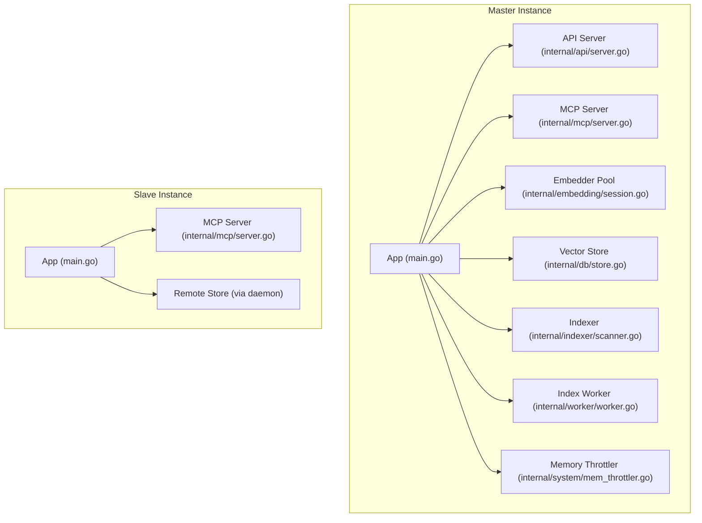
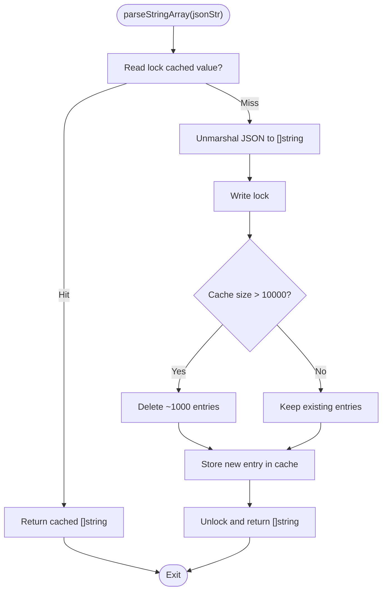
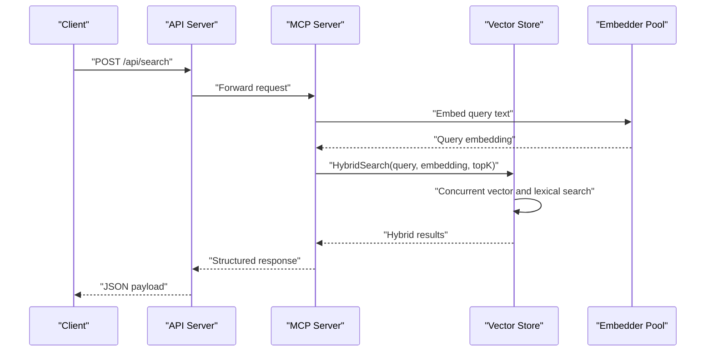
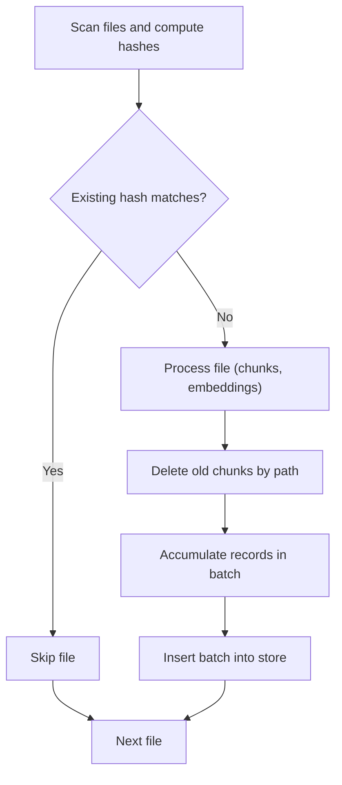
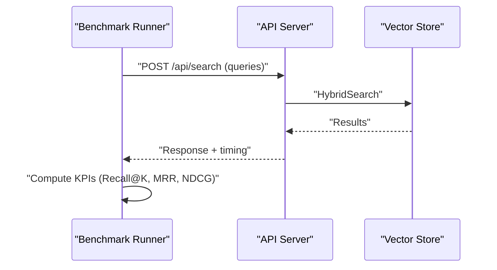
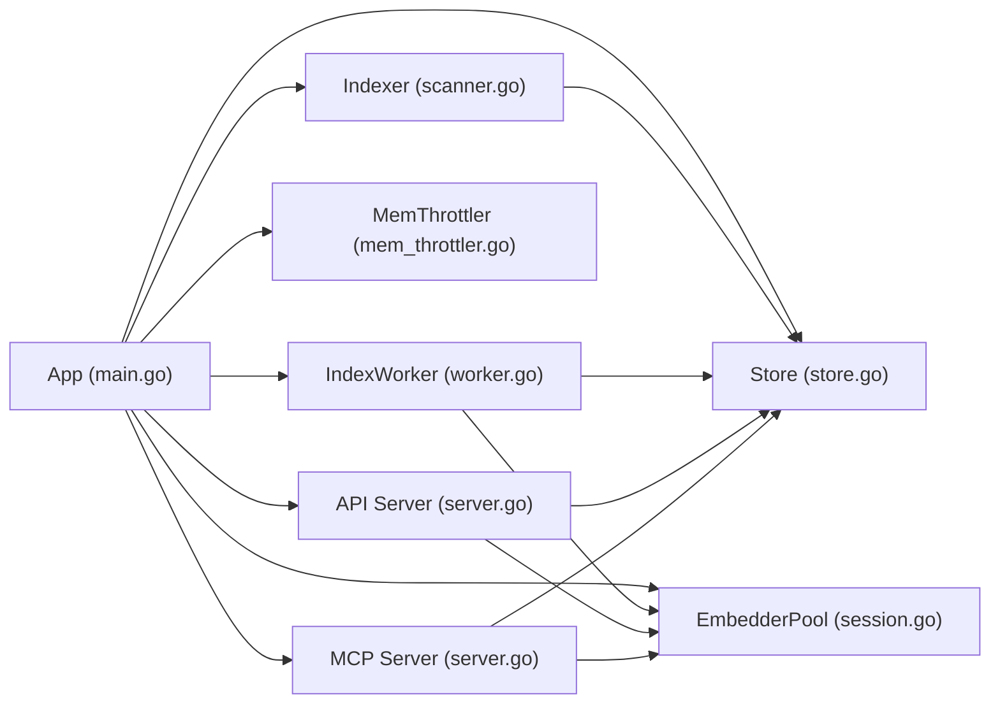

# Performance Tuning and Maintenance

<cite>
**Referenced Files in This Document**
- [main.go](file://main.go)
- [store.go](file://internal/db/store.go)
- [mem_throttler.go](file://internal/system/mem_throttler.go)
- [config.go](file://internal/config/config.go)
- [scanner.go](file://internal/indexer/scanner.go)
- [worker.go](file://internal/worker/worker.go)
- [session.go](file://internal/embedding/session.go)
- [server.go](file://internal/api/server.go)
- [server.go](file://internal/mcp/server.go)
- [retrieval_bench_test.go](file://benchmark/retrieval_bench_test.go)
- [store_bench_test.go](file://internal/db/store_bench_test.go)
- [test-hardware.sh](file://scripts/test-hardware.sh)
- [compare-models.sh](file://scripts/compare-models.sh)
- [setup-services.sh](file://scripts/setup-services.sh)
- [mcp-config.json.example](file://mcp-config.json.example)
</cite>

## Table of Contents
1. [Introduction](#introduction)
2. [Project Structure](#project-structure)
3. [Core Components](#core-components)
4. [Architecture Overview](#architecture-overview)
5. [Detailed Component Analysis](#detailed-component-analysis)
6. [Dependency Analysis](#dependency-analysis)
7. [Performance Considerations](#performance-considerations)
8. [Troubleshooting Guide](#troubleshooting-guide)
9. [Conclusion](#conclusion)
10. [Appendices](#appendices)

## Introduction
This document provides comprehensive performance tuning and maintenance guidance for the vector database system. It focuses on memory management strategies (including the parsed cache mechanism for JSON arrays and cache eviction policies), CPU utilization optimization for concurrent operations and parallel processing patterns, database maintenance procedures (cleanup, index optimization, storage management), performance monitoring and profiling, benchmarking methodologies, scalability planning, corruption prevention, backup and recovery, and troubleshooting common performance issues. Configuration recommendations for different deployment scenarios and hardware configurations are included.

## Project Structure
The system is composed of:
- Application entrypoint and lifecycle management
- Vector database layer backed by a persistent store
- Embedding engine with pooling and ONNX runtime integration
- Indexer with parallel scanning and atomic updates
- Background worker for asynchronous indexing
- Memory throttler for resource-aware operations
- API and MCP servers for external access
- Benchmarks and scripts for performance testing and hardware evaluation

```mermaid
graph TB
A["main.go<br/>App lifecycle, master/slave, stores"] --> B["internal/db/store.go<br/>Vector store, hybrid search, lexical search"]
A --> C["internal/embedding/session.go<br/>Embedder pool, ONNX sessions"]
A --> D["internal/indexer/scanner.go<br/>Parallel indexing, atomic updates"]
A --> E["internal/worker/worker.go<br/>Background indexing worker"]
A --> F["internal/system/mem_throttler.go<br/>Memory monitoring and throttling"]
A --> G["internal/api/server.go<br/>HTTP API server"]
A --> H["internal/mcp/server.go<br/>MCP server, tools, resources"]
A --> I["benchmark/retrieval_bench_test.go<br/>Retrieval KPI benchmarks"]
A --> J["internal/db/store_bench_test.go<br/>Lexical search benchmarks"]
A --> K["scripts/test-hardware.sh<br/>Hardware benchmark harness"]
A --> L["scripts/compare-models.sh<br/>Model comparison harness"]
A --> M["scripts/setup-services.sh<br/>Systemd service setup"]
A --> N["mcp-config.json.example<br/>MCP server configuration"]
```

**Diagram sources**
- [main.go:37-71](file://main.go#L37-L71)
- [store.go:19-663](file://internal/db/store.go#L19-L663)
- [session.go:34-85](file://internal/embedding/session.go#L34-L85)
- [scanner.go:67-191](file://internal/indexer/scanner.go#L67-L191)
- [worker.go:24-61](file://internal/worker/worker.go#L24-L61)
- [mem_throttler.go:21-110](file://internal/system/mem_throttler.go#L21-L110)
- [server.go:24-139](file://internal/api/server.go#L24-L139)
- [server.go:64-119](file://internal/mcp/server.go#L64-L119)
- [retrieval_bench_test.go:92-224](file://benchmark/retrieval_bench_test.go#L92-L224)
- [store_bench_test.go:10-51](file://internal/db/store_bench_test.go#L10-L51)
- [test-hardware.sh:20-114](file://scripts/test-hardware.sh#L20-L114)
- [compare-models.sh:237-324](file://scripts/compare-models.sh#L237-L324)
- [setup-services.sh:1-30](file://scripts/setup-services.sh#L1-L30)
- [mcp-config.json.example:1-11](file://mcp-config.json.example#L1-L11)

**Section sources**
- [main.go:37-71](file://main.go#L37-L71)
- [store.go:19-663](file://internal/db/store.go#L19-L663)
- [session.go:34-85](file://internal/embedding/session.go#L34-L85)
- [scanner.go:67-191](file://internal/indexer/scanner.go#L67-L191)
- [worker.go:24-61](file://internal/worker/worker.go#L24-L61)
- [mem_throttler.go:21-110](file://internal/system/mem_throttler.go#L21-L110)
- [server.go:24-139](file://internal/api/server.go#L24-L139)
- [server.go:64-119](file://internal/mcp/server.go#L64-L119)
- [retrieval_bench_test.go:92-224](file://benchmark/retrieval_bench_test.go#L92-L224)
- [store_bench_test.go:10-51](file://internal/db/store_bench_test.go#L10-L51)
- [test-hardware.sh:20-114](file://scripts/test-hardware.sh#L20-L114)
- [compare-models.sh:237-324](file://scripts/compare-models.sh#L237-L324)
- [setup-services.sh:1-30](file://scripts/setup-services.sh#L1-L30)
- [mcp-config.json.example:1-11](file://mcp-config.json.example#L1-L11)

## Core Components
- Vector Store: Provides insertion, vector search, lexical search, hybrid search, and cleanup operations. Implements a parsed cache for JSON arrays with eviction policy and parallel filtering for large datasets.
- Embedding Engine: Manages ONNX sessions and a connection pool to minimize initialization overhead and maximize throughput.
- Indexer: Scans files, detects changes via hashing, and performs parallel processing with atomic updates to maintain consistency.
- Background Worker: Processes indexing tasks asynchronously from a channel queue.
- Memory Throttler: Monitors system memory and advises when to throttle or pause heavy tasks.
- API/MCP Servers: Expose search and tooling capabilities over HTTP and MCP protocols.
- Benchmarks and Scripts: Provide retrieval KPIs, latency measurements, and hardware evaluation routines.

**Section sources**
- [store.go:19-663](file://internal/db/store.go#L19-L663)
- [session.go:34-85](file://internal/embedding/session.go#L34-L85)
- [scanner.go:67-191](file://internal/indexer/scanner.go#L67-L191)
- [worker.go:24-61](file://internal/worker/worker.go#L24-L61)
- [mem_throttler.go:21-110](file://internal/system/mem_throttler.go#L21-L110)
- [server.go:24-139](file://internal/api/server.go#L24-L139)
- [server.go:64-119](file://internal/mcp/server.go#L64-L119)
- [retrieval_bench_test.go:92-224](file://benchmark/retrieval_bench_test.go#L92-L224)
- [store_bench_test.go:10-51](file://internal/db/store_bench_test.go#L10-L51)
- [test-hardware.sh:20-114](file://scripts/test-hardware.sh#L20-L114)
- [compare-models.sh:237-324](file://scripts/compare-models.sh#L237-L324)

## Architecture Overview
The system orchestrates embedding, indexing, and search with concurrency and resource awareness. The master instance initializes the store, embedder pool, and API server, while the slave instance delegates operations to the master via a daemon client. Background workers and file watchers coordinate indexing and status reporting.

**Diagram sources**
- [main.go:93-176](file://main.go#L93-L176)
- [server.go:24-139](file://internal/api/server.go#L24-L139)
- [server.go:64-119](file://internal/mcp/server.go#L64-L119)
- [session.go:34-85](file://internal/embedding/session.go#L34-L85)
- [store.go:19-663](file://internal/db/store.go#L19-L663)
- [scanner.go:67-191](file://internal/indexer/scanner.go#L67-L191)
- [worker.go:24-61](file://internal/worker/worker.go#L24-L61)
- [mem_throttler.go:21-110](file://internal/system/mem_throttler.go#L21-L110)

## Detailed Component Analysis

### Memory Management Strategies and Parsed Cache Mechanism
The vector store maintains a parsed cache for JSON arrays extracted from metadata to avoid repeated unmarshaling during search loops. The cache uses a read-write mutex for thread-safe access and implements a partial eviction policy to cap growth.

**Diagram sources**
- [store.go:633-663](file://internal/db/store.go#L633-L663)

Key characteristics:
- Cache key: JSON string representation
- Cache value: Decoded string array
- Eviction policy: Threshold-based partial eviction (~10% when exceeding 10,000 entries)
- Concurrency: Read-mostly with guarded writes

Operational tips:
- Monitor cache hit rate and eviction frequency to tune thresholds.
- Ensure metadata JSON arrays remain reasonably sized to reduce churn.
- Consider precomputing frequently accessed arrays if feasible.

**Section sources**
- [store.go:633-663](file://internal/db/store.go#L633-L663)

### CPU Utilization Optimization and Parallel Processing Patterns
The system leverages concurrency in multiple layers:

- Vector search parallelization: Lexical search splits results into chunks and processes them concurrently across CPU cores, with a guard to avoid overhead on small result sets.
- Hybrid search: Vector and lexical searches run concurrently, then fused with Reciprocal Rank Fusion and dynamic weighting.
- Indexing parallelism: The indexer spawns worker goroutines proportional to CPU count, processes files in parallel, and batches inserts atomically to prevent “ghost-chunk” bugs.
- Embedding batching: The embedder pool reuses initialized ONNX sessions and supports batch operations to amortize per-request overhead.

**Diagram sources**
- [server.go:24-139](file://internal/api/server.go#L24-L139)
- [server.go:64-119](file://internal/mcp/server.go#L64-L119)
- [store.go:223-336](file://internal/db/store.go#L223-L336)
- [session.go:261-271](file://internal/embedding/session.go#L261-L271)

Practical guidance:
- Adjust topK and concurrency factors based on dataset size and CPU cores.
- Use batch embedding for bulk operations to reduce overhead.
- Monitor GC pressure and adjust batch sizes to balance throughput and latency.

**Section sources**
- [store.go:124-221](file://internal/db/store.go#L124-L221)
- [store.go:223-336](file://internal/db/store.go#L223-L336)
- [scanner.go:120-191](file://internal/indexer/scanner.go#L120-L191)
- [session.go:261-271](file://internal/embedding/session.go#L261-L271)

### Database Maintenance Procedures
Maintenance encompasses cleanup, index optimization, and storage management:

- Cleanup operations:
  - Delete by path and prefix to remove stale or renamed files atomically.
  - Clear project scope deletions for complete project resets.
- Index optimization:
  - Hash-based change detection avoids redundant indexing.
  - Atomic delete-before-insert prevents ghost chunks and ensures consistency.
  - Batch inserts reduce transaction overhead.
- Storage management:
  - Dimension probing on collection creation prevents embedding dimension mismatches.
  - Status tracking and progress reporting aid operational visibility.

**Diagram sources**
- [scanner.go:67-191](file://internal/indexer/scanner.go#L67-L191)
- [scanner.go:337-355](file://internal/indexer/scanner.go#L337-L355)
- [store.go:411-444](file://internal/db/store.go#L411-L444)

Operational recommendations:
- Periodically trigger full indexing to reconcile deletions and schema changes.
- Monitor collection counts and storage growth to plan capacity.
- Validate embedding dimensions before switching models to avoid corruption risks.

**Section sources**
- [scanner.go:67-191](file://internal/indexer/scanner.go#L67-L191)
- [scanner.go:337-355](file://internal/indexer/scanner.go#L337-L355)
- [store.go:35-64](file://internal/db/store.go#L35-L64)
- [store.go:411-444](file://internal/db/store.go#L411-L444)

### Performance Monitoring, Query Profiling, and Bottleneck Identification
The system provides built-in observability and benchmarking:

- Health endpoint for readiness checks.
- Retrieval KPI benchmarks (Recall@K, MRR, NDCG, latency percentiles).
- Lexical search benchmarks for targeted profiling.
- Hardware evaluation script for model comparisons and latency baselines.
- MCP resources for status and configuration inspection.

**Diagram sources**
- [server.go:131-139](file://internal/api/server.go#L131-L139)
- [retrieval_bench_test.go:180-224](file://benchmark/retrieval_bench_test.go#L180-L224)
- [store.go:223-336](file://internal/db/store.go#L223-L336)

Guidance:
- Use retrieval KPIs to detect regressions post-changes.
- Profile latency percentiles to identify tail latency hotspots.
- Correlate MCP status resources with indexing progress for operational insights.

**Section sources**
- [server.go:131-139](file://internal/api/server.go#L131-L139)
- [retrieval_bench_test.go:92-224](file://benchmark/retrieval_bench_test.go#L92-L224)
- [store_bench_test.go:10-51](file://internal/db/store_bench_test.go#L10-L51)
- [test-hardware.sh:20-114](file://scripts/test-hardware.sh#L20-L114)

### Benchmarking Methodologies and Scalability Planning
- Deterministic retrieval benchmarks with fixture-driven KPI thresholds.
- Hardware harness for model comparisons and latency measurement.
- Scalability planning should consider:
  - Embedding pool sizing to match CPU cores and GPU availability.
  - Batch sizes for embedding and insert operations.
  - Concurrency limits for indexing and search.
  - Disk I/O and vector index layout for large-scale deployments.

**Section sources**
- [retrieval_bench_test.go:92-224](file://benchmark/retrieval_bench_test.go#L92-L224)
- [test-hardware.sh:20-114](file://scripts/test-hardware.sh#L20-L114)
- [compare-models.sh:237-324](file://scripts/compare-models.sh#L237-L324)

### Corruption Prevention, Backup, and Recovery
- Dimension probing at collection creation prevents embedding mismatches that could corrupt data integrity.
- Atomic delete-before-insert during indexing reduces inconsistent states.
- Backup and recovery:
  - Persist the database directory and models directory as configured.
  - Use the MCP status resource to confirm indexing completion before backups.
  - Restore by replacing the database directory and restarting the service.

**Section sources**
- [store.go:35-64](file://internal/db/store.go#L35-L64)
- [scanner.go:160-176](file://internal/indexer/scanner.go#L160-L176)

### Troubleshooting Guide
Common issues and remedies:
- Slow searches:
  - Increase embedding pool size and adjust batch sizes.
  - Tune topK and leverage hybrid search weights.
  - Inspect lexical filtering and parsed cache effectiveness.
- Memory leaks:
  - Ensure proper resource cleanup for ONNX sessions and tensors.
  - Monitor memory throttler signals and reduce concurrency when thresholds are exceeded.
- Disk space management:
  - Clean stale paths and projects regularly.
  - Monitor collection counts and prune obsolete records.

Operational checks:
- Use health endpoint and MCP status resources for diagnostics.
- Review logs and progress maps for indexing anomalies.

**Section sources**
- [session.go:273-298](file://internal/embedding/session.go#L273-L298)
- [mem_throttler.go:87-110](file://internal/system/mem_throttler.go#L87-L110)
- [scanner.go:105-118](file://internal/indexer/scanner.go#L105-L118)
- [server.go:131-139](file://internal/api/server.go#L131-L139)

## Dependency Analysis
The following diagram highlights key dependencies among core components:

**Diagram sources**
- [main.go:93-176](file://main.go#L93-L176)
- [store.go:19-663](file://internal/db/store.go#L19-L663)
- [session.go:34-85](file://internal/embedding/session.go#L34-L85)
- [scanner.go:67-191](file://internal/indexer/scanner.go#L67-L191)
- [worker.go:24-61](file://internal/worker/worker.go#L24-L61)
- [mem_throttler.go:21-110](file://internal/system/mem_throttler.go#L21-L110)
- [server.go:24-139](file://internal/api/server.go#L24-L139)
- [server.go:64-119](file://internal/mcp/server.go#L64-L119)

**Section sources**
- [main.go:93-176](file://main.go#L93-L176)
- [store.go:19-663](file://internal/db/store.go#L19-L663)
- [session.go:34-85](file://internal/embedding/session.go#L34-L85)
- [scanner.go:67-191](file://internal/indexer/scanner.go#L67-L191)
- [worker.go:24-61](file://internal/worker/worker.go#L24-L61)
- [mem_throttler.go:21-110](file://internal/system/mem_throttler.go#L21-L110)
- [server.go:24-139](file://internal/api/server.go#L24-L139)
- [server.go:64-119](file://internal/mcp/server.go#L64-L119)

## Performance Considerations
- Embedding pool sizing: Match pool size to CPU cores and workload concurrency.
- Batch sizes: Balance throughput and latency; monitor GC pauses.
- Concurrency controls: Leverage runtime.NumCPU() for parallelism; avoid oversubscription.
- Memory throttling: Use the throttler to pause heavy tasks under memory pressure.
- Indexing cadence: Schedule periodic full scans to reconcile deletions and schema drift.

[No sources needed since this section provides general guidance]

## Troubleshooting Guide
- Slow searches:
  - Validate embedding pool utilization and batch sizes.
  - Confirm hybrid search weights and topK settings.
- Memory leaks:
  - Verify ONNX tensor and session cleanup paths.
  - Monitor throttler signals and reduce concurrency.
- Disk space:
  - Clean stale paths and prune projects.
  - Monitor collection counts and storage growth.

**Section sources**
- [session.go:273-298](file://internal/embedding/session.go#L273-L298)
- [mem_throttler.go:87-110](file://internal/system/mem_throttler.go#L87-L110)
- [scanner.go:105-118](file://internal/indexer/scanner.go#L105-L118)

## Conclusion
This system achieves strong performance through parallel indexing, efficient caching, and resource-aware concurrency. Robust maintenance procedures, comprehensive benchmarking, and clear operational controls enable reliable scaling and troubleshooting. Adopt the recommendations herein to optimize memory usage, CPU throughput, and storage efficiency while maintaining data integrity.

[No sources needed since this section summarizes without analyzing specific files]

## Appendices

### Configuration Recommendations by Deployment Scenario
- Development workstation:
  - Embedder pool size: 1–2
  - Disable file watcher for quiet runs
  - Use smaller topK for faster feedback
- CI/CD pipeline:
  - Enable retrieval KPI benchmarks with fixture thresholds
  - Use deterministic embedding for reproducible results
- Production server:
  - Scale embedder pool to CPU cores
  - Enable memory throttling and monitor metrics
  - Use systemd service setup for reliability

**Section sources**
- [config.go:30-130](file://internal/config/config.go#L30-L130)
- [setup-services.sh:1-30](file://scripts/setup-services.sh#L1-L30)
- [mcp-config.json.example:1-11](file://mcp-config.json.example#L1-L11)