# Search Algorithms and Optimization

<cite>
**Referenced Files in This Document**
- [handlers_search.go](file://internal/mcp/handlers_search.go)
- [store.go](file://internal/db/store.go)
- [scanner.go](file://internal/indexer/scanner.go)
- [session.go](file://internal/embedding/session.go)
- [mem_throttler.go](file://internal/system/mem_throttler.go)
- [config.go](file://internal/config/config.go)
- [guardrails.go](file://internal/util/guardrails.go)
- [retrieval_bench_test.go](file://benchmark/retrieval_bench_test.go)
</cite>

## Table of Contents
1. [Introduction](#introduction)
2. [Project Structure](#project-structure)
3. [Core Components](#core-components)
4. [Architecture Overview](#architecture-overview)
5. [Detailed Component Analysis](#detailed-component-analysis)
6. [Dependency Analysis](#dependency-analysis)
7. [Performance Considerations](#performance-considerations)
8. [Troubleshooting Guide](#troubleshooting-guide)
9. [Conclusion](#conclusion)

## Introduction
This document explains the vector database search algorithms and optimization strategies implemented in the codebase. It focuses on the hybrid search pipeline that combines vector similarity search with lexical matching using Reciprocal Rank Fusion (RRF), dynamic weighting based on query characteristics, and boosting mechanisms. It also covers concurrent execution patterns, parallel processing optimizations for large datasets, and memory management strategies. Finally, it provides practical examples, tuning recommendations, and troubleshooting guidance for search performance.

## Project Structure
The search functionality spans several modules:
- MCP handlers orchestrate search requests and present results.
- The vector store encapsulates Chromem-based persistence and hybrid search.
- The indexer prepares and inserts records with metadata and embeddings.
- The embedder manages ONNX-based embeddings and optional reranking.
- System utilities provide memory monitoring and configuration.

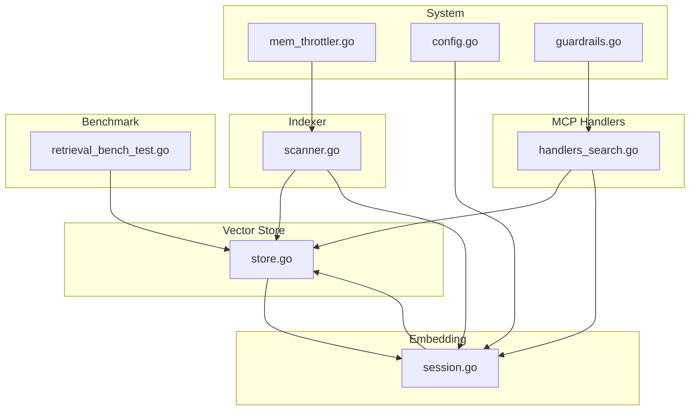

**Diagram sources**
- [handlers_search.go:191-313](file://internal/mcp/handlers_search.go#L191-L313)
- [store.go:223-336](file://internal/db/store.go#L223-L336)
- [scanner.go:67-191](file://internal/indexer/scanner.go#L67-L191)
- [session.go:29-65](file://internal/embedding/session.go#L29-L65)
- [mem_throttler.go:21-110](file://internal/system/mem_throttler.go#L21-L110)
- [config.go:13-28](file://internal/config/config.go#L13-L28)
- [guardrails.go:3-16](file://internal/util/guardrails.go#L3-L16)
- [retrieval_bench_test.go:92-224](file://benchmark/retrieval_bench_test.go#L92-L224)

**Section sources**
- [handlers_search.go:191-313](file://internal/mcp/handlers_search.go#L191-L313)
- [store.go:223-336](file://internal/db/store.go#L223-L336)
- [scanner.go:67-191](file://internal/indexer/scanner.go#L67-L191)
- [session.go:29-65](file://internal/embedding/session.go#L29-L65)
- [mem_throttler.go:21-110](file://internal/system/mem_throttler.go#L21-L110)
- [config.go:13-28](file://internal/config/config.go#L13-L28)
- [guardrails.go:3-16](file://internal/util/guardrails.go#L3-L16)
- [retrieval_bench_test.go:92-224](file://benchmark/retrieval_bench_test.go#L92-L224)

## Core Components
- Hybrid search pipeline: Concurrent vector and lexical search with RRF reranking and boosting.
- Dynamic weighting: Adjusts lexical vs vector weights based on query characteristics (e.g., code-like identifiers).
- Boosting: Function score, recency boost for documents, and priority-based scoring.
- Parallel processing: Chunked processing and CPU utilization for large datasets.
- Memory management: System memory throttling and safe resource cleanup.

Key implementation locations:
- Hybrid search and RRF: [store.go:223-336](file://internal/db/store.go#L223-L336)
- Dynamic weighting and boosting: [store.go:254-333](file://internal/db/store.go#L254-L333)
- Concurrent vector/lexical execution: [store.go:231-245](file://internal/db/store.go#L231-L245)
- Lexical filtering with parallel chunks: [store.go:124-221](file://internal/db/store.go#L124-L221)
- MCP handler orchestrating hybrid search: [handlers_search.go:191-271](file://internal/mcp/handlers_search.go#L191-L271)
- Embedder pool and ONNX sessions: [session.go:29-65](file://internal/embedding/session.go#L29-L65)
- Memory throttling: [mem_throttler.go:21-110](file://internal/system/mem_throttler.go#L21-L110)

**Section sources**
- [store.go:223-336](file://internal/db/store.go#L223-L336)
- [store.go:254-333](file://internal/db/store.go#L254-L333)
- [store.go:231-245](file://internal/db/store.go#L231-L245)
- [store.go:124-221](file://internal/db/store.go#L124-L221)
- [handlers_search.go:191-271](file://internal/mcp/handlers_search.go#L191-L271)
- [session.go:29-65](file://internal/embedding/session.go#L29-L65)
- [mem_throttler.go:21-110](file://internal/system/mem_throttler.go#L21-L110)

## Architecture Overview
The hybrid search architecture executes vector and lexical queries concurrently, merges results via RRF, applies dynamic weighting, and then boosts and sorts by combined scores.

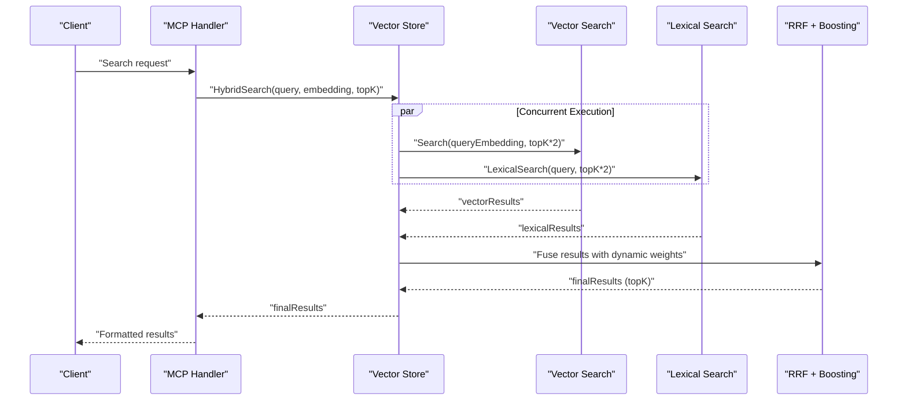

**Diagram sources**
- [handlers_search.go:191-271](file://internal/mcp/handlers_search.go#L191-L271)
- [store.go:223-336](file://internal/db/store.go#L223-L336)

## Detailed Component Analysis

### Hybrid Search Pipeline (Vector + Lexical + RRF)
- Concurrent execution: Vector and lexical searches are launched as goroutines and awaited together.
- Fetch more for fusion: Both result sets are expanded (topK*2) to improve RRF effectiveness.
- Reciprocal Rank Fusion (RRF): Scores are computed using a fixed k and dynamic lexical weight.
- Dynamic weighting: If the query contains code-like identifiers, lexical weight increases to favor exact matches.
- Boosting: Applies function_score, recency boost for documents, and priority multipliers.
- Final selection: TopK results are selected and returned.

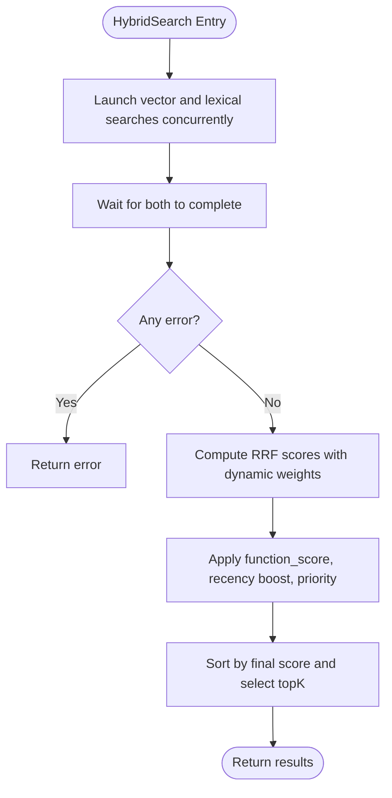

**Diagram sources**
- [store.go:223-336](file://internal/db/store.go#L223-L336)

**Section sources**
- [store.go:223-336](file://internal/db/store.go#L223-L336)

### Dynamic Weighting Based on Query Characteristics
- Heuristic: Detects code-like identifiers using a regular expression pattern.
- Adjustment: Increases lexical weight when identifiers are present, emphasizing exact matches for symbol-heavy queries.

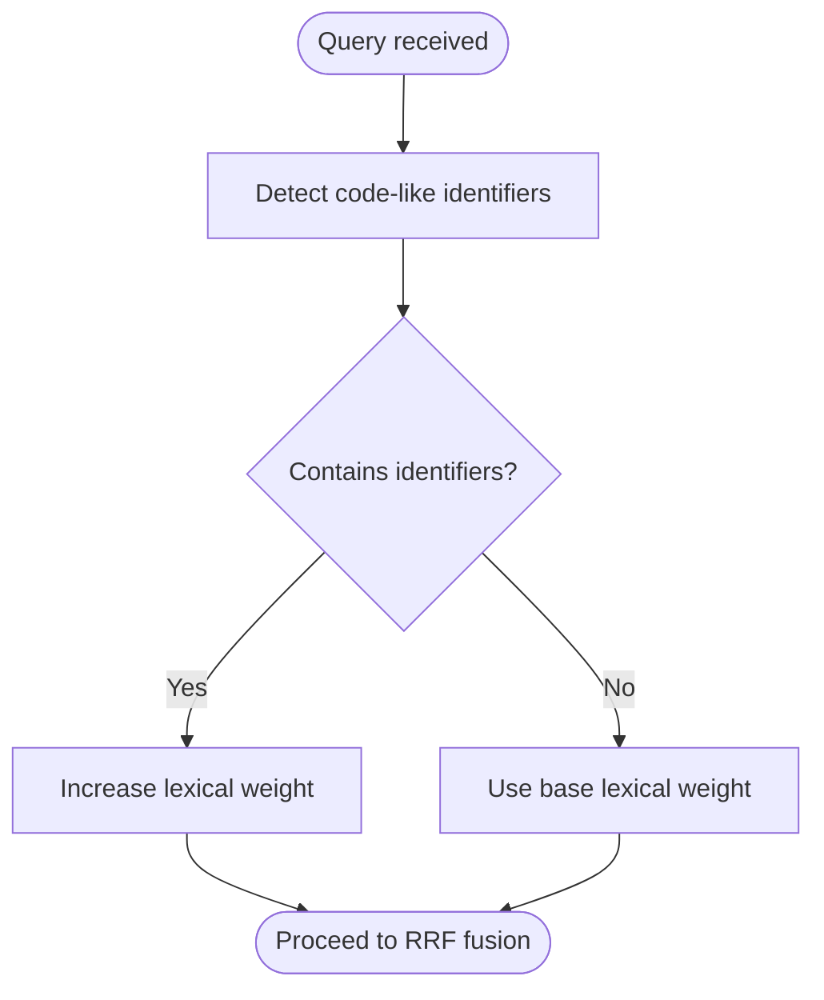

**Diagram sources**
- [store.go:254-276](file://internal/db/store.go#L254-L276)

**Section sources**
- [store.go:254-276](file://internal/db/store.go#L254-L276)

### Boosting Mechanisms
- Function score: Reads a numeric function_score from metadata and uses it as a multiplicative boost.
- Recency boost: For document category, computes a half-life decay based on updated_at to favor recent content.
- Priority-based scoring: Uses a configurable priority multiplier from metadata.

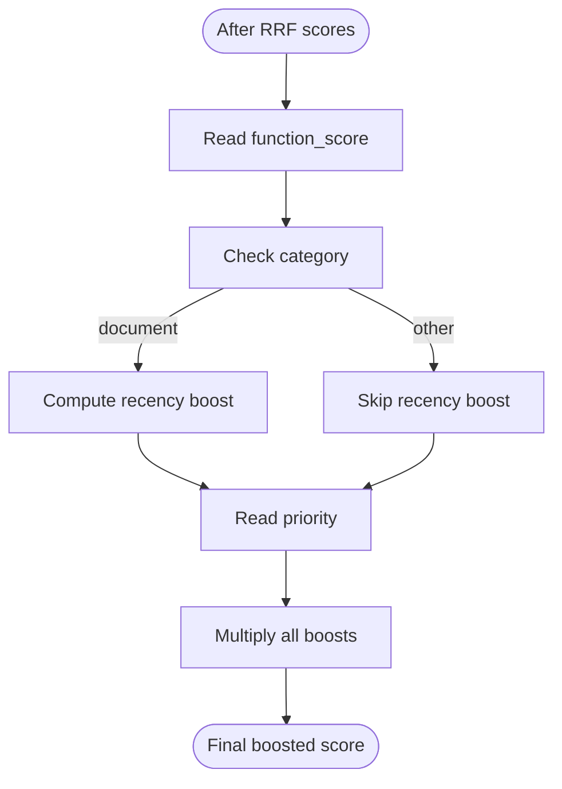

**Diagram sources**
- [store.go:278-323](file://internal/db/store.go#L278-L323)

**Section sources**
- [store.go:278-323](file://internal/db/store.go#L278-L323)

### Concurrent Execution Pattern for Vector and Lexical Queries
- Goroutines: Two goroutines execute vector and lexical searches concurrently.
- WaitGroup: Ensures both finish before proceeding.
- Error handling: Propagates the first encountered error.

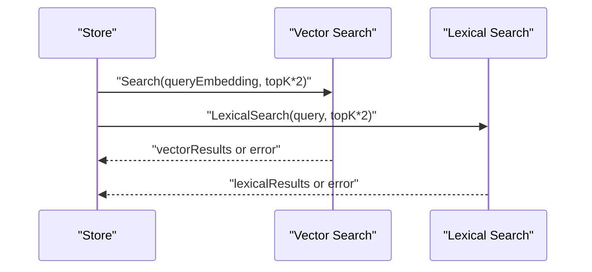

**Diagram sources**
- [store.go:231-245](file://internal/db/store.go#L231-L245)

**Section sources**
- [store.go:231-245](file://internal/db/store.go#L231-L245)

### Parallel Processing Optimizations for Large Datasets
- Chunked processing: Lexical filtering splits results into chunks sized by CPU cores.
- Parallel workers: Each chunk is processed by a dedicated goroutine.
- Small dataset optimization: Skips parallelization for small result sets to avoid overhead.
- Batch insertions: Indexer batches records and inserts atomically to reduce overhead.

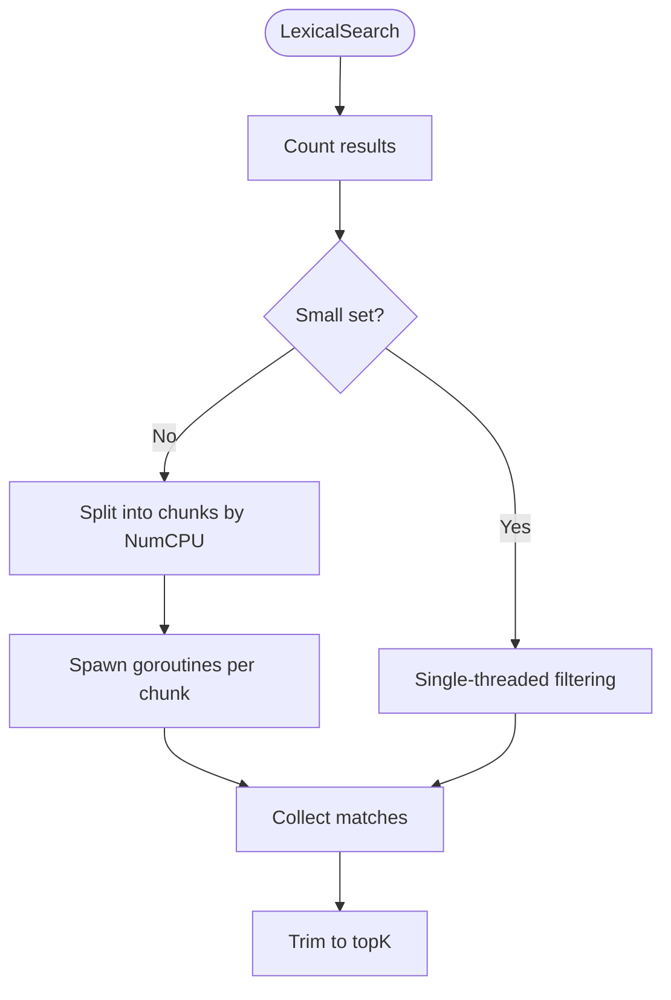

**Diagram sources**
- [store.go:124-221](file://internal/db/store.go#L124-L221)

**Section sources**
- [store.go:124-221](file://internal/db/store.go#L124-L221)
- [scanner.go:120-191](file://internal/indexer/scanner.go#L120-L191)

### Memory Management Strategies
- Memory throttling: Monitors system memory and advises when to throttle heavy tasks.
- Safe resource cleanup: Embedder sessions and tensors are destroyed on close.
- Background monitoring: Periodic updates of memory status.

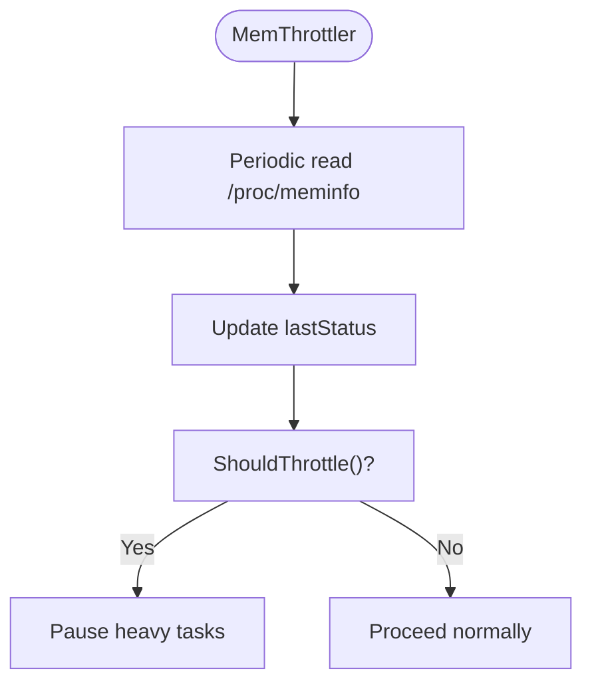

**Diagram sources**
- [mem_throttler.go:46-110](file://internal/system/mem_throttler.go#L46-L110)

**Section sources**
- [mem_throttler.go:46-110](file://internal/system/mem_throttler.go#L46-L110)
- [session.go:273-298](file://internal/embedding/session.go#L273-L298)

### Embedding and Reranking
- Embedder pool: Manages a pool of ONNX sessions for embeddings and optional reranking.
- Normalization: Embeddings are normalized for cosine similarity.
- Reranking: Optional cross-encoder reranking is applied post-filtering.

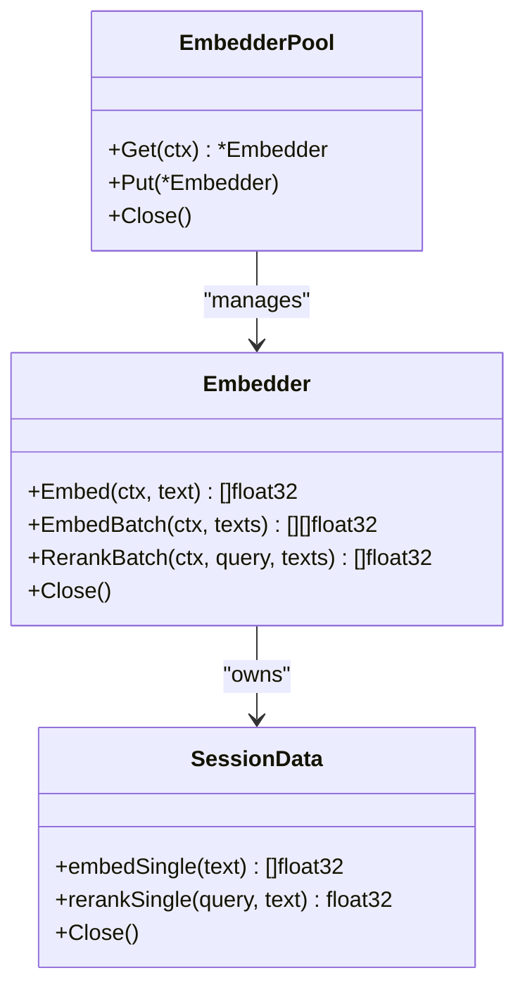

**Diagram sources**
- [session.go:29-65](file://internal/embedding/session.go#L29-L65)
- [session.go:176-245](file://internal/embedding/session.go#L176-L245)
- [session.go:300-366](file://internal/embedding/session.go#L300-L366)

**Section sources**
- [session.go:29-65](file://internal/embedding/session.go#L29-L65)
- [session.go:176-245](file://internal/embedding/session.go#L176-L245)
- [session.go:300-366](file://internal/embedding/session.go#L300-L366)

### MCP Handler Orchestration
- Search handler embeds the query, retrieves the store, and executes hybrid search.
- Post-processing: Filters by path, optionally reranks with cross-encoder, trims to token budget, and formats results.

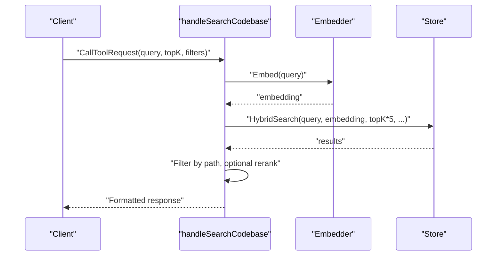

**Diagram sources**
- [handlers_search.go:191-271](file://internal/mcp/handlers_search.go#L191-L271)

**Section sources**
- [handlers_search.go:191-271](file://internal/mcp/handlers_search.go#L191-L271)

## Dependency Analysis
- Handlers depend on the store for hybrid search and on the embedder for query embeddings.
- Store depends on Chromem for vector operations and on metadata for boosting.
- Indexer depends on the embedder for batch embeddings and on the store for atomic updates.
- Embedder depends on ONNX runtime and tokenizer libraries.
- Memory throttler depends on OS memory metrics.

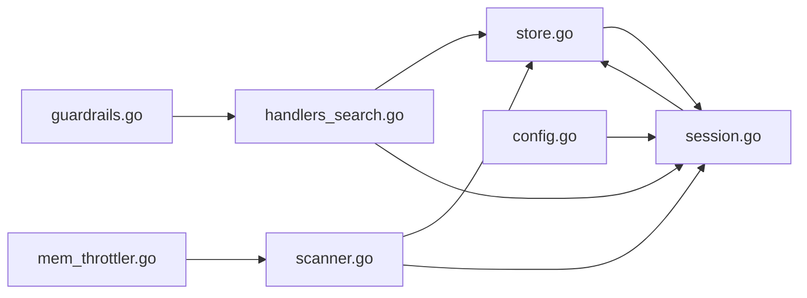

**Diagram sources**
- [handlers_search.go:191-271](file://internal/mcp/handlers_search.go#L191-L271)
- [store.go:223-336](file://internal/db/store.go#L223-L336)
- [scanner.go:67-191](file://internal/indexer/scanner.go#L67-L191)
- [session.go:29-65](file://internal/embedding/session.go#L29-L65)
- [mem_throttler.go:21-110](file://internal/system/mem_throttler.go#L21-L110)
- [config.go:13-28](file://internal/config/config.go#L13-L28)
- [guardrails.go:3-16](file://internal/util/guardrails.go#L3-L16)

**Section sources**
- [handlers_search.go:191-271](file://internal/mcp/handlers_search.go#L191-L271)
- [store.go:223-336](file://internal/db/store.go#L223-L336)
- [scanner.go:67-191](file://internal/indexer/scanner.go#L67-L191)
- [session.go:29-65](file://internal/embedding/session.go#L29-L65)
- [mem_throttler.go:21-110](file://internal/system/mem_throttler.go#L21-L110)
- [config.go:13-28](file://internal/config/config.go#L13-L28)
- [guardrails.go:3-16](file://internal/util/guardrails.go#L3-L16)

## Performance Considerations
- Hybrid search expansion: Fetching topK*2 for both vector and lexical improves RRF effectiveness at the cost of extra computation.
- Dynamic weighting: Favoring lexical for identifier-heavy queries improves precision for code-like searches.
- Boosting: Applying function_score, recency, and priority multipliers refines ranking quality.
- Parallel lexical filtering: Chunking and CPU-aware goroutines scale well with large datasets.
- Embedding batching: Batch embeddings when possible; fallback to sequential for resilience.
- Memory throttling: Prevents out-of-memory conditions during heavy indexing or search bursts.
- Token budgeting: MCP handler trims results to stay within context windows.

[No sources needed since this section provides general guidance]

## Troubleshooting Guide
Common issues and remedies:
- Dimension mismatch errors: Occur when switching embedding models; rebuild the database.
  - Reference: [store.go:51-61](file://internal/db/store.go#L51-L61)
- Slow lexical search on large datasets: Enable parallel chunking and tune CPU utilization.
  - Reference: [store.go:124-221](file://internal/db/store.go#L124-L221)
- Out-of-memory during indexing: Use memory throttler to pause heavy tasks and reduce concurrency.
  - Reference: [mem_throttler.go:88-103](file://internal/system/mem_throttler.go#L88-L103)
- Cross-encoder reranking disabled: If reranker model is missing, hybrid search falls back to topK selection.
  - Reference: [handlers_search.go:236-271](file://internal/mcp/handlers_search.go#L236-L271)
- Query timeouts: MCP handlers enforce timeouts for filesystem grep; adjust limits or filters.
  - Reference: [handlers_search.go:52-54](file://internal/mcp/handlers_search.go#L52-L54)
- Benchmark regressions: Use retrieval benchmarks to detect quality drops.
  - Reference: [retrieval_bench_test.go:92-224](file://benchmark/retrieval_bench_test.go#L92-L224)

**Section sources**
- [store.go:51-61](file://internal/db/store.go#L51-L61)
- [store.go:124-221](file://internal/db/store.go#L124-L221)
- [mem_throttler.go:88-103](file://internal/system/mem_throttler.go#L88-L103)
- [handlers_search.go:236-271](file://internal/mcp/handlers_search.go#L236-L271)
- [handlers_search.go:52-54](file://internal/mcp/handlers_search.go#L52-L54)
- [retrieval_bench_test.go:92-224](file://benchmark/retrieval_bench_test.go#L92-L224)

## Conclusion
The system implements a robust hybrid search pipeline that combines vector and lexical search with RRF fusion and dynamic weighting. It leverages concurrency, parallel processing, and targeted boosting to deliver high-quality results efficiently. Memory management and configuration-driven behavior ensure stability across varied environments. Benchmarks provide regression detection, and the MCP handlers offer a user-friendly interface for search operations.