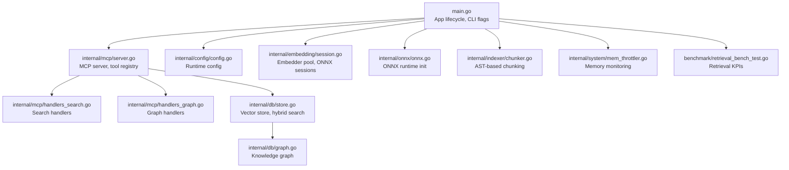
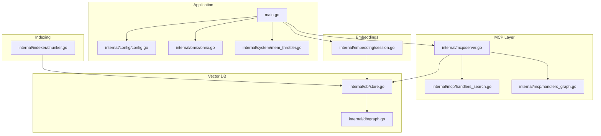
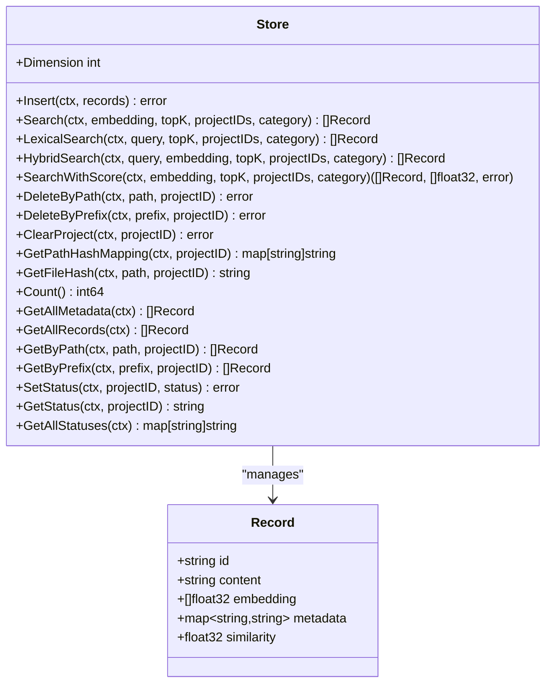
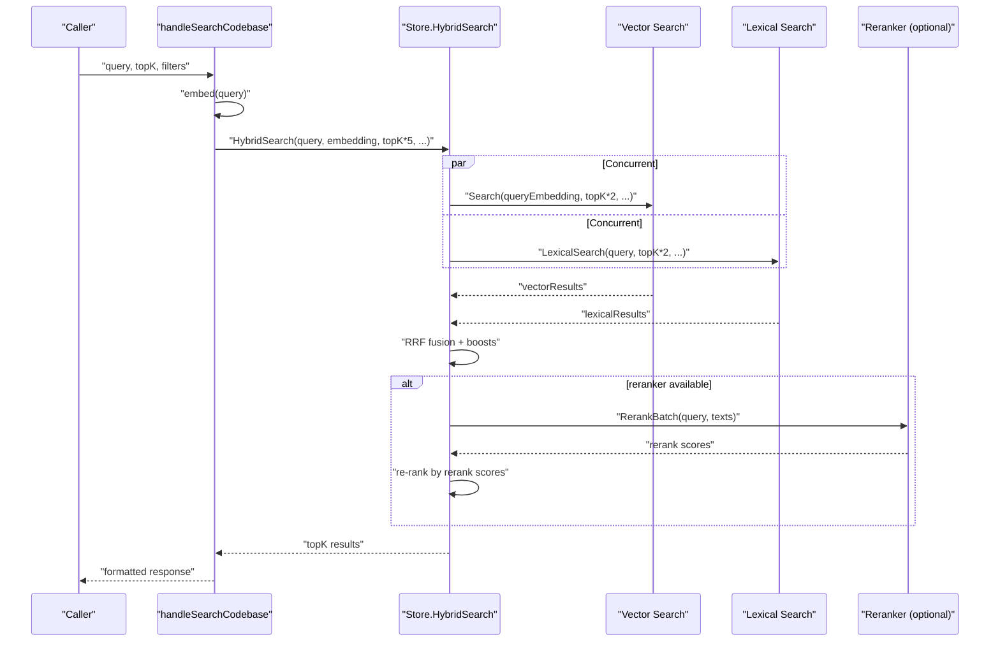
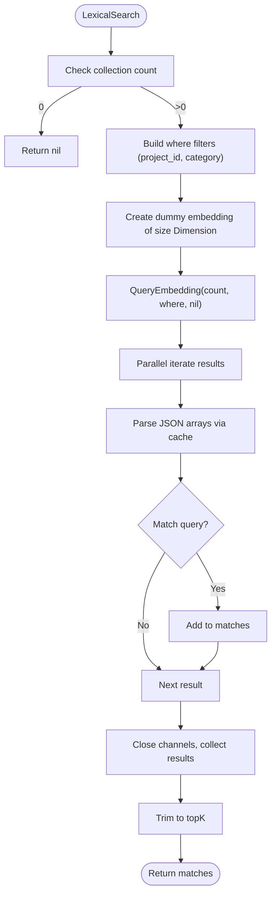
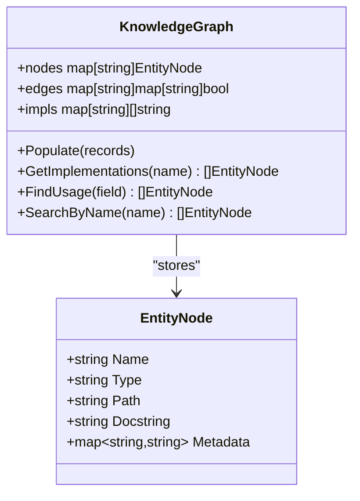
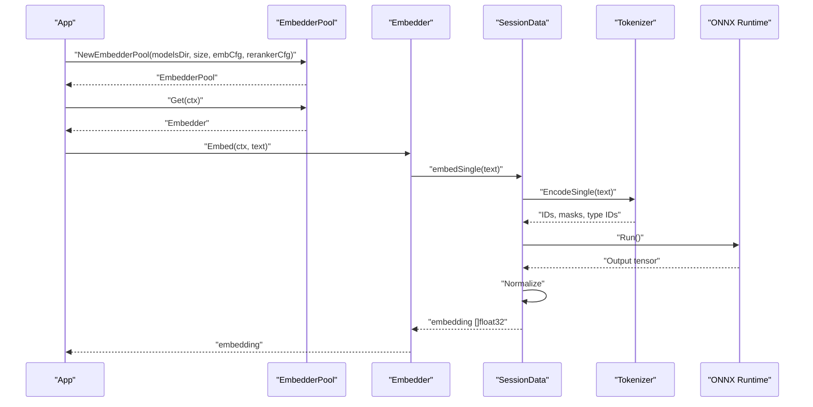
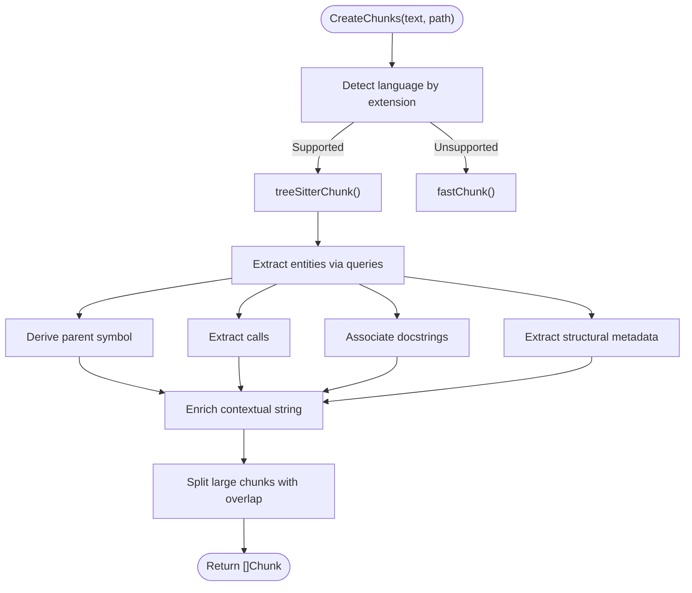
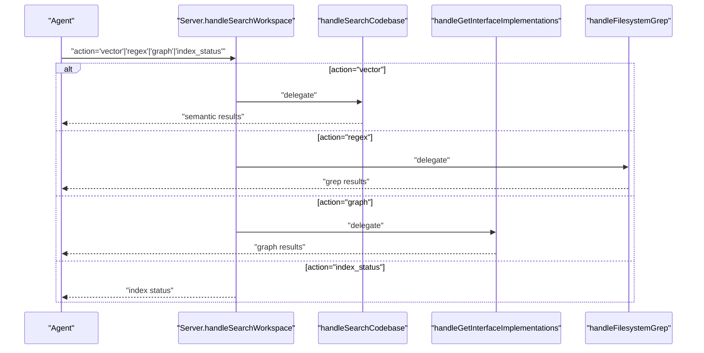
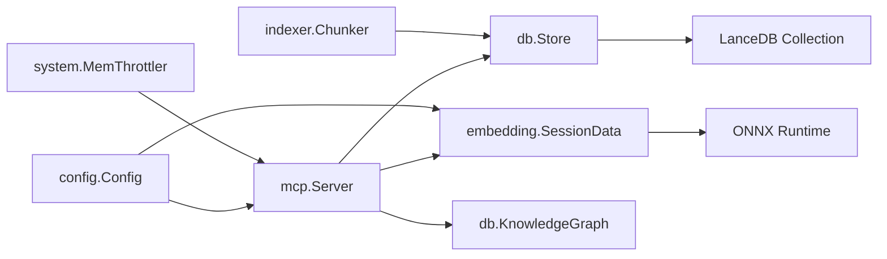

# Vector Database Management

<cite>
**Referenced Files in This Document**
- [main.go](file://main.go)
- [internal/mcp/server.go](file://internal/mcp/server.go)
- [internal/mcp/handlers_search.go](file://internal/mcp/handlers_search.go)
- [internal/mcp/handlers_graph.go](file://internal/mcp/handlers_graph.go)
- [internal/db/store.go](file://internal/db/store.go)
- [internal/db/graph.go](file://internal/db/graph.go)
- [internal/indexer/chunker.go](file://internal/indexer/chunker.go)
- [internal/embedding/session.go](file://internal/embedding/session.go)
- [internal/onnx/onnx.go](file://internal/onnx/onnx.go)
- [internal/config/config.go](file://internal/config/config.go)
- [internal/system/mem_throttler.go](file://internal/system/mem_throttler.go)
- [benchmark/retrieval_bench_test.go](file://benchmark/retrieval_bench_test.go)
</cite>

## Table of Contents
1. [Introduction](#introduction)
2. [Project Structure](#project-structure)
3. [Core Components](#core-components)
4. [Architecture Overview](#architecture-overview)
5. [Detailed Component Analysis](#detailed-component-analysis)
6. [Dependency Analysis](#dependency-analysis)
7. [Performance Considerations](#performance-considerations)
8. [Troubleshooting Guide](#troubleshooting-guide)
9. [Conclusion](#conclusion)
10. [Appendices](#appendices)

## Introduction
This document describes the vector database system powering Vector MCP Go’s semantic search and knowledge graph features. It covers the database schema, record structure and metadata, vector dimensions and indexing strategies, hybrid search combining vector similarity, lexical matching, and graph traversal, and the integration with ONNX-based embeddings. It also documents performance characteristics, scaling, memory management, maintenance, and troubleshooting.

## Project Structure
The vector database system spans several modules:
- Application bootstrap and orchestration
- MCP server exposing tools for search, graph queries, and indexing
- Vector database backed by a persistent collection
- Embedding pipeline using ONNX runtime
- Code chunking and metadata extraction for indexing
- Memory throttling for safe resource usage

**Diagram sources**
- [main.go:1-349](file://main.go#L1-L349)
- [internal/mcp/server.go:1-459](file://internal/mcp/server.go#L1-L459)
- [internal/mcp/handlers_search.go:1-366](file://internal/mcp/handlers_search.go#L1-L366)
- [internal/mcp/handlers_graph.go:1-95](file://internal/mcp/handlers_graph.go#L1-L95)
- [internal/db/store.go:1-664](file://internal/db/store.go#L1-L664)
- [internal/db/graph.go:1-155](file://internal/db/graph.go#L1-L155)
- [internal/indexer/chunker.go:1-759](file://internal/indexer/chunker.go#L1-L759)
- [internal/embedding/session.go:1-367](file://internal/embedding/session.go#L1-L367)
- [internal/onnx/onnx.go:1-44](file://internal/onnx/onnx.go#L1-L44)
- [internal/config/config.go:1-139](file://internal/config/config.go#L1-L139)
- [internal/system/mem_throttler.go:1-151](file://internal/system/mem_throttler.go#L1-L151)
- [benchmark/retrieval_bench_test.go:1-357](file://benchmark/retrieval_bench_test.go#L1-L357)

**Section sources**
- [main.go:1-349](file://main.go#L1-L349)
- [internal/mcp/server.go:1-459](file://internal/mcp/server.go#L1-L459)

## Core Components
- Vector Store: Persistent collection with vector embeddings and metadata; supports vector similarity search, lexical filtering, and hybrid ranking.
- Knowledge Graph: In-memory graph of code entities and relationships derived from metadata.
- Embedder: ONNX-based embedding and optional reranking sessions with pooling and normalization.
- Chunker: AST-aware chunking with structural metadata extraction for richer embeddings.
- MCP Handlers: Unified search tool integrating vector, lexical, and graph modes.
- Memory Throttler: Prevents resource exhaustion during heavy indexing/search workloads.

**Section sources**
- [internal/db/store.go:19-664](file://internal/db/store.go#L19-L664)
- [internal/db/graph.go:9-155](file://internal/db/graph.go#L9-L155)
- [internal/embedding/session.go:18-367](file://internal/embedding/session.go#L18-L367)
- [internal/indexer/chunker.go:22-759](file://internal/indexer/chunker.go#L22-L759)
- [internal/mcp/handlers_search.go:191-366](file://internal/mcp/handlers_search.go#L191-L366)
- [internal/system/mem_throttler.go:13-151](file://internal/system/mem_throttler.go#L13-L151)

## Architecture Overview
The system orchestrates embedding, indexing, and retrieval through a layered architecture:
- Application layer initializes configuration, ONNX runtime, and stores.
- MCP server exposes tools for search, graph queries, and indexing.
- Vector store encapsulates LanceDB-backed persistence and hybrid search.
- Embedder pool manages ONNX sessions and normalization.
- Chunker extracts semantic chunks and structural metadata.
- Memory throttler guards system resources.

**Diagram sources**
- [main.go:1-349](file://main.go#L1-L349)
- [internal/mcp/server.go:1-459](file://internal/mcp/server.go#L1-L459)
- [internal/mcp/handlers_search.go:1-366](file://internal/mcp/handlers_search.go#L1-L366)
- [internal/mcp/handlers_graph.go:1-95](file://internal/mcp/handlers_graph.go#L1-L95)
- [internal/db/store.go:1-664](file://internal/db/store.go#L1-L664)
- [internal/db/graph.go:1-155](file://internal/db/graph.go#L1-L155)
- [internal/embedding/session.go:1-367](file://internal/embedding/session.go#L1-L367)
- [internal/indexer/chunker.go:1-759](file://internal/indexer/chunker.go#L1-L759)
- [internal/onnx/onnx.go:1-44](file://internal/onnx/onnx.go#L1-L44)
- [internal/system/mem_throttler.go:1-151](file://internal/system/mem_throttler.go#L1-L151)

## Detailed Component Analysis

### Vector Store Schema and Record Structure
- Collection: LanceDB-backed collection named for project context.
- Record fields:
  - id: Unique identifier
  - content: Text content chunk
  - embedding: Float32 vector of fixed dimension
  - metadata: String-keyed map for filtering and boosting
  - similarity: Returned by similarity search
- Metadata keys commonly used:
  - path, project_id, category, type, hash, name, symbols (JSON array), calls (JSON array), relationships, updated_at, function_score, priority
- Dimension probing ensures model consistency; mismatch triggers a clear error advising deletion of the database and restart.

**Diagram sources**
- [internal/db/store.go:19-664](file://internal/db/store.go#L19-L664)

**Section sources**
- [internal/db/store.go:27-64](file://internal/db/store.go#L27-L64)
- [internal/db/store.go:35-64](file://internal/db/store.go#L35-L64)

### Hybrid Search Pipeline
Hybrid search combines vector similarity and lexical matching with Reciprocal Rank Fusion (RRF):
- Concurrently executes vector search and lexical search, fetching more candidates to allow reranking.
- Applies dynamic weights: lexical boosted when query resembles identifiers.
- Scores combine RRF with boosts:
  - function_score metadata
  - recency boost for document category
  - priority metadata
- Final ranking sorts by combined score; trims to topK.

**Diagram sources**
- [internal/mcp/handlers_search.go:191-313](file://internal/mcp/handlers_search.go#L191-L313)
- [internal/db/store.go:223-336](file://internal/db/store.go#L223-L336)

**Section sources**
- [internal/db/store.go:223-336](file://internal/db/store.go#L223-L336)
- [internal/mcp/handlers_search.go:211-271](file://internal/mcp/handlers_search.go#L211-L271)

### Lexical Filtering Logic
Lexical search retrieves all records and applies parallelized filtering:
- Filters by project_id and category where applicable.
- Checks metadata fields: symbols (JSON array), name, content, calls (JSON array).
- Uses cached parsing of JSON arrays to avoid repeated unmarshalling.
- Returns topK matches after filtering.

**Diagram sources**
- [internal/db/store.go:85-221](file://internal/db/store.go#L85-L221)

**Section sources**
- [internal/db/store.go:85-221](file://internal/db/store.go#L85-L221)
- [internal/db/store.go:633-663](file://internal/db/store.go#L633-L663)

### Knowledge Graph Construction and Traversal
- Entities: Structured metadata extracted from AST chunks (names, types, docstrings, structural metadata).
- Edges: Implementation relationships inferred from structural metadata; usage tracing via metadata keys.
- Queries:
  - GetImplementations(interfaceName): structs implementing an interface
  - FindUsage(fieldName): entities using a field
  - SearchByName(name): fuzzy name search
- Graph population: Builds nodes and edges from all records in the store.

**Diagram sources**
- [internal/db/graph.go:9-155](file://internal/db/graph.go#L9-L155)

**Section sources**
- [internal/db/graph.go:36-105](file://internal/db/graph.go#L36-L105)
- [internal/db/graph.go:107-155](file://internal/db/graph.go#L107-L155)

### Embedding and ONNX Integration
- Embedder pool: Manages multiple ONNX sessions with configurable pool size.
- Sessions: Tokenization via pre-trained tokenizer, tensor preparation, ONNX inference, and normalization.
- Dimensions: Configurable via model metadata; validated at runtime.
- Reranking: Optional cross-encoder reranker session for batch scoring.

**Diagram sources**
- [internal/embedding/session.go:38-174](file://internal/embedding/session.go#L38-L174)
- [internal/embedding/session.go:180-245](file://internal/embedding/session.go#L180-L245)
- [internal/onnx/onnx.go:12-44](file://internal/onnx/onnx.go#L12-L44)

**Section sources**
- [internal/embedding/session.go:18-367](file://internal/embedding/session.go#L18-L367)
- [internal/onnx/onnx.go:12-44](file://internal/onnx/onnx.go#L12-L44)

### Indexing Strategy and Chunking
- AST-aware chunking: Language-specific queries extract entities (functions, classes, interfaces, methods).
- Gap filling: Non-entity regions are split into “Unknown” chunks.
- Context enrichment: Adds contextual strings with file, entity, type, docstring, calls, and structural metadata.
- Scoring: Heuristic score based on lines and call count.
- Large content handling: Overlapping rune-safe splitting to fit model context windows.

**Diagram sources**
- [internal/indexer/chunker.go:43-101](file://internal/indexer/chunker.go#L43-L101)
- [internal/indexer/chunker.go:114-421](file://internal/indexer/chunker.go#L114-L421)
- [internal/indexer/chunker.go:539-577](file://internal/indexer/chunker.go#L539-L577)

**Section sources**
- [internal/indexer/chunker.go:43-101](file://internal/indexer/chunker.go#L43-L101)
- [internal/indexer/chunker.go:114-421](file://internal/indexer/chunker.go#L114-L421)
- [internal/indexer/chunker.go:539-577](file://internal/indexer/chunker.go#L539-L577)

### MCP Unified Search Tool
- search_workspace routes to:
  - vector: semantic search via handleSearchCodebase
  - regex: filesystem grep via handleFilesystemGrep
  - graph: interface implementations via handleGetInterfaceImplementations
  - index_status: indexing progress via handleIndexStatus

**Diagram sources**
- [internal/mcp/server.go:331-407](file://internal/mcp/server.go#L331-L407)
- [internal/mcp/handlers_search.go:316-366](file://internal/mcp/handlers_search.go#L316-L366)
- [internal/mcp/handlers_search.go:20-189](file://internal/mcp/handlers_search.go#L20-L189)
- [internal/mcp/handlers_graph.go:10-95](file://internal/mcp/handlers_graph.go#L10-L95)

**Section sources**
- [internal/mcp/server.go:331-407](file://internal/mcp/server.go#L331-L407)
- [internal/mcp/handlers_search.go:316-366](file://internal/mcp/handlers_search.go#L316-L366)

## Dependency Analysis
- Coupling:
  - MCP server depends on vector store, embedder, and knowledge graph.
  - Vector store depends on LanceDB collection and metadata.
  - Embedder pool depends on ONNX runtime and tokenizer.
  - Chunker depends on Tree-Sitter parsers and language-specific queries.
- Cohesion:
  - Embedding and ONNX initialization are centralized.
  - Search handlers encapsulate hybrid logic and formatting.
  - Graph handlers focus on entity queries.
- External dependencies:
  - LanceDB for vector storage
  - ONNX Runtime for inference
  - Tree-Sitter for AST parsing
  - MCP protocol for tooling

**Diagram sources**
- [internal/mcp/server.go:66-117](file://internal/mcp/server.go#L66-L117)
- [internal/db/store.go:19-64](file://internal/db/store.go#L19-L64)
- [internal/embedding/session.go:18-174](file://internal/embedding/session.go#L18-L174)
- [internal/indexer/chunker.go:103-206](file://internal/indexer/chunker.go#L103-L206)
- [internal/config/config.go:13-129](file://internal/config/config.go#L13-L129)
- [internal/system/mem_throttler.go:22-110](file://internal/system/mem_throttler.go#L22-L110)

**Section sources**
- [internal/mcp/server.go:66-117](file://internal/mcp/server.go#L66-L117)
- [internal/db/store.go:19-64](file://internal/db/store.go#L19-L64)
- [internal/embedding/session.go:18-174](file://internal/embedding/session.go#L18-L174)
- [internal/indexer/chunker.go:103-206](file://internal/indexer/chunker.go#L103-L206)
- [internal/config/config.go:13-129](file://internal/config/config.go#L13-L129)
- [internal/system/mem_throttler.go:22-110](file://internal/system/mem_throttler.go#L22-L110)

## Performance Considerations
- Vector dimensions and normalization:
  - Dimensions are configured via model metadata and enforced at runtime.
  - Embeddings are normalized for cosine similarity.
- Hybrid search:
  - Fetches more candidates to improve reranking quality.
  - Dynamic weighting favors lexical matches for identifier-like queries.
  - Boosts include function_score, recency for documents, and priority metadata.
- Parallelization:
  - Lexical filtering uses parallel workers scaled to CPU count.
  - Embedder pool enables concurrent embedding requests.
- Memory management:
  - Memory throttler prevents resource exhaustion; can throttle or refuse LSP startup based on thresholds.
- Benchmarks:
  - Retrieval KPIs (recall@K, MRR, NDCG) validated against fixture-based thresholds.

**Section sources**
- [internal/db/store.go:223-336](file://internal/db/store.go#L223-L336)
- [internal/db/store.go:85-221](file://internal/db/store.go#L85-L221)
- [internal/embedding/session.go:247-258](file://internal/embedding/session.go#L247-L258)
- [internal/system/mem_throttler.go:87-103](file://internal/system/mem_throttler.go#L87-L103)
- [benchmark/retrieval_bench_test.go:92-224](file://benchmark/retrieval_bench_test.go#L92-L224)

## Troubleshooting Guide
- Dimension mismatch:
  - Symptom: Error indicating vectors must have the same length after switching models.
  - Action: Delete the vector database directory and restart.
- Empty or missing ONNX library:
  - Symptom: ONNX runtime initialization failure.
  - Action: Ensure ONNX shared library path is set or present in expected locations.
- No results from lexical search:
  - Verify project_id/category filters and metadata presence (symbols, name, calls).
  - Confirm chunker generated metadata for the target files.
- Slow hybrid search:
  - Increase embedder pool size.
  - Reduce topK or enable reranking only when beneficial.
  - Ensure recency and priority metadata are set appropriately.
- Memory pressure during indexing:
  - Adjust memory thresholds or reduce pool size.
  - Use memory throttler feedback to pause heavy tasks.

**Section sources**
- [internal/db/store.go:51-61](file://internal/db/store.go#L51-L61)
- [internal/onnx/onnx.go:12-44](file://internal/onnx/onnx.go#L12-L44)
- [internal/db/store.go:85-221](file://internal/db/store.go#L85-L221)
- [internal/system/mem_throttler.go:87-103](file://internal/system/mem_throttler.go#L87-L103)

## Conclusion
Vector MCP Go’s vector database system integrates ONNX-based embeddings, AST-aware chunking, and a hybrid search pipeline to deliver precise, scalable semantic search. The knowledge graph augments retrieval with structural reasoning. Robust configuration, memory throttling, and benchmarking ensure reliable operation across diverse environments.

## Appendices

### Database Maintenance and Backup
- Maintenance:
  - Periodically repopulate the knowledge graph after indexing.
  - Monitor indexing status via MCP resources.
- Backup:
  - Back up the LanceDB directory (configured via DB_PATH).
  - Restore by copying the directory to the desired location and restarting.

**Section sources**
- [internal/mcp/server.go:165-182](file://internal/mcp/server.go#L165-L182)
- [internal/config/config.go:46-52](file://internal/config/config.go#L46-L52)

### Example Queries and Operations
- Semantic search:
  - Use search_workspace with action="vector" and a query string.
- Regex search:
  - Use search_workspace with action="regex" and a pattern; optionally set include_pattern.
- Graph traversal:
  - Use search_workspace with action="graph" and interface_name to list implementations.
- Reranking:
  - If reranker is enabled, results are re-ranked by cross-encoder scores.

**Section sources**
- [internal/mcp/handlers_search.go:316-366](file://internal/mcp/handlers_search.go#L316-L366)
- [internal/mcp/handlers_search.go:191-313](file://internal/mcp/handlers_search.go#L191-L313)
- [internal/mcp/handlers_graph.go:10-95](file://internal/mcp/handlers_graph.go#L10-L95)

### Performance Tuning Recommendations
- Embedding:
  - Tune embedder pool size based on CPU cores and latency targets.
  - Prefer reranking only when query quality benefits outweigh latency costs.
- Indexing:
  - Use overlapping chunking to preserve context without excessive duplication.
  - Ensure structural metadata is present for richer graph and lexical matching.
- Runtime:
  - Adjust memory thresholds to balance throughput and stability.
  - Use path filters to constrain search scope.

**Section sources**
- [internal/embedding/session.go:38-65](file://internal/embedding/session.go#L38-L65)
- [internal/indexer/chunker.go:539-577](file://internal/indexer/chunker.go#L539-L577)
- [internal/system/mem_throttler.go:30-44](file://internal/system/mem_throttler.go#L30-L44)